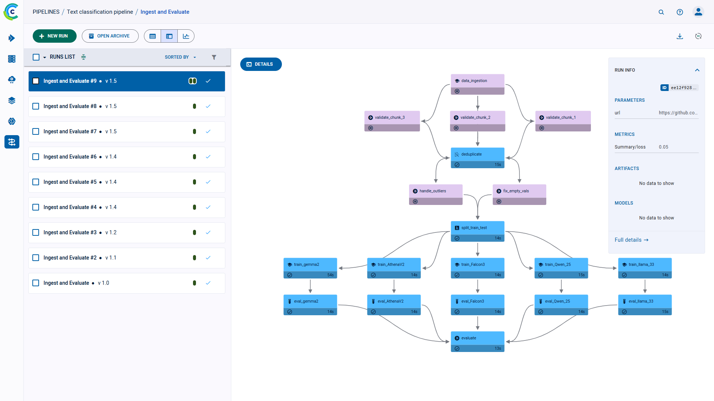

The dataset version panel shows the dataset’s history and details of every version. 

The version panel displays a version history graph. 
Each node in the graph represents a version in the dataset, and shows the following details: 

* Version name/number$$
* Version size 
* Version update time
* Content panel button - Hover over the version and click  
  to view the version’s [content panel](#version-content-panel) 

While the dataset is in $$progress, the versions’ details and colors are updated.

## Version Details
### Version Info

On the right side of the dataset version panel, view the **VERSION INFO** which shows: 
* Version name
* Dataset ID 
* Version file size 
* Number of files
* Number of links
* Version changes from previous version 
  * Number of files added 
  * Number of files modified 
  * Number of files removed 
  * Version size change

To view a version’s complete information, click **Full details**, which will open the dataset version’s [task page](../webapp_exp_track_visual.md).

To view a specific version’s information, click the version node step on the genealogy graph, and the info panel displays 
its **VERSION INFO**. 

### Version Content Panel

Click on **DETAILS** on the top left of the info panel of hover over a version node and click $$ICON$$ to view a version’s 
content panel. 

The content panel consists of the following sections:
* **CONTENT** - Table summarizing version contents, including file names, file sizes, and hashes 
* **PREVIEW** - Preview of dataset contents, including its tabular data and debug samples. Hover over tables to 
  access [plot tools](../webapp_exp_track_visual.md#scalar-plot-tools). Click on a debug sample to expand it. 
* **CONSOLE** - A log of the dataset version’s console output

Click $$ICON$$ to on the content panel header to view the panel in full screen. 