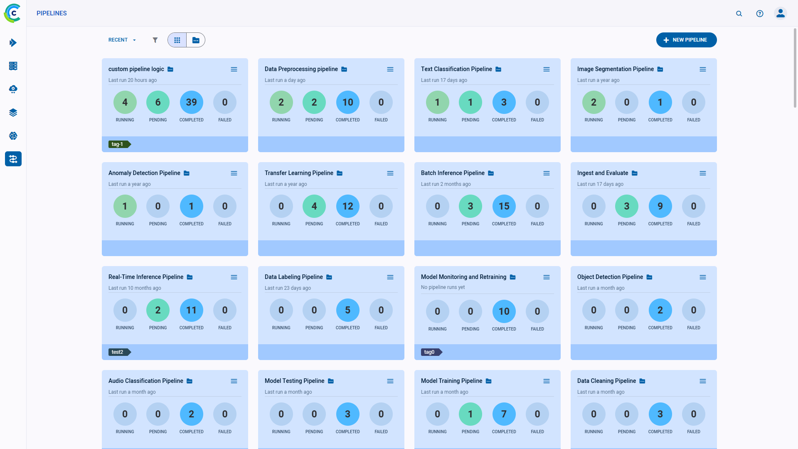

Use the **Pipelines** Page to navigate between and manage pipelines. The page shows execution summaries for all 
[ClearML Pipelines](../../pipelines/pipelines.md).

Click on a pipeline card to navigate to its [Pipeline Runs Table](webapp_pipeline_table.md), where you can view the 
pipeline structure, configuration, and outputs of all the pipeline’s runs, as well as create new runs.

Filter the pipelines to find the one you’re looking for more easily. These filters can be applied by clicking :
* My Work - Show only pipelines that you created
* Tags - Choose which tags to filter by from a list of tags used in the pipelines.
  * Filter by multiple tag values using the **ANY** or **ALL** options, which correspond to the logical "AND" and "OR" 
  respectively. These options appear on the top of the tag list.
  * Filter by the absence of a tag (logical "NOT") by clicking its checkbox twice. An X will appear in the tag's checkbox.

## Pipeline Cards

The pipeline cards display summarized pipeline information:  

* Pipeline name
* Time since the pipeline’s most recent run
* Run summary - Number of *Running*/*Pending*/*Completed*/*Failed* runs
* Tags 

### Pipeline Actions

Click  on the top right
of a pipeline card to open its context menu and access pipeline actions.  

* **Rename** - Change the pipeline’s name
* **Add Tag** - Add label to the pipeline to help easily classify groups of pipelines.
* **Delete** - Delete the pipeline: delete all its runs and any models/artifacts produced (a list of remaining artifacts 
  is returned). To delete a pipeline, all its runs must first be [archived](../webapp_archiving.md). 