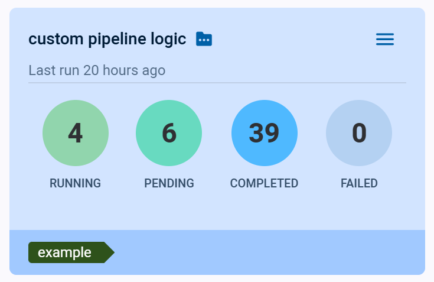
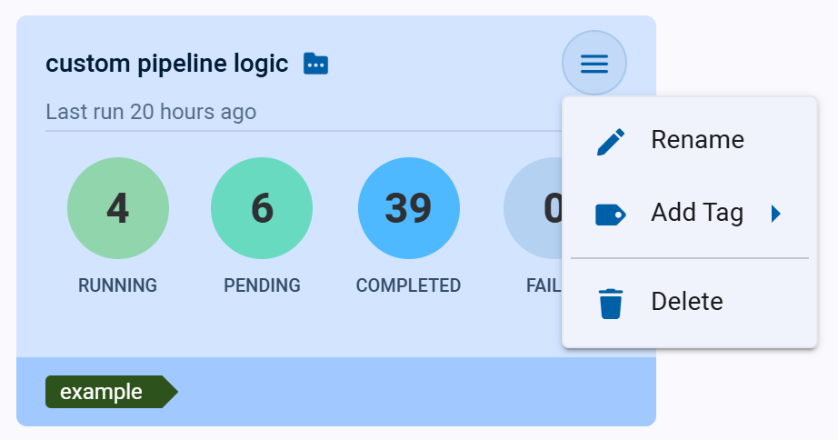

Use the **Pipelines** Page to navigate between and manage pipelines. The page shows execution summaries for all 
[ClearML Pipelines](../../fundamentals/pipelines.md).

Click on a pipeline card to navigate to its [Pipeline Runs Table](webapp_pipeline_table.md), where you can view the 
pipeline structure, configuration and outputs for all of the pipeline’s runs, as well as create new runs.

## Pipeline Cards

The pipeline cards display summarized pipeline information:  

* Pipeline name
* Time since the pipeline’s most recent run
* Run summary - Number of *Running*/*Pending*/*Completed*/*Failed* runs
* Tags 

### Pipeline Actions

Click  on the top right
of a pipeline card to open its context menu and access pipeline actions.  

* Rename - Change the pipeline’s name
* Add Tag - Add label to the pipeline to help easily classify groups of pipelines.
