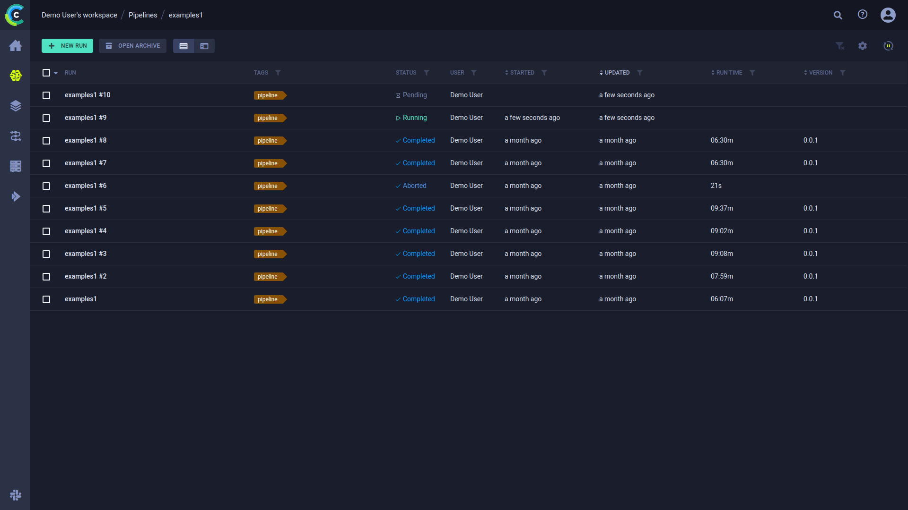
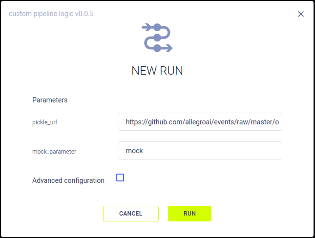
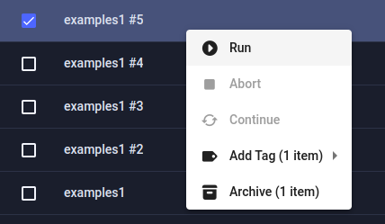

The pipeline runs table is a [customizable](#customizing-the-runs-table) list of the pipeline’s runs. From the table, 
you can view a run’s details, and manage runs (create, continue, or abort). The runs table's auto-refresh allows users 
to continually monitor run progress.

## Run Table Columns

The models table contains the following columns:

| Column | Description | Type |
|---|---|---|
| **RUN** | Pipeline run identifier  |  String |
| **VERSION** | The pipeline version number. Corresponds to the [PipelineController](../../fundamentals/pipelines.md#pipelines-from-tasks) ’s and PipelineDecorator’s `version` parameter | Version string |
| **TAGS** | Descriptive, user-defined, color-coded tags assigned to run. | Tag |
| **STATUS** | Pipeline run's status. See a list of the [task states and state transitions](../../fundamentals/task.md#task-states). |  String |
| **USER** | User who created the run.  |  String |
| **STARTED** | Elapsed time since the run started. To view the date and time of start, hover over the elapsed time.  |  Date-time |
| **UPDATED** | Elapsed time since the last update to the run. To view the date and time of update, hover over the elapsed time. |  Date-time |
| **RUN TIME** | The current / total running time of the run. | Time |
| **_Metrics_** | Add metrics column (last, minimum, and / or maximum values). Available options depend upon the runs in the table. | Varies according to runs in table |
| **_Hyperparameters_** | Add hyperparameters. Available options depend upon the runs in the table. | Varies according to runs in table |

## Customizing the Runs Table

Customize the table using any of the following:
* Dynamic column ordering - Drag a column title to a different position.
* Show / hide columns - Click  
  to view and select columns to show. Click **Metric** and **Hyper Parameter** to add the respective custom columns
* [Filter columns](#filtering-columns)
* Sort columns
* Resize columns - Drag the column separator to change the width of that column. Double click the column separator for 
  automatic fit.

Changes are persistent (cached in the browser) and represented in the URL, so customized settings can be saved in a 
browser bookmark and shared with other ClearML users.

:::note Float Values Display
By default, the runs table displays rounded up float values. Hover over a float to view its precise value in the 
tooltip that appears. To view all precise values in a column, hover over a float and click .  
:::

### Filtering Columns

Filters can be applied by clicking  
on a column, and the relevant filter appears.

There are a few types of filters:
* Value set - Choose which values to include from a list of all values in the column
* Numerical ranges - Insert minimum and / or maximum value
* Date ranges - Insert starting and / or ending date and time
* Tags - Choose which tags to filter by from a list of all tags used in the column. 
  * Filter by multiple tag values using the **ANY** or **ALL** options, which correspond to the logical "AND" and "OR" respectively. These 
    options appear on the top of the tag list.
  * Filter by the absence of a tag (logical "NOT") by clicking its checkbox twice. An `X` will appear in the tag's checkbox.
  
Once a filter is applied to a column, its filter icon will appear with a highlighted dot on its top right ( ).  

To clear all active filters, click  
in the top right corner of the table.

:::note
The following table customizations are saved on a per pipeline basis:
* Columns order
* Column width
* Active sort order
* Active filters
* Custom columns
:::

## Create Run
To launch a new run for a pipeline, click **+ NEW RUN** on the top left of the page. This opens a **NEW RUN** modal, where 
you can set the run’s parameters. By default, the fields are pre-filled with the last run’s values. 

Click **Advanced configurations** to change the run’s execution queue.  

After clicking **RUN**, the new pipeline run is enqueued in the specified queue, and the run is added to the pipeline run table. 

## Run Actions

The following table describes the actions that can be done from the run table, including the [states](../../fundamentals/task.md#task-states)
that allow each operation.  

| Action | Description | States Valid for the Action | State Transition |
|---|---|---|---|
| Archive | To more easily work with active runs, archive a run. See [Archiving](../webapp_archiving.md). | Any state |  None  |
| Restore | Action available in the archive. Restore a run to the active pipeline runs table. | Any state | None |
| Run | Create a new pipeline run. Configure and enqueue it for execution. See [Create Run](#create-run).  | Any State | *Pending* |
| Abort | Manually stop / cancel a run. | *Running* / *Pending* | *Aborted* |
| Continue | Rerun with the same parameters |  *Aborted* | *Pending* |
| Tags | User-defined labels added to runs for grouping and organization. | Any state |  None  |

These actions can be accessed with the context menu, when right-clicking a run.

Most of the actions mentioned in the chart above can be performed on multiple runs at once.
[Select multiple runs](#selecting-multiple-runs), then use either the context menu, or the bar that appears at the bottom 
of the page, to perform operations on the selected runs. Actions can be performed only on the runs that match the action criteria 
(for example, only *Aborted* pipeline runs can be continued). The context menu shows the number of runs that can be 
affected by each action. The same information can be found in the bottom menu, in a tooltip that appears when hovering 
over an action icon. 

## Selecting Multiple Runs

Select multiple runs by clicking the checkbox on the left of each relevant run. Clear any existing selection 
by clicking the checkbox in the top left corner of the table.

Click the checkbox in the top left corner of the table to select all items currently visible.

An extended bulk selection tool is available through the down arrow next to the checkbox in the top left corner, enabling 
selecting items beyond the items currently on-screen:
* **All** - Select all runs in the pipeline
* **None** - Clear selection
* **Filtered** - Select all runs in the project that match the current active table filters 

