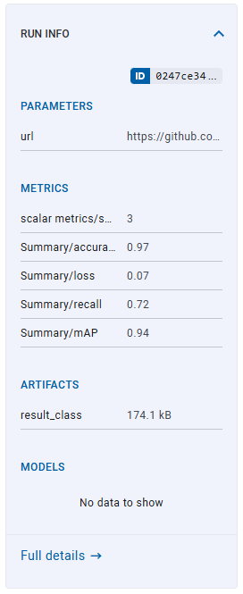
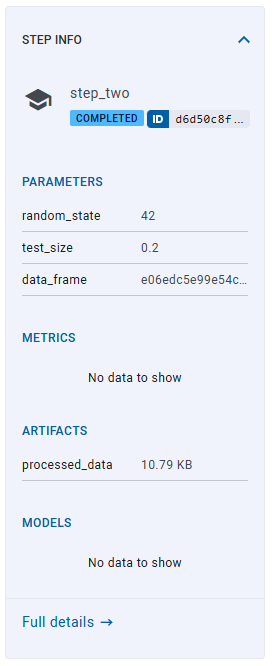
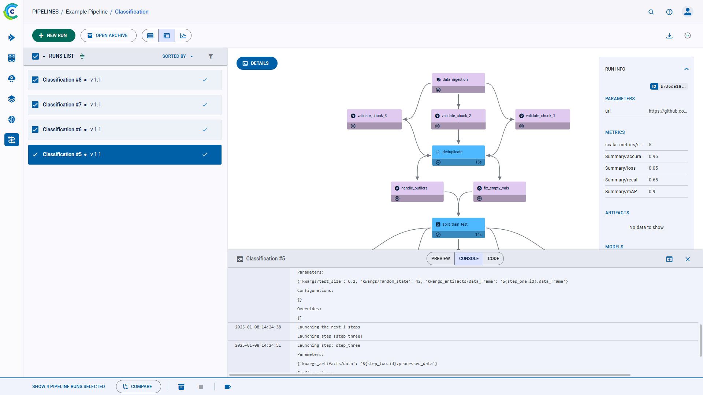
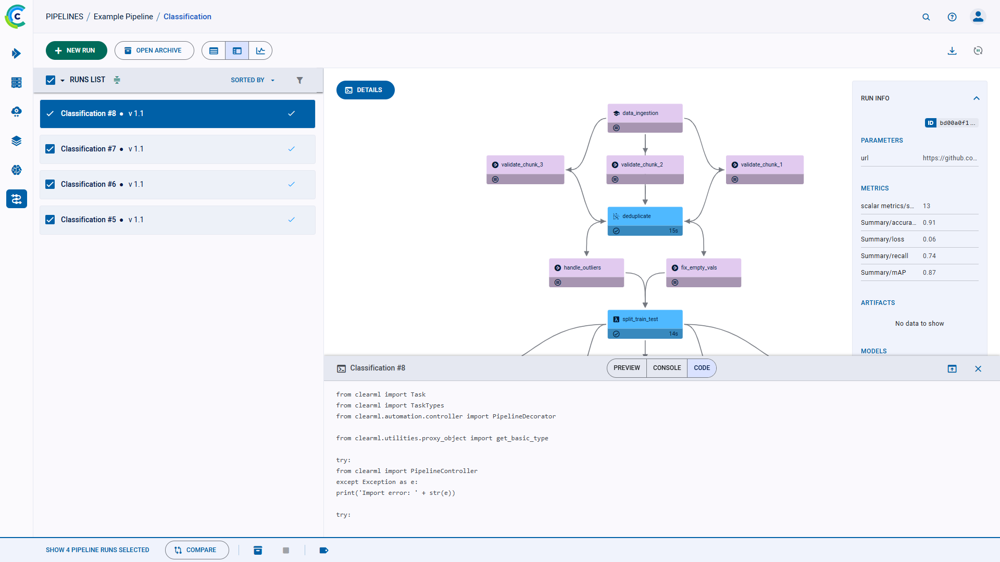

The run details panel shows the pipeline’s structure and the execution status of every step, as well as the run’s 
configuration parameters and output. 

Each step shows: 

* Step name
* Step status
* Step execution time
* Step log button - Hover over the step and click  
  to view the step’s [console log and code](#run-and-step-log) 

While the pipeline is running, the steps’ details and colors are updated.

## Run and Step Details
### Run and Step Info

On the right side of the pipeline run panel, view the **RUN INFO** which shows: 
* Run Parameters 
* Reported Metrics
* Produced Artifacts 
* Output Models 

To view a run’s complete information, click **Full details**, which will open the pipeline’s controller [task page](../webapp_exp_track_visual.md). 
View each list’s complete details in the pipeline task’s corresponding tabs: 
* **PARAMETERS** list > **CONFIGURATION** tab
* **METRICS** list > **SCALARS** tab
* **ARTIFACTS** and **MODELS** lists > **ARTIFACTS** tab 

To view a specific step’s information, click the step on the execution graph, and the info panel displays its **STEP INFO**. 
The panel displays the step’s name, task type, and status, as well as its parameters, metrics, artifacts, and models. 

To return to viewing the run’s information, click the pipeline graph, outside any of the steps.  

### Run and Step Log

Click on **DETAILS** on the top left of the info panel to view a run’s full console log. The log contains everything printed 
to stdout and stderr.  

To view a step’s console log, click **DETAILS** and then click on a step. 

For pipelines steps generated from functions using either [`PipelineController.add_function_step`](../../references/sdk/automation_controller_pipelinecontroller.md#add_function_step)
or [`PipelineDecorator.component`](../../references/sdk/automation_controller_pipelinecontroller.md#pipelinedecoratorcomponent), 
you can also view the selected step’s code. On the top center 
of the console panel, click **Code**. 

