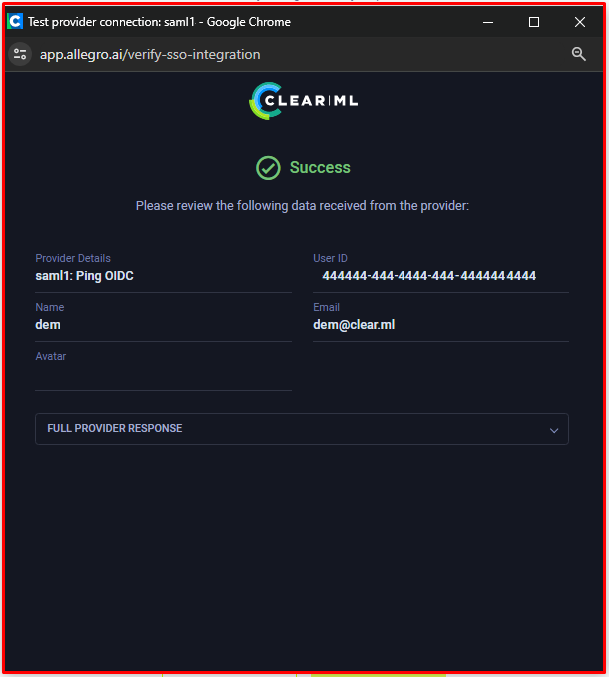

:::important Enterprise Feature 
This feature is available under the ClearML Enterprise plan.
:::

Administrators can connect identity service providers to the server: configure an identity connection, which allows
ClearML to communicate with your identity provider, retrieve user information, authenticate users, and more. Once an identity 
provider connection is configured and enabled, the option appears in your server login page.

**To create a new connection**:
1. Click **+ New Connection**
2. In the **New Provider Connection** modal, select a protocol (OIDC or SAML) and a provider 
   * OIDC providers:
     * Auth0 
     * AWS Cognito 
     * Google 
     * Keycloak 
     * Microsoft AD 
     * Microsoft Azure 
     * Okta 
     * Ping 
     * Custom
   * SAML providers
     * Duo 
     * Google
     * Jumpcloud
     * Microsoft AD
     * Custom
3. Click **Next**
4. Provide the **Provider Connection Configuration**. Note that some of the information, such as the `Client ID`,
   `Client Secret`, and the `Authorization Endpoint`, must be obtained from your identity provider's ClearML App settings
   and copied to the relevant field.
   
   <Collapsible title="OIDC Providers" type="configuration">

      * ClearML WebApp URL - The external URL for the ClearML WebApp. Used to construct the Callback URL used by the 
      identity provider
      * Callback URL - Copy the field's content into the `Callback URL` field in your provider's ClearML App / integration
      (sometimes the field is called `Redirect URL`). Used by the identity provider to redirect the session back to the ClearML 
      Server. 
      * Display name - Unique name to be used in the ClearML Login screen. Make sure no two 
      connections have the same name.
      * Client ID - The Client ID of your identity provider's ClearML App. Copy this value from your identity provider's 
       ClearML App settings
      * Client Secret - The client secret generated by your identity provider for the ClearML App. Copy this value from your identity 
       provider's ClearML App settings
      * Authorization Endpoint - Used to authorize each user login. Copy this value from your identity provider's ClearML App settings
      * Access Token Endpoint - Used to obtain an access token as part of the login process. Copy this value from your 
       identity provider's ClearML App settings
      * Revocation Endpoint - Used to revoke an access token. Copy this value from your identity provider's 
       ClearML App settings
      * Obtain user information from Identity Token - Select to retrieve user information from the identity token generated 
       by the provider. If not selected, provide a **User Info Endpoint** which is used to obtain additional user information 
       as part of the login process. Copy this value from your identity provider's ClearML App settings 
      * Email verification - Only allow signup/login to users with a verified email address. If selected, make sure that 
       your identity provider returns an `email_verified` claim in generated tokens.
      * Create new users on first login - Select to automatically create a ClearML user for new users logging in using 
       this connection. If not selected, 
       only existing ClearML users or users who were invited using their email address can log in using this connection.
      * Verify token signature - Select to verify 
       signatures for tokens returned by the identity provider. This requires the `JWKS URI` to be configured. Make sure your 
       identity provider's ClearML App is set up to sign tokens. 
      * Additional Settings
        * Code challenge method - Select one of the methods from the dropdown menu (`None`, `Plain`, or `S256`). This setting 
         should match the one defined in your identity provider's ClearML App settings
        * Standard Userinfo scopes - Comma-separated list of scopes. Used to control access to user information. In case 
         you need to add another scope, use the `Additional scopes` field below.
        * Additional scopes - Comma-separated list of any additional scopes required by your identity provider
      * Claims mappings - Maps ClearML claim names to the names defined in your identity provider's ClearML App settings
        * user id - The user's unique ID
        * email - The user's email address
        * name - The user's full name 
        * given name - The user's given name (optional if **name** is specified)
        * family name - The user's family name (surname, optional if **name** is specified)
        * picture - The user's avatar or picture URL 
      * User Groups Synchronization - Supports synchronizing group membership. If enabled, and the groups claim is returned 
       by the provider, the server will attempt to match each group to an existing ClearML group and assign the ClearML user 
       to the matched ClearML group. The server will also make sure the ClearML user is removed from the group if 
       a previous membership has been revoked.

   </Collapsible> 

   <Collapsible title="SAML Providers" type="configuration">

      * ClearML Webapp URL - The external URL for the ClearML WebApp. This is used to construct the Callback URL used by 
       the identity provider
      * Reply/ACS URL - Copy this field's content into the `Assertion Consumer Service URL` field in your provider's 
       ClearML App. Used by the identity provider to redirect the session back to the ClearML Server. 
      * Display name - Unique name to be used in the ClearML Login screen. Make sure no two 
       connections have the same name. 
      * Entity ID - The Entity ID of your identity provider's ClearML App. Copy this value from your identity provider's 
       ClearML App settings 
      * IDP metadata file - Provided by the identity provider and contains SAML configuration details used by the ClearML 
       Server to set up the connection. Download this from your identity provider's ClearML App settings. 
      * Security Settings
        * Require signed assertions - Assume IDP assertions or responses are signed by the identity provider. If enabled, 
         make sure your identity provider's ClearML App is configured to sign assertions or responses.
        * Sign client requests - The ClearML Server will sign requests sent to the identity provider. Make sure your 
         identity provider's ClearML App is configured to accept signed client requests and its Client Certificate section 
         there is set up with the same value for the Public Key.
           1. Sign requests sent to the identity provider. Use the following shell commands to generate a public/private key pair:
      
           ```
           openssl genrsa -out server.key 2048
           chmod 600 server.key
           openssl req -new -key server.key -out server.csr
           openssl x509 -req -days 3650 -in server.csr -signkey server.key -out server.cer
           ```
           
          2. Paste the content of the `server.cer` file into the `Public Key` field below and the content of the `server.key` 
          file into the `Private Key` field below. Make sure your identity provider's ClearML App is configured to accept 
          signed client requests and its `Client Certificate` section there is set up with the same value for the `Public Key`.  

      * Claims mappings - Maps ClearML Claim names to the names defined in your identity provider's ClearML App settings
        * user id - The user's unique ID
        * email - The user's email address
        * name - The user's full name 
        * given name - The user's given name (optional if **name** is specified)
        * family name - The user's family name (surname, optional if **name** is specified)
        * picture - The user's avatar or picture URL 
      * User Groups Synchronization - Supports synchronizing group membership. If enabled, and the groups claim is returned 
      by the provider, the server will attempt to match each group to an existing ClearML group and assign the ClearML user 
      to the matched ClearML group. The server will also make sure the ClearML user is removed from the group if 
      a previous membership has been revoked.

   </Collapsible> 

1. Click **Test Provider** to make sure that the connection is working. This calls the identity provider, and displays 
  the returned information, so you can verify that the information was mapped correctly. An error will be displayed, if the provider fails to connect.

   

2. Click **Save**

The **Provider Connections** table lists all currently defined connections, and the following details:
* Active - Toggle to enable / disable the provider connection
* Name - Connection name
* Provider - Connection's provider 
* Protocol - Connection's protocol
* ID - Connection's ID (click to copy)
* Last Update - Last update time

Hover over a connection in the table to **Edit** or **Delete** it.  
 


