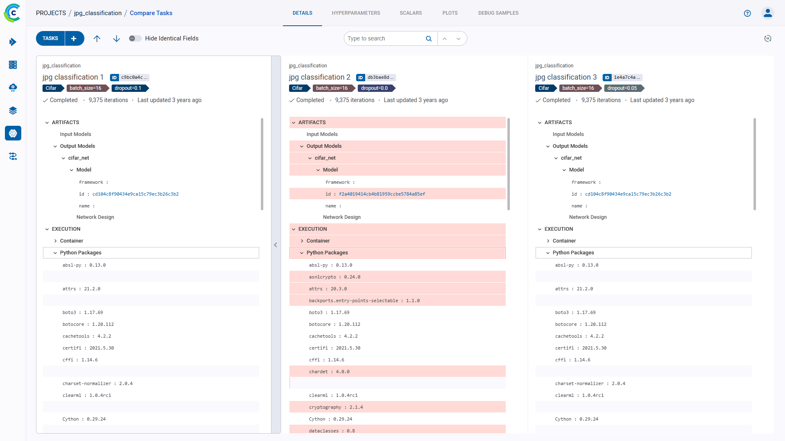
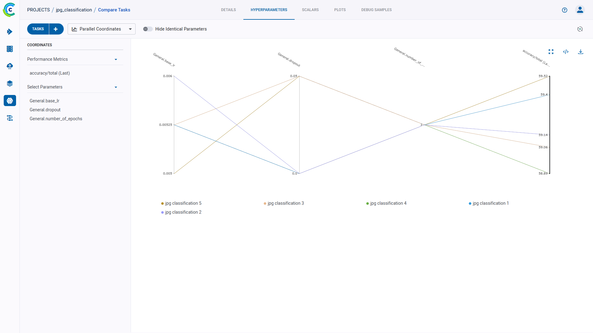
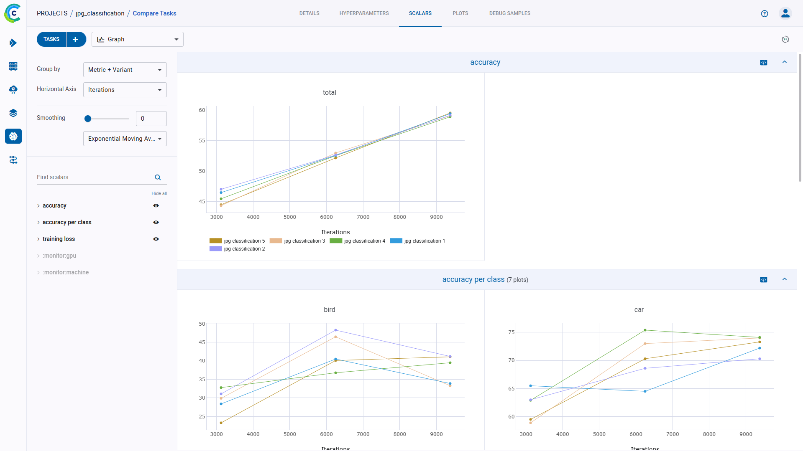
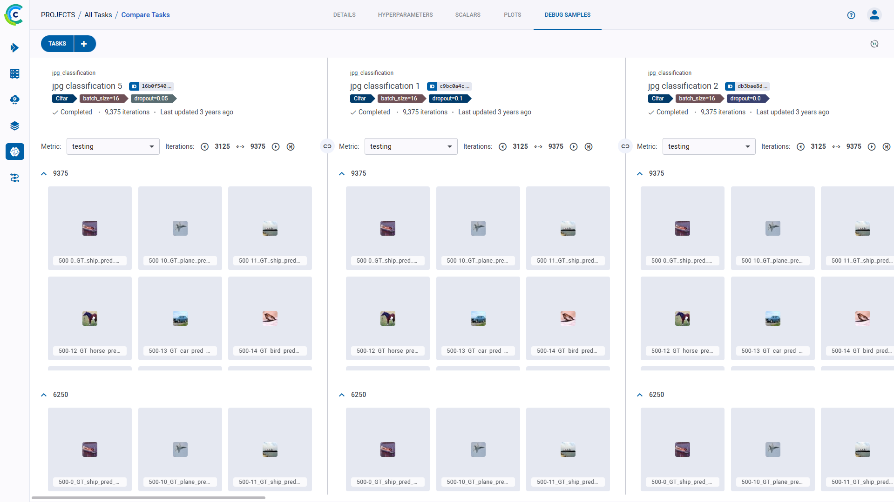

It is always useful to investigate what causes an experiment to succeed.
The **ClearML Web UI** provides a deep experiment comparison, allowing to locate, visualize, and analyze differences including:

* [Details](#details)
    - Artifacts - Input model, output model, and model design.
    - Execution - Installed packages and source code.
    - Configuration - Configuration objects used by the experiment.
    - Info - General experiment details.
* [Hyperparameters](#hyperparameters)
    - [Values (table) view](#values-mode) - Key/value of all the arguments used by the experiments.
    - [Parallel coordinates view](#parallel-coordinates-mode) - Impact of each argument on a selected metric
      the experiments reported (see [task.connect_configuration](../references/sdk/task.md#connect_configuration)).
* [Scalars](#scalars)
    - Specific values and plots of scalar series (see [reporting scalars](../guides/reporting/scalar_reporting.md) / [automatic reporting](../fundamentals/logger.md#automatic-reporting))
* [Plots](#plots)
    - Plots are combined to have multiple lines from different experiments (for example multiple RoC curves laid on top
      of each other).
* [Debug samples](#debug-samples)
    - Debug samples by each iteration
    - Examine samples with a viewer (for images and video), and a player (for audio) (see [reporting media](../guides/reporting/media_reporting.md)).

The ClearML experiment comparison provides [comparison features](#comparison-features) making it easy to compare experiments.

## Selecting Experiments to Compare

**To select experiments to compare:**

1. Go to an experiments table, which includes the experiments to be compared.
1. Select the experiments to compare, select the checkboxes individually or select the top checkbox for all experiments. After selecting the second checkbox, a bottom bar appears.
1. In the bottom bar, click **COMPARE**. The comparison page appears, showing a column for each experiment and differences with a highlighted background color. The experiment on the left is the base experiment. Other experiments compare to the base experiment.

## Details

The **DETAILS** tab includes deep comparisons of the following:
* Artifacts - Input/output models and their configuration, and other artifacts, if any.
* Execution Details - Source code, uncommitted changes, and installed python packages. See details [here](webapp_exp_track_visual.md#execution). 
* Configuration - Configuration objects used by the experiment, sorted by sections. See details [here](webapp_exp_track_visual.md#configuration).
* Info - General experiment details. This includes information describing the stored experiment. See details [here](webapp_exp_track_visual.md#general-information). 

**To Locate the Source Differences:**

Click the **DETAILS** tab **>** Expand highlighted sections, or, in the header, click 
(Previous diff) or  (Next diff).

For example, in the image below, expanding **ARTIFACTS** **>** **Output Model** **>** **Model** shows that the model names 
are different.

## Hyperparameters

Compare hyperparameters as values, or compare by metric (hyperparameter parallel coordinate comparison).

### Values Mode

The Values mode is a side-by-side comparison that shows hyperparameter value differences highlighted line-by-line.

**To view a side by side values comparison:**

1. Click the **HYPER PARAMETERS** tab.
1. In the dropdown menu (on the upper left, next to **+ Add Experiments**), choose **Values**.
1. To show only differences, move the **Hide Identical Fields** slider to on.
1. Locate differences by either:
    * Clicking  (Previous diff) or
       (Next diff).
    * Scrolling to see highlighted hyperparameters.

For example, expanding **General** shows that the `batch_size` and `epochs` differ between the experiments.

### Parallel Coordinates Mode

In the Parallel Coordinates mode, compare a metric to any combination of hyperparameters using a parallel coordinates plot.

**To compare by metric:**

1. Click the **HYPER PARAMETERS** tab.
1. In the dropdown menu (on the upper left, next to **+ Add Experiments**), choose **Parallel Coordinates**.
1. In **Performance Metric**, expand a metric or monitored resource, and then click a variant.
1. Select the metric values to use. Choose one of the following:
    * **LAST** - The final value, or the most recent value, for in-progress experiments.
    * **MIN** - Minimal value.
    * **MAX** - Maximal value.
1. In **Parameters**, select the hyperparameter checkboxes to compare.
1. To view one experiment on the plot, hover over the experiment name in the legend.

For example, plot the metric/variant `epoch_accuracy`/`validation: epoch_accuracy` against the hyperparameters
`batch_size` and `epochs`.

Hover over one of the experiment names in the legend, and the plot shows only that data.

## Scalars

Visualize the comparison of scalars, which includes metrics and monitored resources in the **SCALARS** tab.

### Compare Specific Values

**To compare specific values:**

1. Click the **SCALARS** tab.
1. In the dropdown menu (upper right of the left sidebar), choose either:
    * **Last Values** (the final or most recent value)
    * **Min Values** (the minimal values)
    * **Max Values** (the maximal values)
1. Sort by variant.

### Compare Scalar Series

Compare scalar series in plots and analyze differences using **ClearML Web UI** plot tools.

**To compare scalar series:**

1. Click the **SCALARS** tab.
1. In the dropdown menu (upper right of the left sidebar), choose **Graph**.

**To improve scalar series analysis:**

* In **Group by**, select one of these option:
  * **Metric** - all variants for a metric on the same plot.
  * **Metric+Variant** - every variant appears on its own plot.
* Horizontal axis options:
  * Iterations,
  * Relative time since the experiment began,
  * Wall (clock time).
* Smooth a curve - move the **Smoothing** slider or type in a smoothing number from **0** to **0.999**.
* Use plot controls, which appear when you hover over the top of a plot.
* Hide / show scalar plots - Click **Hide all** and .
* Filter scalars by full or partial scalar name.

This image shows scalars grouped by metric.

This image shows scalars grouped by metric and variant.

## Plots

Visualize the comparison of any data that ClearML automatically captures or that is explicitly reported in experiments,
in the **PLOTS** tab.

**To compare plots:**

1. Click the **PLOTS** tab.
1. To improve your comparison, use either of the following:

    * To locate scalars, click **HIDE ALL**, and then 
      (show) to choose which scalars to see. Scalars can also be filtered by full or partial scalar name, using the search bar.
    * Use any of the plot controls that appear when hovering over the top of a plot, including:
      * Downloading the image
      * Downloading the data as JSON
      * Zooming
      * Panning
      * Switching between logarithmic / linear scale.

## Debug Samples

Compare debug samples at any iteration to verify that an experiment is running as expected. The most recent iteration appears
first. Use the viewer / player to inspect images, audio, video samples and do any of the following:
* Move to the same sample in a different iteration (move the iteration slider).
* Show the next or previous iteration's sample.
* Download the file .
* Zoom.
* View the sample's iteration number, width, height, and coordinates.

**To compare debug samples:**

1. Click the **DEBUG SAMPLES** tab. The most recent iteration appears at the top.
1. Locate debug samples by doing the following:

    * Filter by metric. In the **Metric** list, choose a metric.
    * Show other iterations. Click  (Older images),
       (New images), or  (Newest images).
    * Click  in 
      order to synchronize iteration and metric selection across experiments. For example, if you select a metric for 
      one experiment’s debug samples, the same metric will be automatically selected for the rest of the experiments in the comparison.   

    

1. To open a debug sample (image, audio, or video) in the viewer or player, click the thumbnail.

    

1. To move to the same sample in another iteration, click 
   (previous),  (next), or move the slider.

**To view a debug sample in the viewer / player:**

1. Click the debug sample thumbnail.

1. Do any of the following:

    * Move to the same sample in another iteration - Move the slider, or click **<** (previous) or **>** (next).
    * Download the file - Click  .
    * Zoom
    * For images, locate a position on the sample - Hover over the sample and the X, Y coordinates appear in the legend below the sample.

## Comparison Features

To assist in experiment analysis, the comparison page supports:

* [Changing compared experiments selection](#changing-compared-experiments-selection) 
* [Finding the next or previous difference](#finding-the-next-or-previous-difference).
* [Hiding identical fields](#hiding-identical-fields)
* [Choosing a different base experiment](#choosing-a-different-base-experiment)
* [Dynamic ordering](#dynamic-ordering-of-the-compared-experiments) of the compared experiments
* [Sharing experiments](#sharing-experiments)
* Auto refresh

### Changing Compared Experiments Selection

1. Click **+ Add Experiment** in the top left corner of any of the comparison pages. This will open up a window with an
   experiment table with the currently compared experiments at the top. 
1. Find the experiments to add by sorting and [filtering](webapp_exp_table.md#filtering-columns) the experiments with 
   the appropriate column header controls. Alternatively, use the search bar to find experiments by name.
1. Select experiments to include in the comparison (and / or clear the selection of any experiment you wish to remove).
1. Click **APPLY**.

### Finding the Next or Previous Difference

* Find the previous difference , or
  the next difference .

### Hiding Identical Fields

Move the **Hide Identical Fields** slider to "on" mode to see only fields that are different.

### Choosing a Different Base Experiment

Show differences in other experiments in reference to a new base experiment. To set a new base experiment, do one of the following:
* Click on  on the top right of the experiment that will be the new base.
* Click on  the new base experiment and drag it all the way to the left

### Dynamic Ordering of the Compared Experiments

To reorder the experiments being compared, press  on the top right of the experiment that
needs to be moved, and drag the experiment to its new position.

### Removing an Experiment from the Comparison
Remove an experiment from the comparison, by pressing 
on the top right of the experiment that needs to be removed.

### Sharing Experiments

To share a comparison table, copy the full URL from the address bar and send it to a teammate to collaborate. They will
get the exact same page (including selected tabs etc.).
