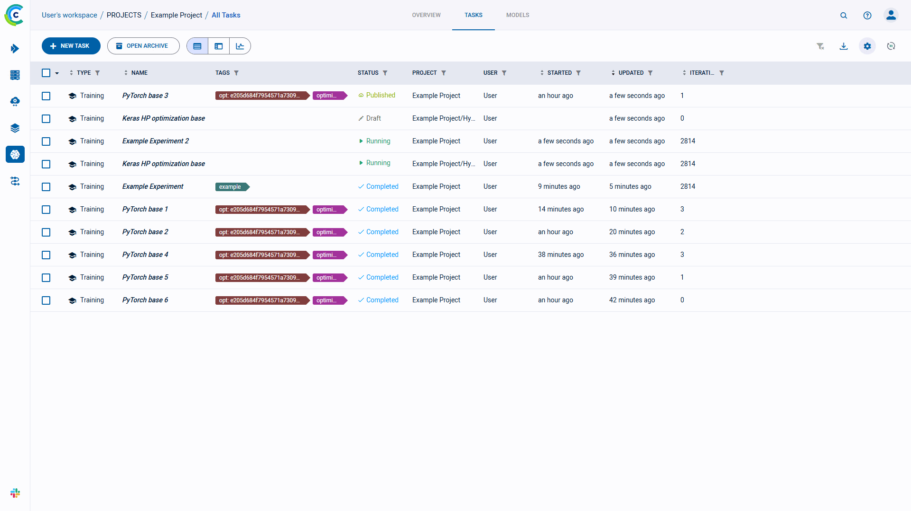
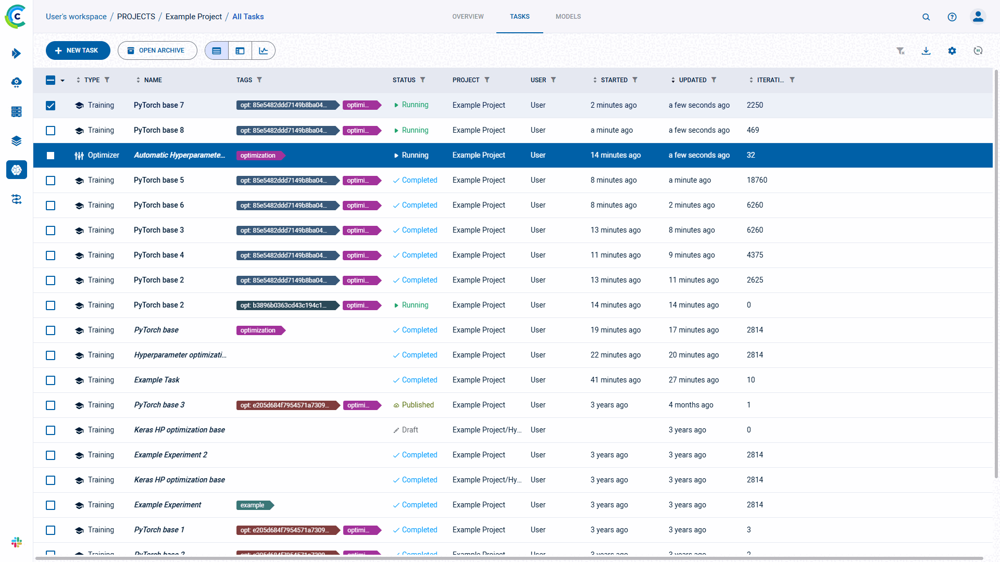

The experiments table is a [customizable](#customizing-the-experiments-table) list of experiments associated with a project. From the experiments
table, view experiment details, and work with experiments (reset, clone, enqueue, create [tracking leaderboards](../guides/ui/building_leader_board.md)
to monitor experimentation, and more). The experiments table's auto-refresh allows users to continually monitor experiment progress.

:::info
To assist in focusing on active experimentation, experiments and models can be archived, so they will not appear
in the active experiments and models tables. See [Archiving](webapp_archiving).
:::

## Experiments Table Columns

The experiments table default and customizable columns are described in the following table.

| Column | Description | Type |
|---|---|---|
| **TYPE** | Type of experiment. **ClearML** supports multiple [task types](../fundamentals/task.md#task-types) for experimentation, and a variety of workflows and use cases. | Default |
| **NAME** | Experiment name.  |  Default |
| **TAGS** | Descriptive, user-defined, color-coded tags assigned to experiments. Use tags to classify experiments, and filter the list. See [tagging experiments](webapp_exp_track_visual#tagging-experiments). | Default |
| **STATUS** | Experiment state (status). See a list of the [task states and state transtions](../fundamentals/task.md#task-states-and-state-transitions). |  Default |
| **PROJECT** | Name of experiment's project.  |  Default |
| **USER** | User who created or cloned the experiment.  |  Default (hidden) |
| **STARTED** | Elapsed time since the experiment started. To view the date and time of start, hover over the elapsed time.  |  Default |
| **UPDATED** | Elapsed time since the last update to the experiment. To view the date and time of update, hover over the elapsed time. |  Default |
| **ITERATION** | Last or most recent iteration of the experiment. |  Default |
| **DESCRIPTION** | A description of the experiment. For cloned experiments, the description indicates it was auto generated with a timestamp. |  Default (hidden) |
| **RUN TIME** | The current / total running time of the experiment. | Default (hidden) |
| **_Metrics_** | Add metrics column (last, minimum, and / or maximum values). The metrics depend upon the experiments in the table. See [adding metrics](#to-add-metrics). | Customizable |
| **_Hyperparameters_** | Add hyperparameters. The hyperparameters depend upon the experiments in the table. See [adding hyperparameters](#to-add-hyperparameters). | Customizable |

## Customizing the Experiments Table

The experiments table can be customized by:
* Showing / hiding default columns
* Adding metrics and hyperparameters
* Sorting
* Filtering

Use experiments table customization for various use cases, including:

* Creating a [leaderboard](#creating-an-experiment-leaderboard) that will update in real time with experiment
  performance, which can be shared and stored.
* Sorting models by metrics - Models are associated with the experiments that created them. For each metric, use the last
  value, the minimal value, and / or the maximal value.
* Tracking hyperparameters - Track hyperparameters by adding them as columns, and applying filters and sorting.

Changes are persistent (cached in the browser), and represented in the URL so customized settings can be saved in a browser
bookmark and shared with other **ClearML** users to collaborate.

:::note
The following experiments-table customizations are saved on a **per project** basis: 
* Columns order
* Column width
* Active sort order
* Active filters
* Custom columns

If a project has subprojects, the experiments can be viewed by their subproject groupings or together with 
all the experiments in the project. The customizations of these two views are saved separately. 
:::

### Adding Metrics and / or Hyperparameters

Add metrics and / or hyperparameters columns to the experiments table. The metrics and hyperparameters depend upon the
experiments in the table.

#### To Add Metrics:

* Click  **>** **+ METRICS** **>** Expand a metric **>** Select the **LAST** (value),
  **MIN** (minimal value), and / or **MAX** (maximal value) checkboxes.

#### To Add Hyperparameters:

* Click  **>** **+ HYPER PARAMETERS** **>** Expand a section **>** Select the
  hyperparameter checkboxes.

### Filtering Experiments

Filters can be applied by clicking  
on a column, and the relevant filter appears.

There are a few types of filters:
* Value set - Choose which values to include from a list of all values in the column
* Numerical ranges - Insert minimum and / or maximum value
* Date ranges - Insert starting and / or ending date and time
* Tags - Choose which tags to include from a list of all tags used in the column. Additionally, tags can be filtered using
  the **ANY** or **ALL** options, which correspond to the logical "AND" and "OR" respectively. These options appear
    on the top of the tag list. 
  
Once a filter is applied to a column, its filter icon will appear with a highlighted dot on its top right ( ).  

### Using Other Customization Features

**To use other customization features:**

* Show / hide columns - Click  **>** select or clear the checkboxes of columns to show or hide.
* Sort columns - According to metrics and hyperparameters, type of experiment, experiment name, start and last update elapsed time, and last iteration.
* Dynamic column ordering - Drag a column title to a different position.
* Column resizing - In the column heading, drag to a new size.
* Column autofit - In the column heading, double click a column separator.

## Experiment Actions

The following table describes the actions that can be done from the experiments table, including the [states](../fundamentals/task.md#task-states-and-state-transitions)
that allow each operation.  

| Action | Description | States Valid for the Action | State Transition |
|---|---|---|---|
| View details | View experiment details in the experiments table, the [info panel](webapp_exp_track_visual#info-panel) (keep the experiments table in view), or the [full screen details view](webapp_exp_track_visual#full-screen-details-view). | Any state |  None  |
| Manage a queue | If an experiment is *Pending* in a queue, view the utilization of that queue, manage that queue (remove experiments and change the order of experiments), and view information about the worker(s) listening to the queue. See the [Workers and Queues](webapp_workers_queues) page. | *Enqueued* |  None  |
| View a worker | If an experiment is *Running*, view resource utilization, worker details, and queues to which a worker is listening. | *Running* |  None  |
| Share | For **ClearML Hosted Service** users only, [share](webapp_exp_sharing) an experiment and its model with a **ClearML Hosted Service** user in another workspace. |  Any state |  None  |
| Archive | To more easily work with active experiments, move an experiment to the archive. See [Archiving](webapp_archiving). | Any state |  None  |
| Enqueue | Add an experiment to a queue for a worker or workers (listening to the queue) to execute. | *Draft* | *Pending* |
| Dequeue | Remove an experiment from a queue. | *Pending* | *Draft* |
| Reset  | Delete the log and output from a previous run of an experiment (for example, before rerunning it). | *Completed*, *Aborted*, or *Failed* | *Draft* |
| Abort | Manually terminate a *Running* experiment. | *Running* | *Aborted* |
| Publish | Publish an experiment to prevent changes to its tracking data, inputs, and outputs. Published experiments and their models are read-only. *Published* experiments cannot be enqueued, but they can be cloned, and their clones can be edited, tuned, and enqueued. | *Completed*, *Aborted*, or *Failed*.  | *Published* |
| Tags | Tag experiments with color-coded labels to assist you in organizing your work. See [tagging experiments](webapp_exp_track_visual#tagging-experiments). | Any state |  None  |
| Clone | Make an exact, editable copy of an experiment (for example, to reproduce an experiment, but keep the original). | *Draft* | Newly Cloned Experiment is *Draft* |
| Move | Move an experiment to another project. | Any state |  None  |

These actions can be accessed with the context menu (when right-clicking an experiment or clicking the menu button 
in an experiment's info panel).

Most of the actions mentioned in the chart above can be performed on multiple experiments at once.
Select multiple experiments, then use either the context menu, or the bar that appears at the bottom of the page, to perform
operations on the selected experiments. Actions can be performed only on the experiments that match the action criteria 
(for example, only *Running* experiments can be aborted). The context menu shows the number 
of experiments that can be affected by each action. The same information can be found in the bottom menu, in a tooltip that
appears when hovering over an action icon. 

## Creating an Experiment Leaderboard

Filter & sort the experiments of any project to create a leaderboard that can be shared and stored. This leaderboard
updates in real time with experiment performance and outputs.

Modify the experiment table in the following ways to create a customized leaderboard:
* Add experiment configuration ([hyperparameters](#to-add-hyperparameters))
* Edit and add experiments [properties](webapp_exp_track_visual.md#user-properties)
* Add reported [metrics](#to-add-metrics), any time series reported metric can be selected, then select the last reported
  value, or the minimum / maximum reported value.
* Filter based on user (dropdown and select) or [experiment types](../fundamentals/task.md#task-types)
* Add specific [tags](webapp_exp_track_visual.md#tagging-experiments) and filter based on them. 

Now the table can be sorted based on any of the columns (probably one of the performance metrics). Select to filter experiments
based on their name by using the search bar.

The final dashboard can be shared by copying the URL from the address bar, this address will replicate the exact same dashboard on any browser.
The dashboard can also be bookmarked for later use.

