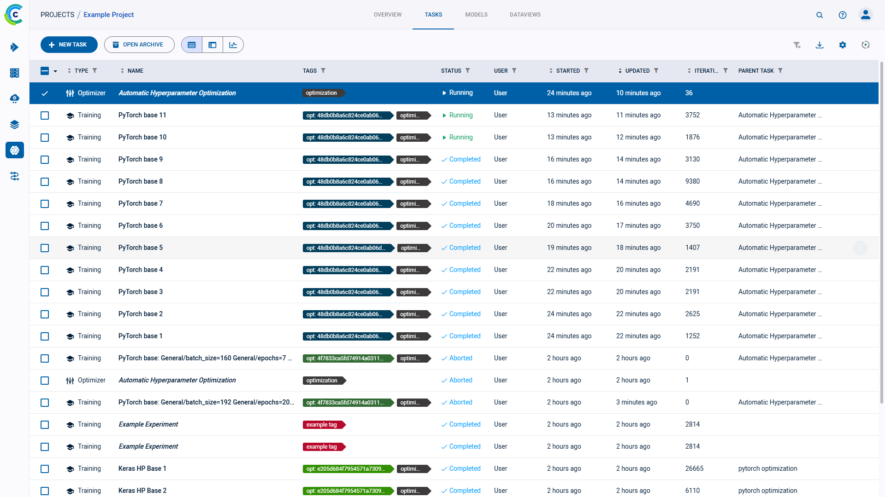
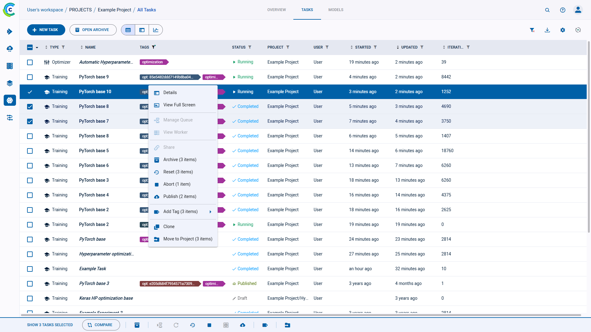
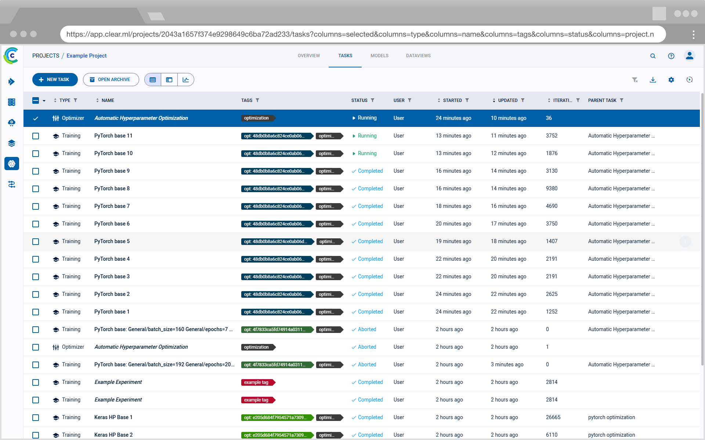

The experiments table is a [customizable](#customizing-the-experiments-table) list of experiments associated with a project. From the experiments
table, view experiment details, and work with experiments (reset, clone, enqueue, create [tracking leaderboards](../guides/ui/building_leader_board.md)
to monitor experimentation, and more). The experiments table's auto-refresh allows users to continually monitor experiment progress.

View the experiments table in table view  
or in details view ,
using the buttons on the top left of the page. Use the table view for a comparative view of your experiments according 
to columns of interest. Use the details view to access a selected experiment’s details, while keeping the experiment list 
in view. Details view can also be accessed by double-clicking a specific experiment in the table view to open its details view. 

:::info
To assist in focusing on active experimentation, experiments and models can be archived, so they will not appear
in the active experiments and models tables. See [Archiving](webapp_archiving.md).
:::

## Experiments Table Columns

The experiments table default and customizable columns are described in the following table.

| Column | Description | Type |
|---|---|---|
| **TYPE** | Type of experiment. ClearML supports multiple [task types](../fundamentals/task.md#task-types) for experimentation, and a variety of workflows and use cases. | Default |
| **NAME** | Experiment name.  |  Default |
| **TAGS** | Descriptive, user-defined, color-coded tags assigned to experiments. Use tags to classify experiments, and filter the list. See [tagging experiments](webapp_exp_track_visual.md#tagging-experiments). | Default |
| **STATUS** | Experiment state (status). See a list of the [task states and state transitions](../fundamentals/task.md#task-states). If you programmatically set task progress values, you will also see a progress indicator for Running, Failed, and Aborted tasks. See [here](../clearml_sdk/task_sdk.md#tracking-task-progress). |  Default |
| **PROJECT** | Name of experiment's project.  |  Default |
| **USER** | User who created or cloned the experiment.  |  Default (hidden) |
| **STARTED** | Elapsed time since the experiment started. To view the date and time of start, hover over the elapsed time.  |  Default |
| **UPDATED** | Elapsed time since the last update to the experiment. To view the date and time of update, hover over the elapsed time. |  Default |
| **ITERATION** | Last or most recent iteration of the experiment. |  Default |
| **DESCRIPTION** | A description of the experiment. For cloned experiments, the description indicates it was auto generated with a timestamp. |  Default (hidden) |
| **RUN TIME** | The current / total running time of the experiment. | Default (hidden) |
| **_Metrics_** | Add metrics column (last, minimum, and / or maximum values). The metrics depend upon the experiments in the table. See [adding metrics](#to-add-metrics). | Customizable |
| **_Hyperparameters_** | Add hyperparameters. The hyperparameters depend upon the experiments in the table. See [adding hyperparameters](#to-add-hyperparameters). | Customizable |

## Customizing the Experiments Table

Customize the table using any of the following:
* Dynamic column order - Drag a column title to a different position.
* Resize columns - Drag the column separator to change the width of that column. Double-click the column separator for 
  automatic fit.
* Changing table columns
    * Show / hide columns - Click 
  **>** mark or clear the checkboxes of columns to show or hide.
    * Add custom columns - Click **+ METRICS** or **+ HYPERPARAMETERS** to add metric / hyperparameter columns to the 
      main column list. Added columns are by default displayed in the table. You can remove the custom columns from the 
      main column list or the column addition windows. 
* [Filter columns](#filtering-columns)
* Sort columns - According to metrics and hyperparameters, type of experiment, experiment name, start and last update elapsed time, and last iteration.

Use experiments table customization for various use cases, including:

* Creating a [leaderboard](#creating-an-experiment-leaderboard) that will update in real time with experiment
  performance, which can be shared and stored.
* Sorting models by metrics - Models are associated with the experiments that created them. For each metric, use the last
  value, the minimal value, and / or the maximal value.
* Tracking hyperparameters - Track hyperparameters by adding them as columns, and applying filters and sorting.

Changes are persistent (cached in the browser), and represented in the URL so customized settings can be saved in a browser
bookmark and shared with other ClearML users to collaborate.

:::note
The following experiments-table customizations are saved on a **per-project** basis: 
* Columns order
* Column width
* Active sort order
* Active filters
* Custom columns

If a project has subprojects, the experiments can be viewed by their subproject groupings or together with 
all the experiments in the project. The customizations of these two views are saved separately. 
:::

### Adding Metrics and / or Hyperparameters

Add metrics and / or hyperparameters columns to the experiments table. The metrics and hyperparameters depend upon the
experiments in the table.

#### To Add Metrics:

* Click  **>** **+ METRICS** **>** Expand a metric **>** Select the **LAST** (value),
  **MIN** (minimal value), and / or **MAX** (maximal value) checkboxes.

#### To Add Hyperparameters:

* Click  **>** **+ HYPERPARAMETERS** **>** Expand a section **>** Select the
  hyperparameter checkboxes.
  
:::note Float Values Display
By default, the experiments table displays rounded up float values. Hover over a float to view its precise value in the 
tooltip that appears. To view all precise values in a column, hover over a float and click .  
:::

### Filtering Columns

Filters can be applied by clicking  
on a column, and the relevant filter appears.

There are a few types of filters:
* Value set - Choose which values to include from a list of all values in the column
* Numerical ranges - Insert minimum and / or maximum value
* Date ranges - Insert starting and / or ending date and time
* Tags - Choose which tags to filter by from a list of all tags used in the column. 
  * Filter by multiple tag values using the **ANY** or **ALL** options, which correspond to the logical "AND" and "OR" respectively. These 
    options appear on the top of the tag list.
  * Filter by the absence of a tag (logical "NOT") by clicking its checkbox twice. An `X` will appear in the tag's checkbox.
  
Once a filter is applied to a column, its filter icon will appear with a highlighted dot on its top right ( ).  

To clear all active filters, click  
in the top right corner of the table.

## Experiment Actions

The following table describes the actions that can be done from the experiments table, including the [states](../fundamentals/task.md#task-states)
that allow each operation.  

Access these actions with the context menu in any of the following ways:
* In the experiments table, right-click an experiment or hover over an experiment and click 
* In an experiment info panel, click the menu button 

| Action | Description | States Valid for the Action | State Transition |
|---|---|---|---|
| Details | Open the experiment's [info panel](webapp_exp_track_visual.md#info-panel) (keeps the experiments list in view). Can also be accessed by double-clicking an experiment in the experiments table. | Any state |  None  |
| View Full Screen | View experiment details in [full screen](webapp_exp_track_visual.md#full-screen-details-view). | Any state |  None  |
| Manage Queue | If an experiment is *Pending* in a queue, view the utilization of that queue, manage that queue (remove experiments and change the order of experiments), and view information about the worker(s) listening to the queue. See the [Workers and Queues](webapp_workers_queues.md) page. | *Enqueued* |  None  |
| View Worker | If an experiment is *Running*, view resource utilization, worker details, and queues to which a worker is listening. | *Running* |  None  |
| Share | For **ClearML Hosted Service** users only, [share](webapp_exp_sharing.md) an experiment and its model with a **ClearML Hosted Service** user in another workspace. |  Any state |  None  |
| Archive | To more easily work with active experiments, move an experiment to the archive. See [Archiving](webapp_archiving.md). | Any state |  None  |
| Restore |Action available in the archive. Restore an experiment to the active experiments table.| Any State | None |
| Enqueue | Add an experiment to a queue for a worker or workers (listening to the queue) to execute. | *Draft* | *Pending* |
| Dequeue | Remove an experiment from a queue. | *Pending* | *Draft* |
| Reset  | Delete the log and output from a previous run of an experiment (for example, before rerunning it). | *Completed*, *Aborted*, or *Failed* | *Draft* |
| Abort | Manually terminate a *Running* experiment. | *Running* | *Aborted* |
| Abort All Children | Manually terminate all *Running* experiments which have this task as a parent | *Running* or *Aborted* | None for parent experiment, *Aborted* for child experiments |
| Publish | Publish an experiment to prevent changes to its tracking data, inputs, and outputs. Published experiments and their models are read-only. *Published* experiments cannot be enqueued, but they can be cloned, and their clones can be edited, tuned, and enqueued. | *Completed*, *Aborted*, or *Failed*.  | *Published* |
| Add Tag | Tag experiments with color-coded labels to assist you in organizing your work. See [tagging experiments](webapp_exp_track_visual.md#tagging-experiments). | Any state |  None  |
| Clone | Make an exact, editable copy of an experiment (for example, to reproduce an experiment, but keep the original). | *Draft* | Newly Cloned Experiment is *Draft* |
| Move to Project | Move an experiment to another project. | Any state |  None  |
| Custom action | The ClearML Enterprise Server provides a mechanism to define your own custom actions, which will appear in the context menu. See [Custom UI Context Menu Actions](../deploying_clearml/clearml_server_config.md#custom-ui-context-menu-actions). | Any State | None |

Most of the actions mentioned in the chart above can be performed on multiple experiments at once.
[Select multiple experiments](#selecting-multiple-experiments), then use either the context menu, or the bar that appears at the bottom of the page, to perform
operations on the selected experiments. Actions can be performed only on the experiments that match the action criteria 
(for example, only *Running* experiments can be aborted). The context menu shows the number 
of experiments that can be affected by each action. The same information can be found in the bottom menu, in a tooltip that
appears when hovering over an action icon. 

## Selecting Multiple Experiments

Select multiple experiments by clicking the checkbox on the left of each relevant experiment. Clear any existing selection 
by clicking the checkbox in the top left corner of the table.

Click the checkbox in the top left corner of the table to select all items currently visible.

An extended bulk selection tool is available through the down arrow next to the checkbox in the top left corner, enabling 
selecting items beyond the items currently on-screen:
* **All** - Select all experiments in the project
* **None** - Clear selection
* **Filtered** - Select **all experiments in the project** that match the current active filters in the project

## Creating an Experiment Leaderboard

Filter & sort the experiments of any project to create a leaderboard that can be shared and stored. This leaderboard
updates in real time with experiment performance and outputs.

Modify the experiments table in the following ways to create a customized leaderboard:
* Add experiment configuration ([hyperparameters](#to-add-hyperparameters))
* Edit and add experiments [properties](webapp_exp_track_visual.md#user-properties)
* Add reported [metrics](#to-add-metrics), any time series reported metric can be selected, then select the last reported
  value, or the minimum / maximum reported value.
* Filter based on user (dropdown and select) or [experiment types](../fundamentals/task.md#task-types)
* Add specific [tags](webapp_exp_track_visual.md#tagging-experiments) and filter based on them. 

Now the table can be sorted based on any of the columns (probably one of the performance metrics). Select to filter experiments
based on their name by using the search bar.

The final dashboard can be shared by copying the URL from the address bar, this address will replicate the exact same dashboard on any browser.
The dashboard can also be bookmarked for later use.

