While an experiment is running, and any time after it finishes, track it and visualize the results in the ClearML Web UI,
including:

* [Execution details](#execution) - Code, the base Docker image used for [ClearML Agent](../clearml_agent.md), output destination for artifacts, and the logging level.
* [Configuration](#configuration) - Hyperparameters, user properties, and configuration objects.
* [Artifacts](#artifacts) - Input model, output model, model snapshot locations, other artifacts.
* [General information](#general-information) - Information about the experiment, for example: the experiment start, create, and last update times and dates, user creating the experiment, and its description.
* [Console](#console) - stdout, stderr, output to the console from libraries, and ClearML explicit reporting.
* [Scalars](#scalars) - Metric plots.
* [Plots](#plots) - Other plots and data, for example: Matplotlib, Plotly, and ClearML explicit reporting.
* [Debug samples](#debug-samples) - Images, audio, video, and HTML.

## Viewing Modes

The ClearML Web UI provides two viewing modes for experiment details:

* The info panel

* Full screen details mode.

Both modes contain all experiment details. When either view is open, switch to the other mode by clicking 
(**View in experiments table / full screen**), or clicking  (**menu**) > **View in experiments
table / full screen**.

### Info Panel

The info panel keeps the experiment table in view so that [experiment actions](webapp_exp_table.md#experiment-actions)
can be performed from the table (as well as the menu in the info panel).

View a screenshot

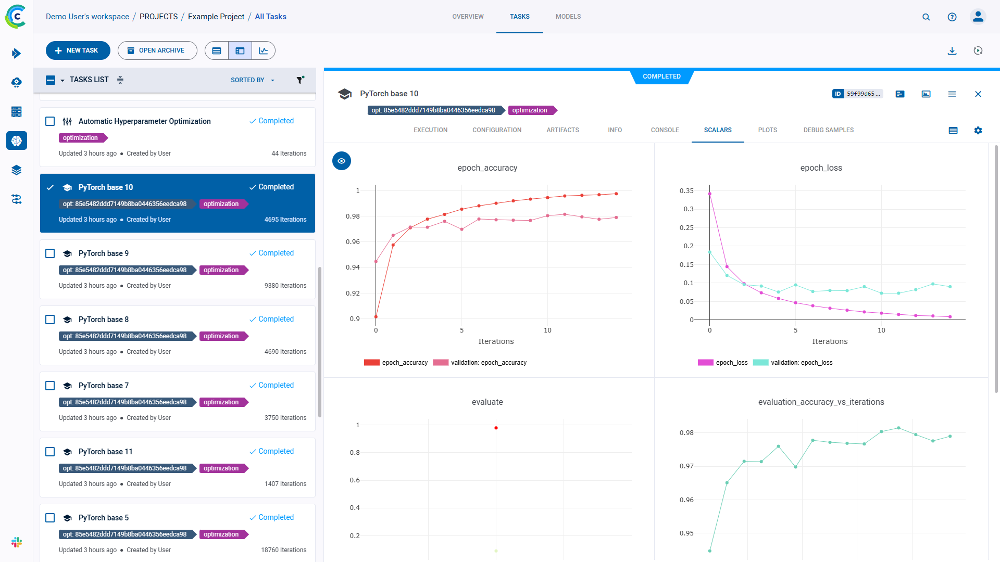

### Full Screen Details View

The full screen details view allows for easier viewing and working with experiment tracking and results. The experiments
table is not visible when the full screen details view is open. Perform experiment actions from the menu.

View a screenshot

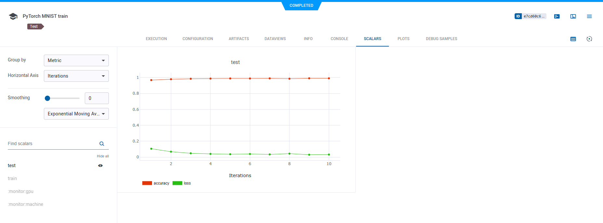

## Execution 
An experiment's **EXECUTION** tab of lists the following:
* Source code
* Uncommitted changes
* Installed Python packages
* Container details
* Output details

In full-screen mode, the source code and output details are grouped in the **DETAILS** section.

### Source Code

The Source Code section of an experiment's **EXECUTION** tab includes:
* The experiment's repository
* Commit ID
* Script path
* Working directory

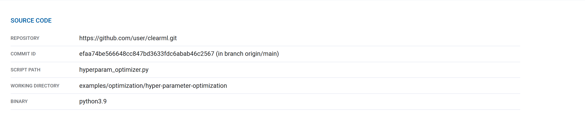

### Uncommitted Changes

ClearML displays the git diff of the experiment in the Uncommitted Changes section. 

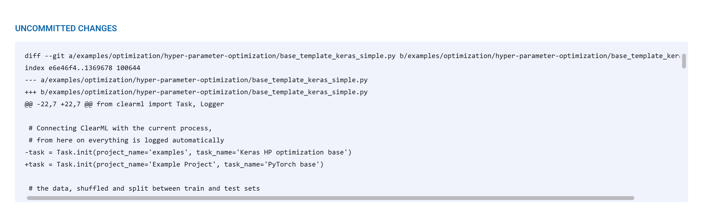

### Installed Packages

The Installed Packages section lists the experiment's installed Python packages and their versions.

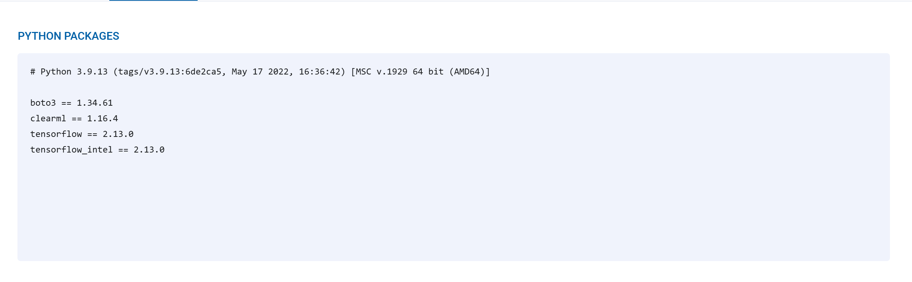

### Container
The Container section list the following information:
* Image - a pre-configured Docker that ClearML Agent will use to remotely execute this experiment (see [Building Docker containers](../clearml_agent.md#exporting-a-task-into-a-standalone-docker-container))
* Arguments - add Docker arguments
* Setup shell script - a bash script to be executed inside the Docker before setting up the experiment's environment

### Output
The Output details include:
* The output destination used for storing model checkpoints (snapshots) and artifacts (see also, [default_output_uri](../configs/clearml_conf.md#config_default_output_uri)
  in the configuration file, and `output_uri` in [`Task.init`](../references/sdk/task.md#taskinit) parameters).

* The logging level for the experiment, which uses the standard Python [logging levels](https://docs.python.org/3/howto/logging.html#logging-levels).

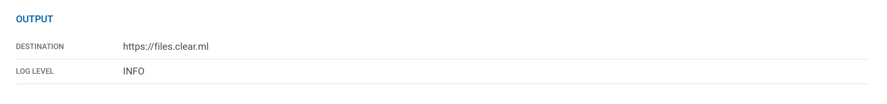

## Configuration

All parameters and configuration objects appear in the **CONFIGURATION** tab.

### Hyperparameters

Hyperparameters are grouped by their type and appear in **CONFIGURATION** **>** **HYPER PARAMETERS**.

#### Command Line Arguments

The **Args** parameter group shows automatically logged `argparse` arguments, and all older experiments parameters, except 
TensorFlow Definitions. Hover over a parameter, and the type, description, and default value appear, if they were provided.

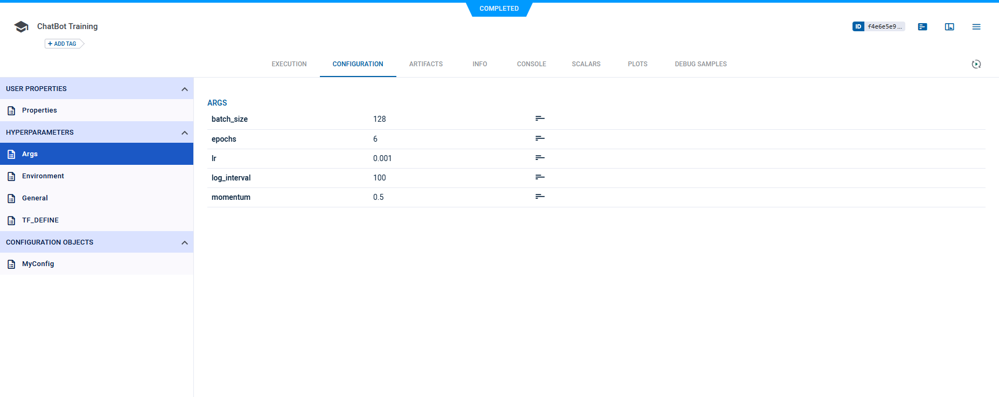

#### Environment Variables

If the `CLEARML_LOG_ENVIRONMENT` variable was set, the **Environment** group will show environment variables (see [this FAQ](../faq.md#track-env-vars)).

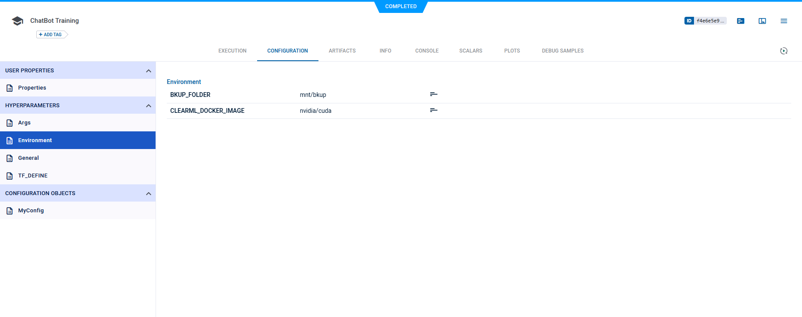

#### Custom Parameter Groups

Custom parameter groups show parameter dictionaries if the parameters were connected to the Task, using the `Task.connect` method,
with a `name` argument provided.

#### TensorFlow Definitions

The **TF_DEFINE** parameter group shows automatic TensorFlow logging.

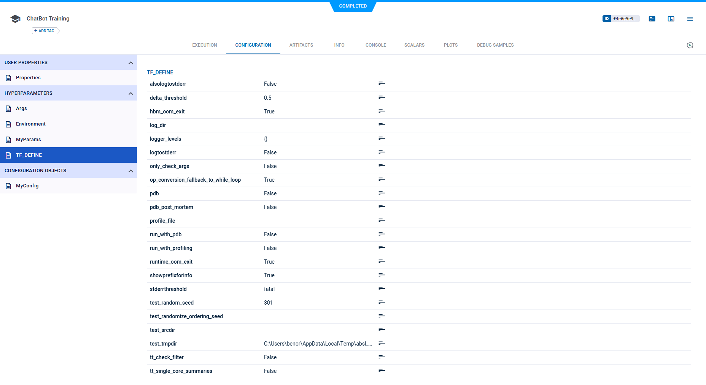

Once an experiment is run and stored in ClearML Server, any of these hyperparameters can be [modified](webapp_exp_tuning.md#modifying-experiments).

### User Properties

User properties allow to store any descriptive information in a key-value pair format. They are editable in any experiment,
except experiments whose status is *Published* (read-only).

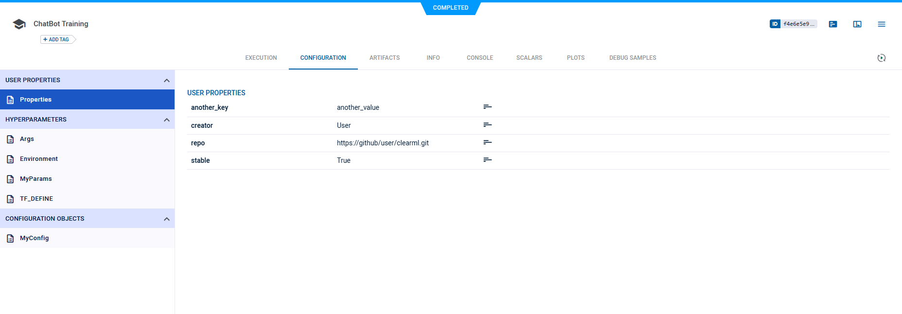

### Configuration Objects

ClearML tracks experiment (Task) model configuration objects, which appear in **Configuration Objects** **>** **General**.
These objects include those that are automatically tracked, and those connected to a Task in code (see [Task.connect_configuration](../references/sdk/task.md#connect_configuration)).

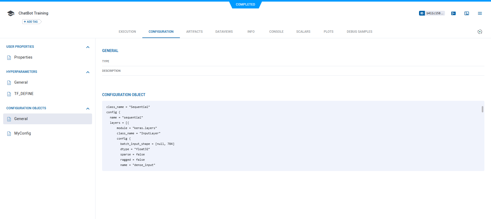

ClearML supports providing a name for a Task model configuration object (see the `name`
parameter in [`Task.connect_configuration`](../references/sdk/task.md#connect_configuration)).

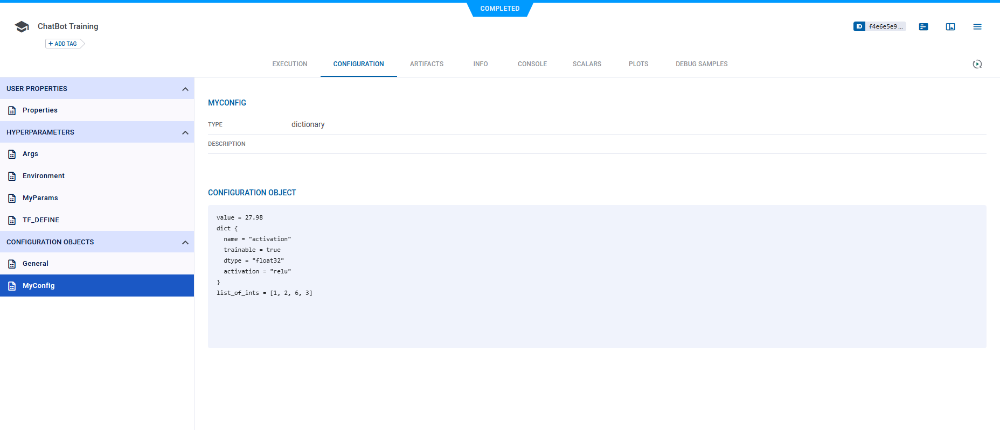

## Artifacts

Artifacts tracked in an experiment appear in the **ARTIFACTS** tab, and include models and other artifacts.

Artifacts location is stored in the `FILE PATH` field.
The UI provides locally stored artifacts with a 'copy to clipboard' action () 
to facilitate local storage access (since web applications are prohibited from accessing the local disk for security reasons).
The UI provides Network hosted (e.g. https://, s3:// etc. URIs) artifacts with a download action () 
to retrieve these files.

### Models

The input and output models appear in the **ARTIFACTS** tab. Models are associated with the experiment, but to see further model details,
including design, label enumeration, and general information, go to the **MODELS** tab, by clicking the model name, which is a hyperlink to those details.

**To retrieve a model:**

1. In the **ARTIFACTS** tab **>** **MODELS** **>** **Input Model** or **Output Model**, click the model name hyperlink.
1. In the model details **>** **GENERAL** tab **>** **MODEL URL**, either:

    * Download the model, if it is stored in remote storage.
    * Copy its location to the clipboard ,
      if it is in a local file.

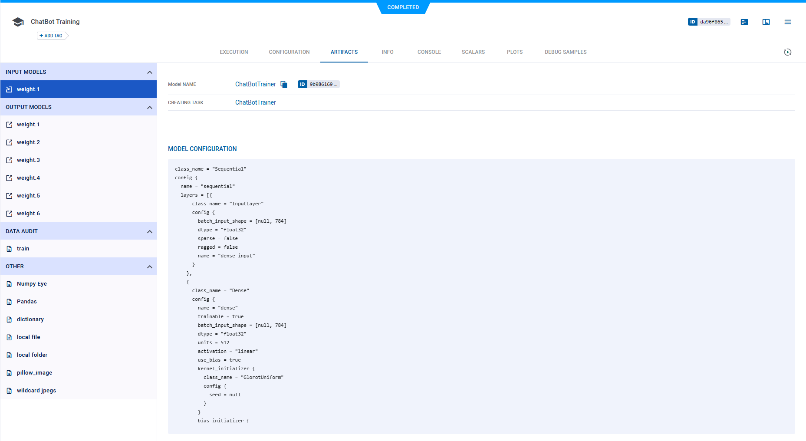

### Other Artifacts

Other artifacts, which are uploaded but not dynamically tracked after the upload, appear in the **OTHER** section. 
They include the file path, file size, and hash.

**To retrieve Other artifacts:**

In the **ARTIFACTS** tab **>** **OTHER** **>** Select an artifact **>** Either:
* Download the artifact , if it is stored in remote storage.
* Copy its location to the clipboard ,
      if it is in a local file.

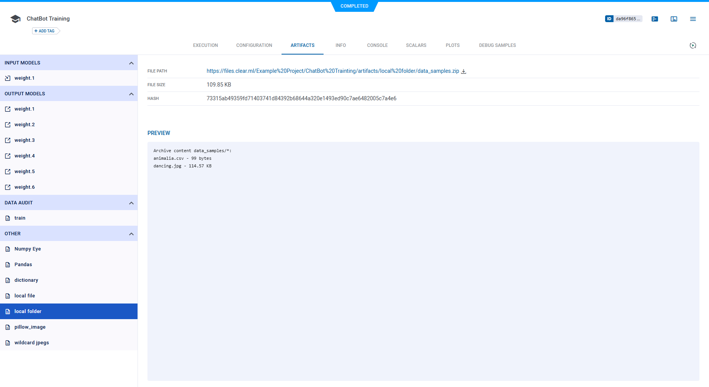

## General Information

General experiment details appear in the **INFO** tab. This includes information describing the stored experiment:
* The parent experiment
* Project name
* Creation, start, and last update dates and times
* User who created the experiment
* Experiment state (status)
* Whether the experiment is archived
* Runtime properties - Information about the machine running the experiment, including:
  * Operating system
  * CUDA driver version
  * Number of CPU cores
  * Number of GPUs
  * CPU / GPU type
  * Memory size
  * Host name 
  * Processor
  * Python version
* Experiment Progress    

    
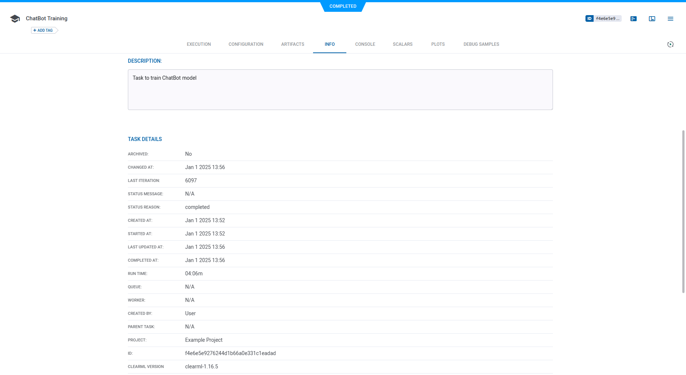

## Experiment Results

:::tip Embedding ClearML Visualization
You can embed experiment plots and debug samples into ClearML [Reports](webapp_reports.md). These visualizations are 
updated live as the experiment(s) updates. The Enterprise Plan and Hosted Service support embedding resources in external 
tools (e.g. Notion). See [Plot Controls](#plot-controls).  
:::

### Console

The complete experiment log containing everything printed to stdout and stderr appears in the **CONSOLE** tab. The full log
is downloadable. To view the end of the log, click **Jump to end**.

View a screenshot

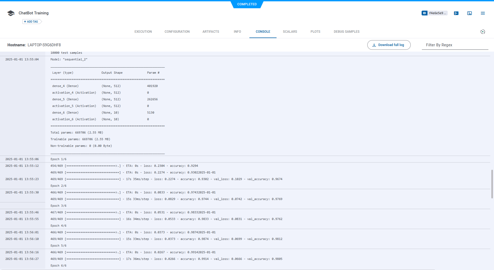

### Scalars

All scalars that ClearML automatically logs, as well as those explicitly reported in code, appear in
**SCALARS**. Scalar values are presented as time series line chart. To see the series for a metric in high resolution, 
view it in full screen mode by hovering over the graph and clicking .

:::info Full Screen Refresh
Scalar graphs in full screen mode do not auto-refresh. Click  
to update the graph. 
:::

#### Scalar Plot Tools

Use the scalar tools to improve analysis of scalar metrics. In the info panel, click  to use the tools. In the full screen details view, the tools
are on the left side of the window. The tools include:
* **Group by** - Select one of the following:
  * **Metric** - All variants for a metric on the same plot

    

    
View a screenshot

    

    

    

    

     
      
  * **None** - Group by metric and variant (individual metric-variant plots).

    

    
View a screenshot

    

    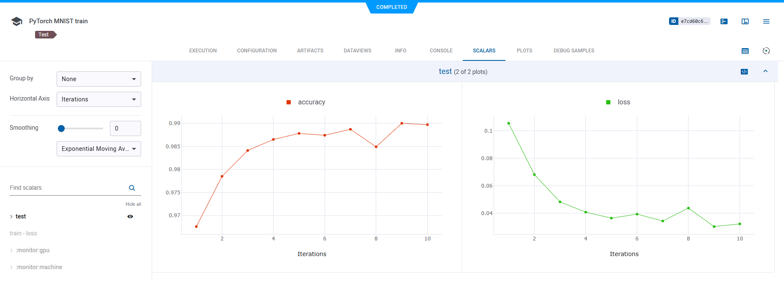

    

    

* Show / hide plots - Click **HIDE ALL**, and then click 
  on those you want to see.
* **Horizontal axis** modes (scalars, only) - Select one of the following:
  * **ITERATIONS**
  * **RELATIVE** - Time since experiment began
  * **WALL** - Local clock time
* Curve smoothing (scalars, only) - In **Smoothing** **>** Move the slider or type a smoothing factor between **0** and **0.999**.

To embed scalar plots in your [Reports](webapp_reports.md), hover over a plot and click , 
which will copy to clipboard the embed code to put in your Reports. In contrast to static screenshots, embedded resources 
are retrieved when the report is displayed allowing your reports to show the latest up-to-date data.

See additional [plot controls](#plot-controls) below.

### Plots
Non-time-series plots appear in **PLOTS**. These include data generated by libraries, visualization tools, and 
explicitly reported using the ClearML Logger. These may include 2D and 3D plots, tables (Pandas and CSV files), and 
Plotly plots. Individual plots can be shown / hidden or filtered by title.

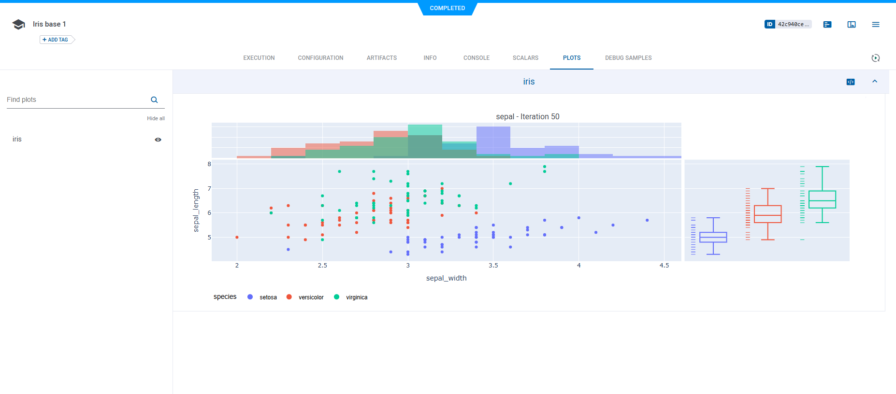

For each metric, the latest reported plot is displayed.

When viewing a plot in full screen (), 
older iterations are available through the iteration slider (or using the up/down arrow keyboard shortcut). Go to the 
previous/next plot in the current iteration using the  /  
buttons (or using the left/right arrow keyboard shortcut).

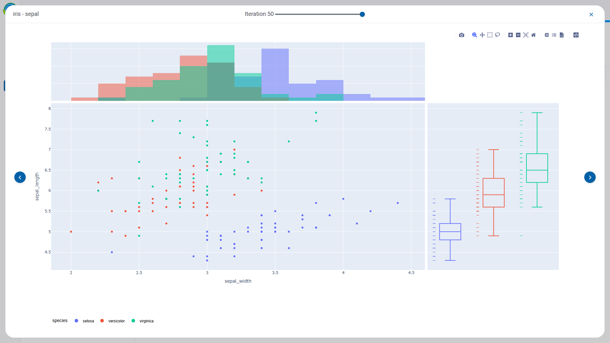

#### Plot Controls

The table below lists the plot controls which may be available for any plot (in the **SCALARS** and **PLOTS** tabs). 
These controls allow you to better analyze the results. Hover over a plot, and the controls appear.

|Icon|Description|
|---|---|
|  | Download plots as PNG files. |
|  | Pan around plot. Click , click the plot, and then drag. |
|  | To examine an area, draw a dotted box around it. Click  and then drag. |
|  | To examine an area, draw a dotted lasso around it. Click  and then drag. |
|  | Zoom into a section of a plot. Zoom in - Click  and drag over a section of the plot. Reset to original scale - Click  . |
|  | Zoom in. |
|  | Zoom out. |
|  | Reset to autoscale after zooming ( , , or ). |
|  | Reset axes after a zoom. |
|  | Show / hide spike lines. |
|  | Show the closest data point on hover, including horizontal and vertical axes values. Click  and then hover over a series on the plot. |
|  | Compare data on hover. Click  and then hover over the plot. |
|  | Switch to logarithmic view. |
|  | Hide / show the legend. |
| | Switch between original and auto-fitted plot dimensions. The original layout is the plot's user-defined dimensions. |
|  | Download plot data as a JSON file. |
|  | Download plot data as a CSV file. |
|  | Expand plot to entire window. When used with scalar graphs, full screen mode displays plots with all data points, as opposed to an averaged plot |
|  | Refresh scalar graphs in full screen mode to update it.  | 
|  | Copy to clipboard the resource embed code. This opens the following options: <ul><li>**Embed in External tool** (available in the ClearML Enterprise plan and Hosted Service) - Copy code to add to external tools (e.g. Notion). </li><li>**Embed in ClearML report** - Copy code to add to a [report](webapp_reports.md)</li></ul> In contrast to static screenshots, embedded resources are retrieved when the tool/report is displayed allowing your tools/reports to show the latest up-to-date data. |

 

#### 3D Plot Controls 
|Icon|Description|
|---|---|
| | Switch to orbital rotation mode - rotate the plot around its middle point. |
| | Switch to turntable rotation mode - rotate the plot around its middle point while constraining one axis |
| | Reset axes to default position. |

### Debug Samples

Experiment outputs such as images, audio, and videos appear in **DEBUG SAMPLES**. These include data generated by 
libraries and visualization tools, and explicitly reported using the [ClearML Logger](../fundamentals/logger.md). 

You can view debug samples by metric at any iteration. Filter the samples by metric by selecting a metric from the 
dropdown menu above the samples. The most recent iteration appears first.

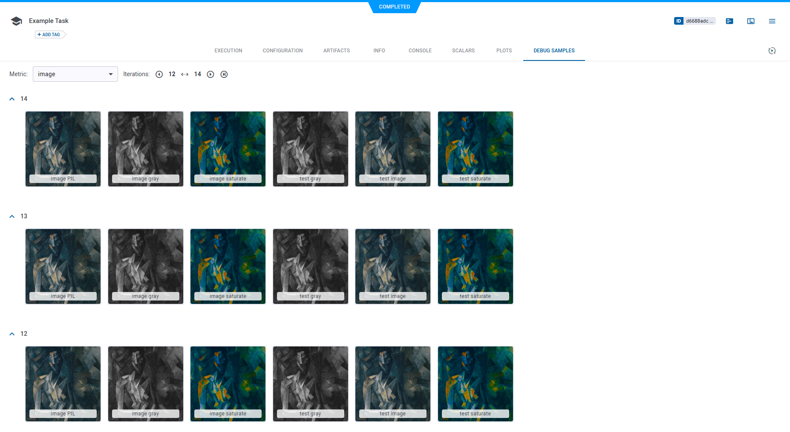

For each metric, the latest reported debug sample is displayed.

Click a sample to view it in full screen. If the sample is video or audio, the full screen mode includes a player. 

When viewing a sample in full screen, older iterations are available through the iteration slider (or using the up/down 
arrow keyboard shortcut). Go to the previous/next sample in the current iteration using the  /  
buttons (or using the left/right arrow keyboard shortcut).

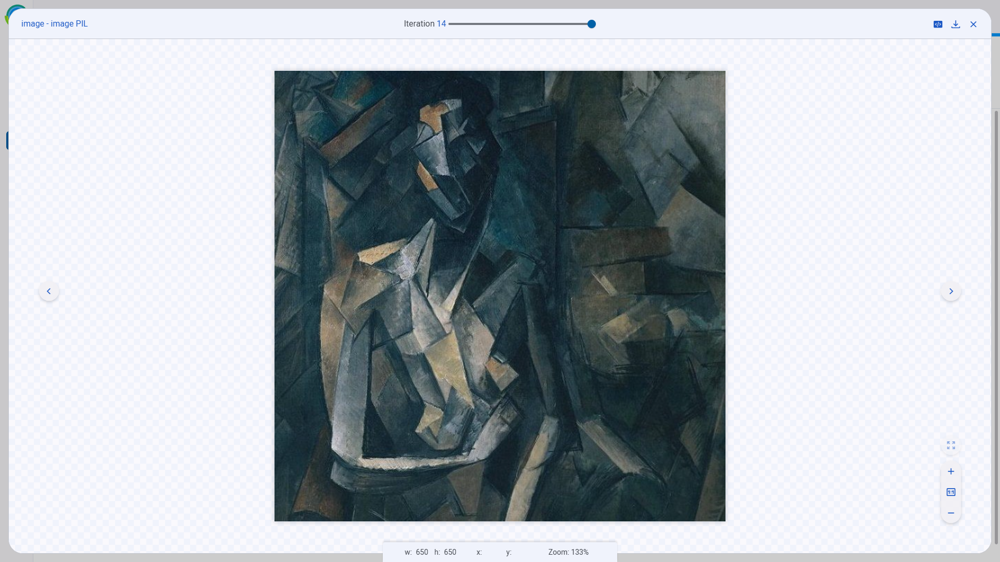

## Tagging Experiments

Tags are user-defined, color-coded labels that can be added to experiments (and models), allowing to easily identify and
group experiments. Tags can show any text. For example, add tags for the type of remote machine experiments were executed
on, label versions of experiments, or apply team names to organize experimentation.

* To add tags and change tag colors:
    1. Click the experiment **>** Hover over the tag area **>** **+ADD TAG** or  (menu)
    1. Do one of the following:
        * Add a new tag - Type the new tag name **>** **(Create New)**.
        * Add an existing tag - Click a tag.
        * Change a tag's colors - Click **Tag Colors** **>** Click the tag icon **>** **Background** or **Foreground** **>** Pick a color **>** **OK** **>** **CLOSE**.
* To remove a tag - Hover over the tag **>** **X**.

## Locating the Experiment (Task) ID

The task ID appears in the experiment page's header. 
