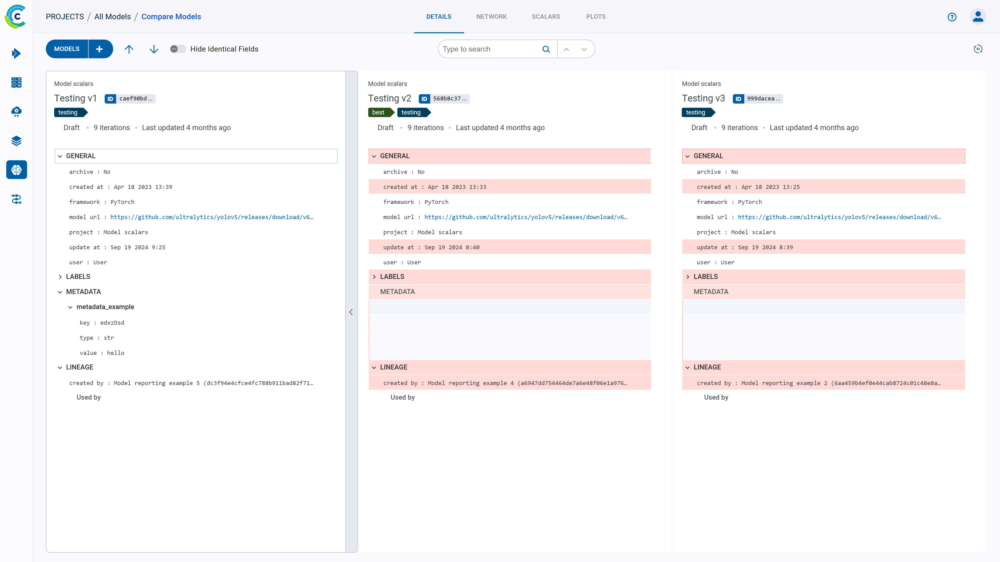
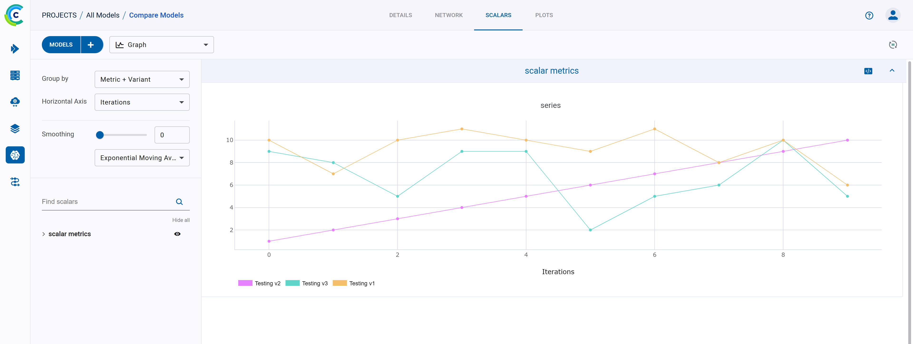
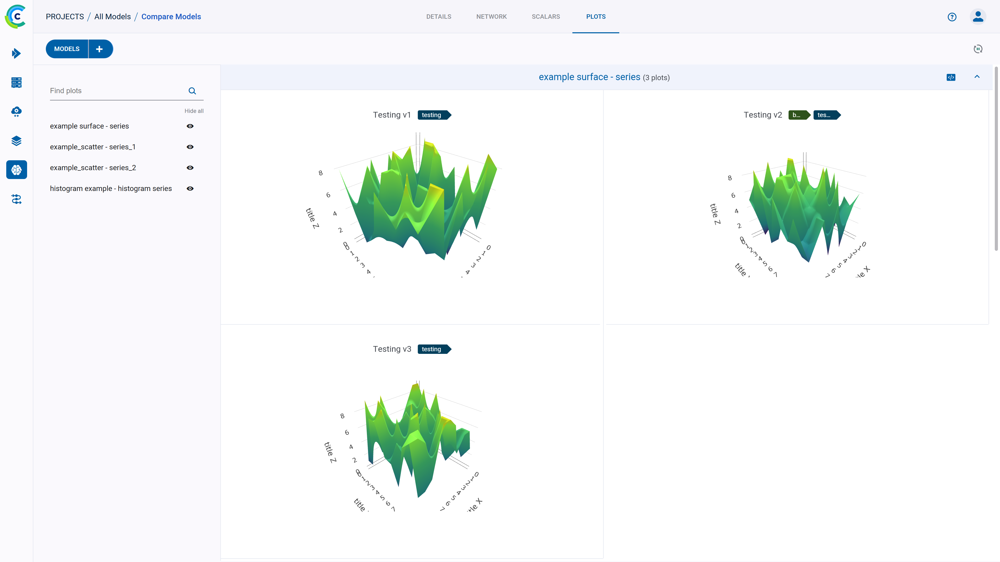

The ClearML Web UI provides features for comparing models, allowing to locate, visualize, and analyze model differences. 
You can view the differences in model details, configuration, scalar values, and more.

## Selecting Models to Compare
To select models to compare:
1. Go to a models table that includes the models to be compared.
1. Select the models to compare. Once multiple models are selected, the batch action bar appears.
1. In the batch action bar, click **COMPARE**. 

The comparison page opens in the DETAILS tab, showing a column for each model.

## Modifying Model Selection
You can modify the model selection while comparing. 
1. Click **+ Add Model** in the top left corner of any of the comparison pages. This will open up a window with a model 
table with the currently compared models at the top.
1. Find the models to add by sorting and [filtering](webapp_model_table.md#filtering-columns) the models with the 
appropriate column header controls. Alternatively, use the search bar to find models by name.
1. Select models to include in the comparison (and / or clear the selection of any models you wish to remove).
1. Click **APPLY**.

## Comparison Modes
The comparison tabs provides the following views:
* Side-by-side textual comparison
* Merged plot comparison 
* Side-by-side graphic comparison 

### Side-by-side Textual Comparison

In the **Details**, **Network**, and **Scalars** (Values mode) tabs, you can view differences in the models' nominal 
values. **Details** displays the models' general information, labels, and metadata. **Network** displays the models' 
configuration. **Scalars** (in Values mode) displays the models’ scalar values (min, max, or last). Each model's 
information is displayed in a column, so each field is lined up side-by-side. 

The model on the left is used as the base model, to which the other models are compared. You can set a new base model 
in one of the following ways:
* Click  
on the top right of the model that will be the new base.
* Click on the new base model and drag it all the way to the left

The differences between the models are highlighted. You can obscure identical fields by switching on the
**Hide Identical Fields** toggle.

### Graphic Comparison
The **Scalars** (Graph mode) and **Plots** tabs display plots attached to the models. The **Scalars** tab compares 
scalar values as time series line charts. The **Plots** tab compares the last reported iteration sample of each 
metric/variant combination per compared model. 

Line, scatter, and bar graphs are compared by a single plot per metric/variant into which the plots of all compared 
models are combined.

The rest of the plots which can’t be merged are displayed separately for each model. 

For better plot analysis, see [Plot Controls](webapp_exp_track_visual.md#plot-controls).
