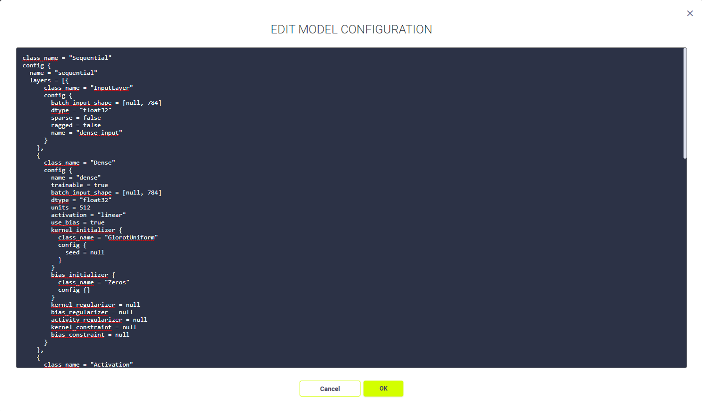
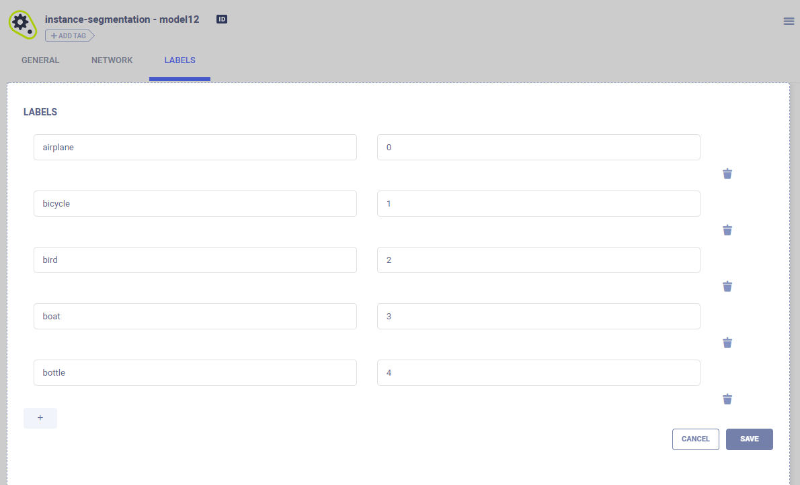

In the models table, modify models that have a status of *Draft* (status *Published* is read-only). Modify the model
configuration and label enumeration.

## Model Configuration

**To edit the model configuration:**

* In the **MODELS** tab, click a model **>** **NETWORK** **>** Hover over **MODEL CONFIGURATION** **>** **CLEAR**
  (to delete the design) or **EDIT** **>** If editing, an editor textbox appears **>** edit **>** **OK**.

### Label Enumeration

For each class, label enumeration contains the class name (key) and value.

**To add, change, or delete label enumeration classes:**
* In the **MODELS** tab, click a model **>** **LABELS** **>** Hover over **LABELS** **>** **EDIT** **>** **+**, edit a
  key or value, or  (delete) **>** **SAVE**.

