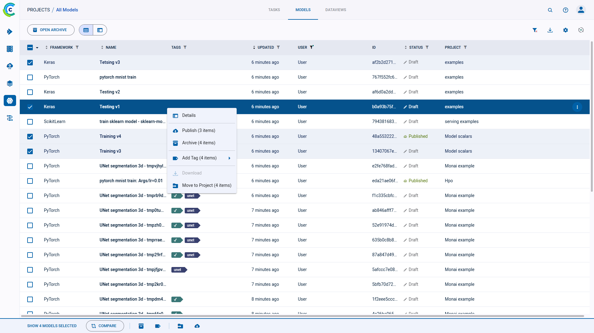

The models table is a [customizable](#customizing-the-models-table) list of models associated with the experiments in a project. From the models table,
view model details, and modify, publish, archive, tag, and move models to other projects.

## Models Table Columns

The models table contains the following columns:

| Column | Description | Type |
|---|---|---|
| **FRAMEWORK** | The model framework. The list includes all frameworks, including custom frameworks. | Default |
| **NAME** | Model name. | Default |
| **TAGS** | User-defined labels added to models for grouping and organization. | Default |
| **STATUS** | The status of the model, which can be *Draft* (editable) or *Published* (read-only). | Default |
| **PROJECT** | The project with which the model is associated.| Default |
| **USER** | The user who ran the experiment that created the model, or the user who imported the model.| Default |
| **TASK** | The experiment (Task) name that created the model. | Default |
| **UPDATED** | Elapsed time since the model was updated. Hover over the elapsed time to view the date and time.| Default |
| **DESCRIPTION** | The model description. | Default (hidden) |

## Customizing the Models Table

The models table is customizable. Changes are persistent (cached in the browser) and represented in the URL, so customized settings
can be saved in a browser bookmark and shared with other **ClearML** users to collaborate.

Customize any combination of the following:

* Dynamic column ordering - Drag a column title to a different position.
* Show / hide columns - Click 
  **>** select or clear the checkboxes of columns to show or hide.
* Filter columns - Type of experiment, experiment status (state), user
* Sort columns - Metrics and hyperparameters, type of experiment, experiment name, start and last update elapsed time, and last iteration.
* Column autofit - In the column heading, double click a resizer (column separator).

:::note
The following models-table customizations are saved on a **per project** basis: 
* Columns order
* Column width
* Active sort order
* Active filters
* Custom columns

If a project has subprojects, the models can be viewed by their subproject groupings or together with 
all the models in the project. The customizations of these two views are saved separately. 
:::

## Model Actions

The following table describes the actions that can be done from the models table, including the states that
allow each feature. Model states are *Draft* (editable) and *Published* (read-only). 

| ClearML Action | Description | States Valid for the Action |
|---|---|--|
| View details | Model details include general information, the model configuration, and label enumeration. Click a model, and the info panel slides open. | Any state |
| Publish | Publish a model to prevent changes to it. *Published* models are read-only. If a model is Published, its experiment also becomes Published (read-only). | *Draft* |
| Archive | To more easily work with active models, move a model to the archive. See [Archiving](webapp_archiving). | Any state |
| Tags | Tag models with color-coded labels to assist in organizing work. See [tagging models](#tagging-models). | Any state |
| Download | Download a model. The file format depends upon the framework. | *Published* |
| Move to project | To organize work and improve collaboration, move a model to another project. | Any state |

These actions can be accessed with the context menu (when right-clicking a model or clicking the menu button 
in a model's info panel).

Some actions mentioned in the chart above can be performed on multiple models at once.
Select multiple models, then use either the context menu, or the bar that appears at the bottom of the page, to perform
operations on the selected models. The context menu shows the number of models that can be affected by each action. 
The same information can be found in the bottom menu, in a tooltip that appears when hovering over an action icon.   

## Tagging Models

Tags are user-defined, color-coded labels that can be added to models (and experiments), allowing to easily identify and
group of experiments. A tag can show any text, for any purpose. For example, add tags for the type of remote machine
experiments execute on, label versions of experiments, or apply team names to organize experimentation.

* To Add tags and to change tag colors:
    1. Click the experiment **>** Hover over the tag area **>** **+ADD TAG** or 
       (menu)
    1. Do one of the following:
        * Add a new tag - Type the new tag name **>** **(Create New)**.
        * Add an existing tag - Click a tag.
        * Change a tag's colors - Click **Tag Colors** **>** Click the tag icon **>** **Background** or **Foreground**
          **>** Pick a color **>** **OK** **>** **CLOSE**.
* To remove a tag - Hover over the tag **>** **X**.
