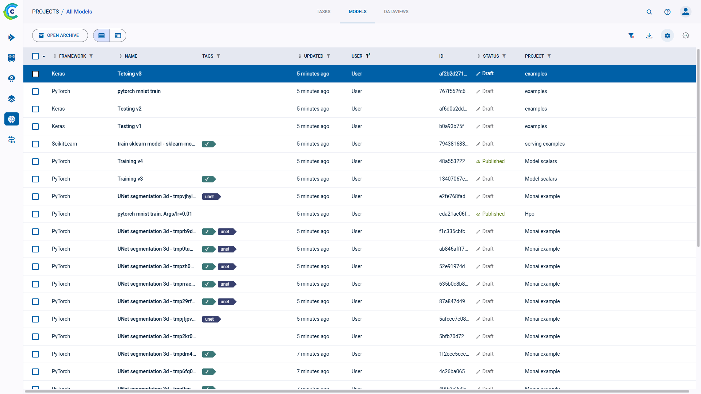

The models table is a [customizable](#customizing-the-models-table) list of models associated with the experiments in a project. From the models table,
view model details, and modify, publish, archive, tag, and move models to other projects.

View the models table in table view  
or in details view ,
using the buttons on the top left of the page. Use the table view for a comparative view of your models according to 
columns of interest. Use the details view to access a selected model’s details, while keeping the model list in view. 
Details view can also be accessed by double clicking a specific model in the table view to open its details view. 

## Models Table Columns

The models table contains the following columns:

| Column | Description | Type |
|---|---|---|
| **FRAMEWORK** | The model framework. The list includes all frameworks, including custom frameworks. | String |
| **NAME** | Model name. | String |
| **TAGS** | User-defined labels added to models for grouping and organization. | Tag |
| **STATUS** | The status of the model, which can be *Draft* (editable) or *Published* (read-only). | String |
| **PROJECT** | The project with which the model is associated.| String |
| **USER** | The user who ran the experiment that created the model, or the user who imported the model.| String |
| **TASK** | The experiment (Task) name that created the model. | String |
| **UPDATED** | Elapsed time since the model was updated. Hover over the elapsed time to view the date and time.| Date-time |
| **DESCRIPTION** | The model description (not shown by default). | String |
| *Metadata*| User defined metadata key column. Available options depend upon the models in the table. | String |

## Customizing the Models Table

The models table is customizable. Changes are persistent (cached in the browser) and represented in the URL, so customized settings
can be saved in a browser bookmark and shared with other ClearML users to collaborate.

Customize the table using any of the following:

* Dynamic column order - Drag a column title to a different position.
* Resize columns - Drag the column separator to change the width of that column. Double click the column separator for 
  automatic fit.
* Changing table columns
    * Show / hide columns - Click 
  **>** mark or clear the checkboxes of columns to show or hide.
    * Add custom columns - Click **+ ADD CUSTOM METADATA COLUMN** to add metadata columns to the main column list. Added 
      columns are by default displayed in the table. You can remove the metadata columns from the main column list or the 
      column addition window. 
* Filter columns - By ML framework, tags, user
* Sort columns - By metadata, ML framework, description, and last update elapsed time.

:::note
The following models-table customizations are saved on a **per project** basis: 
* Columns order
* Column width
* Active sort order
* Active filters
* Custom columns

If a project has subprojects, the models can be viewed by their subproject groupings or together with 
all the models in the project. The customizations of these two views are saved separately. 
:::

## Model Actions

The following table describes the actions that can be done from the models table, including the states that
allow each feature. Model states are *Draft* (editable) and *Published* (read-only). 

Access these actions with the context menu in any of the following ways:
* In the models table, right click a model, or hover over a model and click 
* In a model's info panel, click the menu button 

| ClearML Action | Description | States Valid for the Action |
|---|---|--|
| Details | View model details, which include general information, the model configuration, and label enumeration. Can also be accessed by double clicking a model in the models table | Any state |
| Publish | Publish a model to prevent changes to it. *Published* models are read-only. If a model is Published, its experiment also becomes Published (read-only). | *Draft* |
| Archive | To more easily work with active models, move a model to the archive. See [Archiving](webapp_archiving.md). | Any state |
| Restore | Action available in the archive. Restore a model to the active model table. | Any state |
| Add Tag | Tag models with color-coded labels to assist in organizing work. See [tagging models](#tagging-models). | Any state |
| Download | Download a model. The file format depends upon the framework. | *Published* |
| Move to Project | To organize work and improve collaboration, move a model to another project. | Any state |
| Custom action | The ClearML Enterprise Server provides a mechanism to define your own custom actions, which will appear in the context menu. See [Custom UI Context Menu Actions](../deploying_clearml/clearml_server_config.md#custom-ui-context-menu-actions). | Any state |

Some actions mentioned in the chart above can be performed on multiple models at once.
Select multiple models, then use either the context menu, or the bar that appears at the bottom of the page, to perform
operations on the selected models. The context menu shows the number of models that can be affected by each action. 
The same information can be found in the bottom menu, in a tooltip that appears when hovering over an action icon.   

## Tagging Models

Tags are user-defined, color-coded labels that can be added to models (and experiments), allowing to easily identify and
group of experiments. A tag can show any text, for any purpose. For example, add tags for the type of remote machine
experiments execute on, label versions of experiments, or apply team names to organize experimentation.

* To Add tags and to change tag colors:
    1. Click the experiment **>** Hover over the tag area **>** **+ADD TAG** or 
       (menu)
    1. Do one of the following:
        * Add a new tag - Type the new tag name **>** **(Create New)**.
        * Add an existing tag - Click a tag.
        * Change a tag's colors - Click **Tag Colors** **>** Click the tag icon **>** **Background** or **Foreground**
          **>** Pick a color **>** **OK** **>** **CLOSE**.
* To remove a tag - Hover over the tag **>** **X**.

## Filtering Columns

Filters can be applied by clicking  
on a column, and the relevant filter appears.

There are a couple filter types:
* Value set - Choose which values to include from a list of all values in the column
* Tags - Choose which tags to filter by from a list of all tags used in the column. 
  * Filter by multiple tag values using the **ANY** or **ALL** options, which correspond to the logical "AND" and "OR" respectively. These 
    options appear on the top of the tag list.
  * Filter by the absence of a tag (logical "NOT") by clicking its checkbox twice. An `X` will appear in the tag's checkbox. 
  
Once a filter is applied to a column, its filter icon will appear with a highlighted dot on its top right 
( ).  

To clear all active filters, click  
in the top right corner of the table.