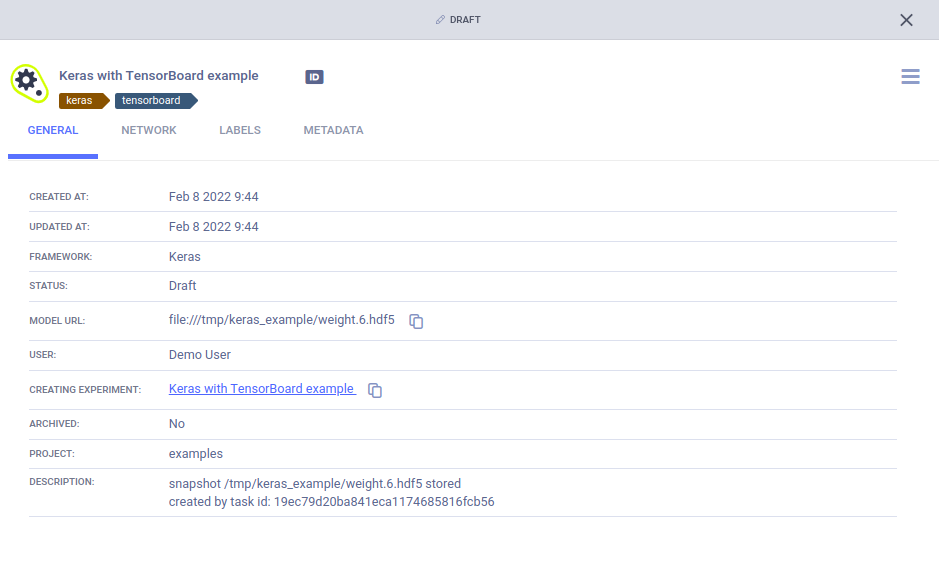
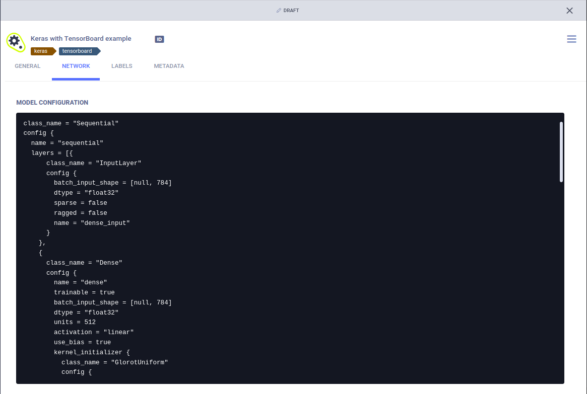
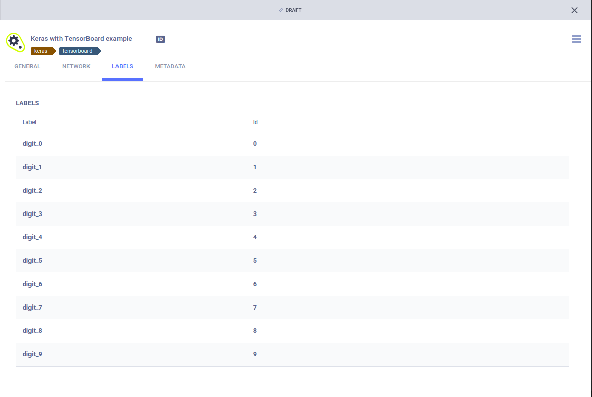
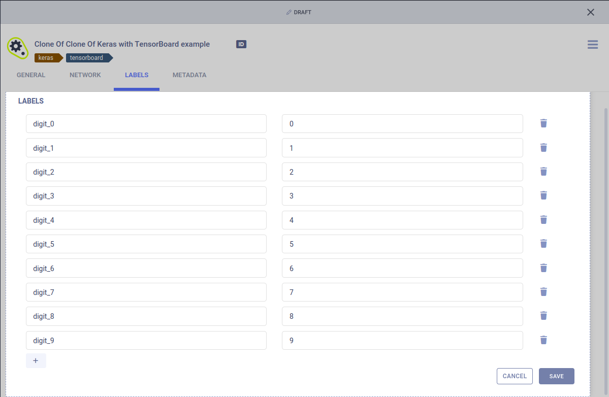
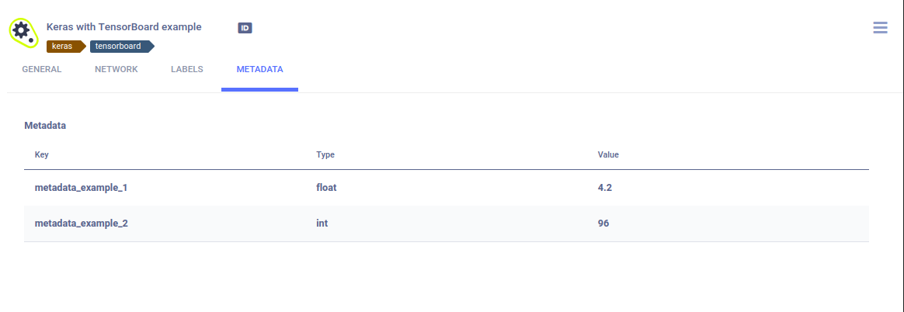
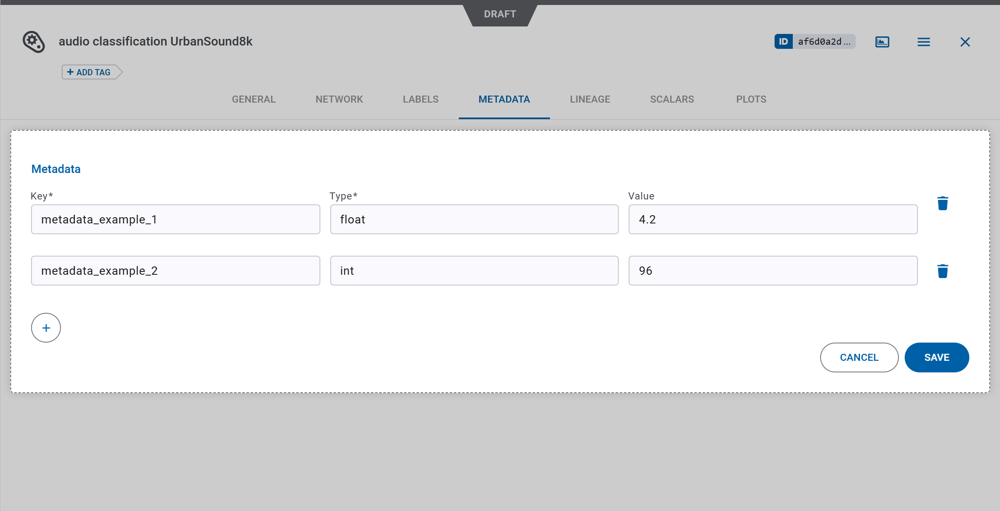
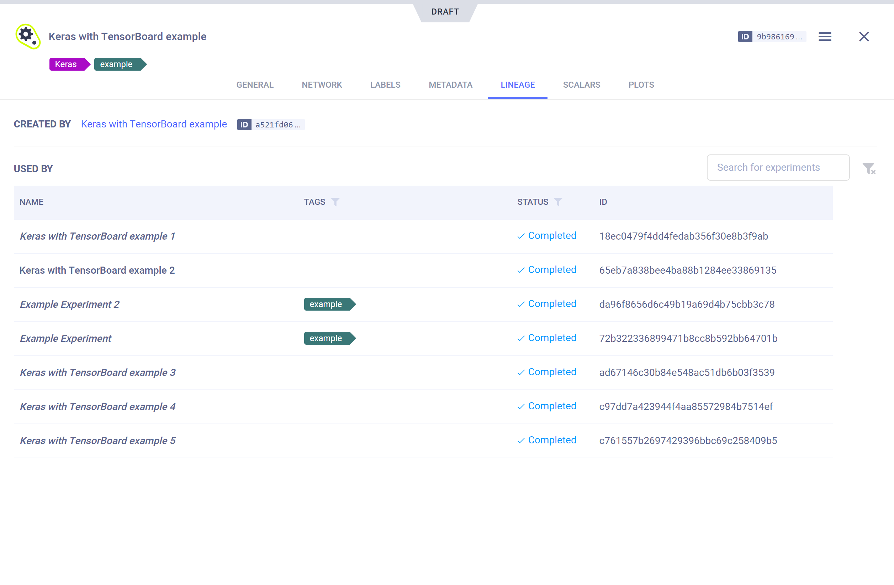
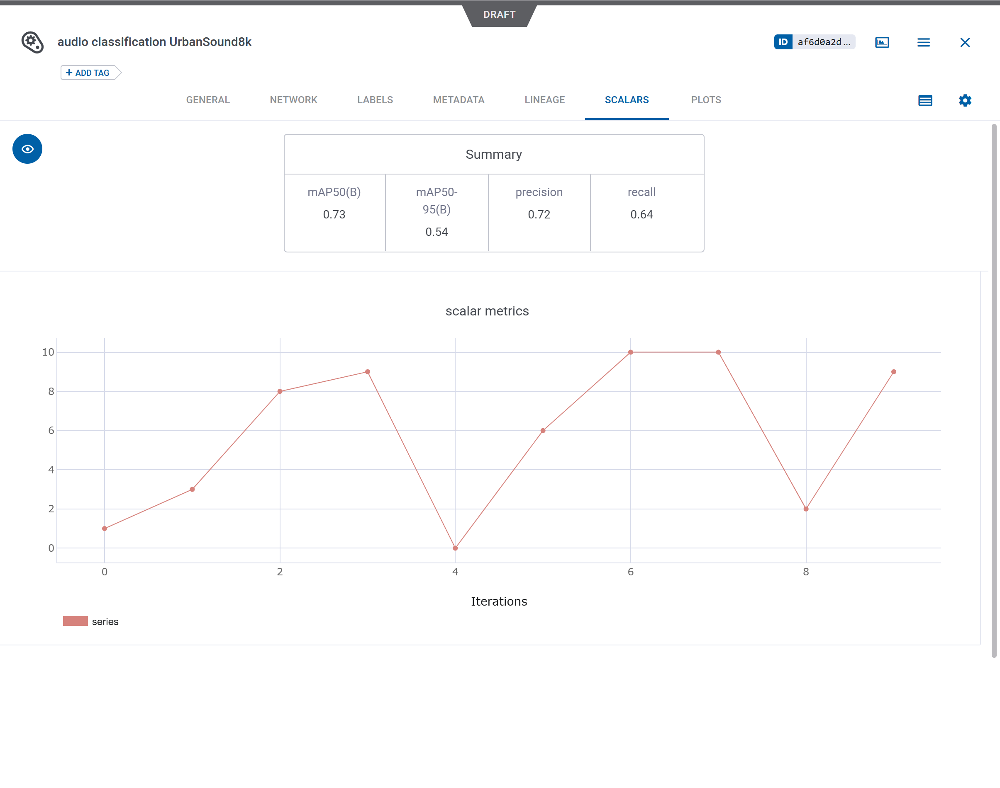
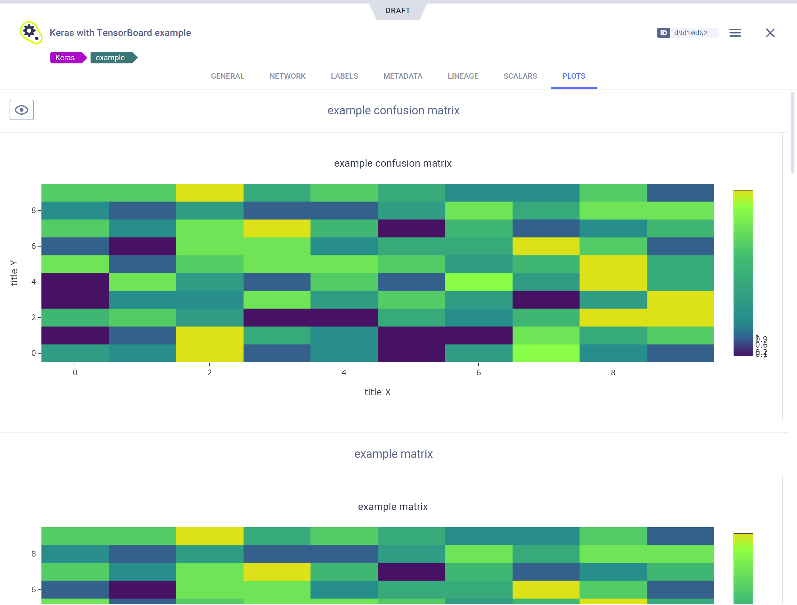

In the models table, double-click on a model to view and / or modify the following: 
* General model information
* Model configuration
* Model label enumeration
* Model metadata 

Models in *Draft* status are editable, so you can modify their configuration, label enumeration, and metadata. 
*Published* models are read-only, so only their metadata can be modified.

## General Model Information

The **GENERAL** tab lists the model's General information including: 
* Model URL
* ML Framework
* Creating experiment (ClearML experiment that generated the model)
* Description (click to edit)

If the model is stored in a network location, it can be downloaded by clicking the model URL. If the model was stored on 
the local machine you can copy its URL to manually access it.

## Model Configuration 

The **NETWORK** tab displays the model's configuration. 

Hover over the model configuration area to access the following actions:

*  Search 
*  Copy configuration 
* CLEAR (for Draft models) - Delete the configuration 
* EDIT (for Draft models) - Modify / Add model configuration

## Label Enumeration

The **Label Enumeration** tab displays for each class label (“Label”) its name and enumerated value (“ID”).

To modify / add / delete class labels (for Draft models), hover over the label table, then click EDIT. This opens the 
label editing window. 

## Metadata

The **METADATA** tab lists the model's metadata entries, which consist of a key, type, and value. 

To modify / add / delete model metadata items, hover over Metadata, then click EDIT. This opens the Metadata editing 
window.

## Lineage

The **LINEAGE** tab displays the model's creating experiment (the ClearML experiment that generated the model) and lists 
all the tasks where the model is used as an input model. Click an experiment to navigate to its page.

You can filter the task list by tags and task status.

Use the search bar to look for experiments based on their name, ID, or description.

## Scalars

The **SCALARS** tab displays all scalar plots attached to a model. Scalar values are presented as time series line 
charts. To see the series for a metric in high resolution, view it in full screen mode by hovering over the graph and 
clicking .
For better plot analysis, see [Plot Controls](webapp_exp_track_visual.md#plot-controls).

Reported single value scalars are aggregated into a table plot displaying scalar names and values. 

## Plots 

The **PLOTS** tab displays plots attached to a model. For better plot analysis, see [Plot Controls](webapp_exp_track_visual.md#plot-controls).

