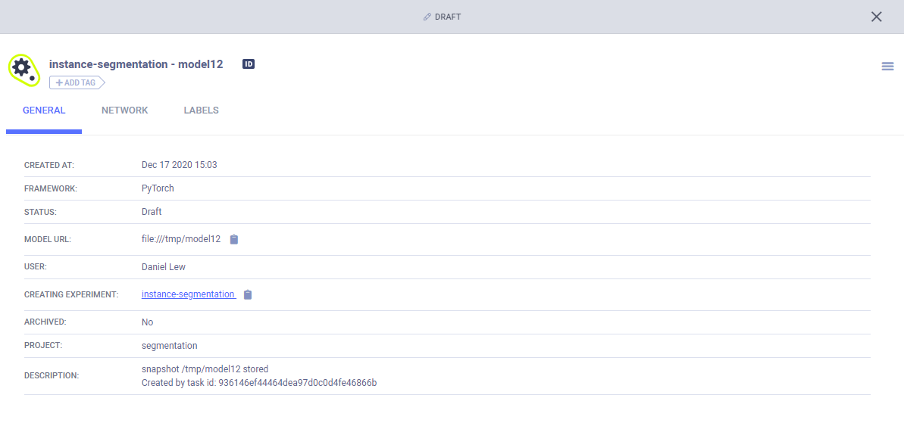
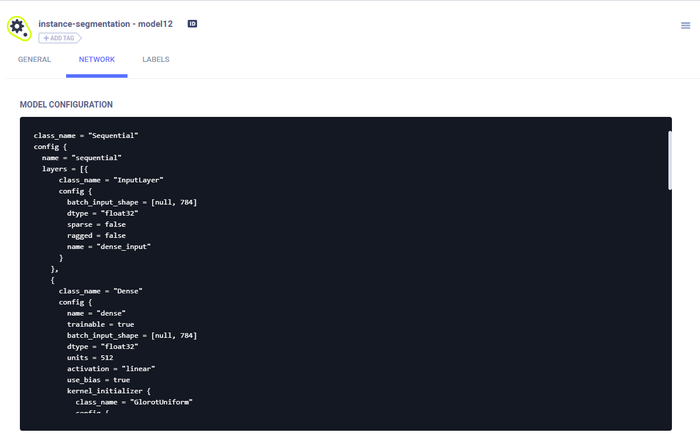
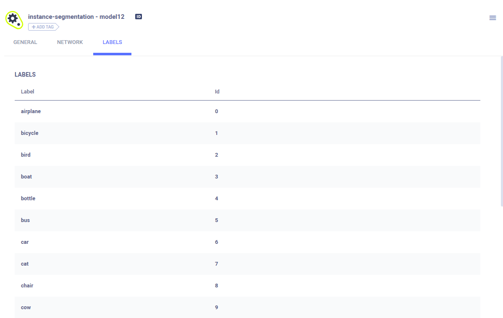

In the models table, click on a model to view its general information, configuration, and label enumeration.
    
## General Model Information

General information includes: 
* Model URL
* Model checkpoints (snapshots)
* Framework
* Creating experiment (experiment that stored the model in the **ClearML Server**)

If a model is a local file, it is downloadable. If a model is in another type of storage location, the URL can be copied to the clipboard. 

## Model Configuration 

## Label Enumeration

For each class, label enumeration contains the class name (key) and value.

