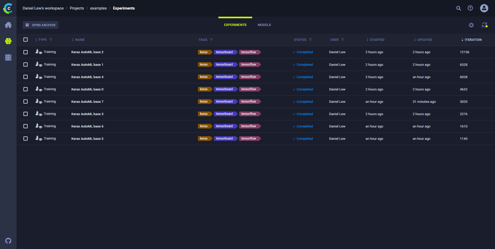

The **ClearML Web UI** is the graphical user interface for the ClearML platform, which includes:
* Experiment management
* Browsing
* Resource utilization monitoring
* Profile management
* Direct access to the ClearML community (Slack Channel, Youtube, and GitHub).

The **ClearML Web UI** is composed of the following pages:
* The [Home](webapp_home.md) Page - The dashboard for recent activity, and quick access to experiments and projects.
* The [Projects Page](webapp_projects_page.md) - The main experimentation page, where specific projects can be opened.

  Each project page contains customizable [experiments](webapp_exp_table.md) and [models](webapp_model_table.md) tables
  with the following options:
    * [Track experiments and visualize results](webapp_exp_track_visual.md)
    * [Reproduce experiments](webapp_exp_reproducing.md)
    * [Tune experiments](webapp_exp_tuning.md)
    * [Compare experiments](webapp_exp_comparing.md)
    * [Share experiments and their models](webapp_exp_sharing.md) with users of other hosted service workspaces
    * [Archive experiments and models](webapp_archiving.md)
    * [View](webapp_model_viewing.md) and [modify](webapp_model_modifying.md) models

* The [Workers and Queues](webapp_workers_queues.md) Page - The resource monitoring and queues management page.
* The [Profile Page](webapp_profile.md) - Manage a ClearML user account:
  * Create ClearML credentials
  * Provide Cloud Storage Access credentials for the **ClearML Web UI**
  * If using the **ClearML Hosted Service**, invite users and switch workspaces

In addition, from the **ClearML Web UI**, use these buttons to access the ClearML community:

* The **ClearML**  Slack channel. Ask questions about **ClearML**.
* The **ClearML**  YouTube Channel. View our tutorials, presentations, and discussions.
* The **ClearML**  GitHub repository.

For more information, see the [Community page](../community.md).
