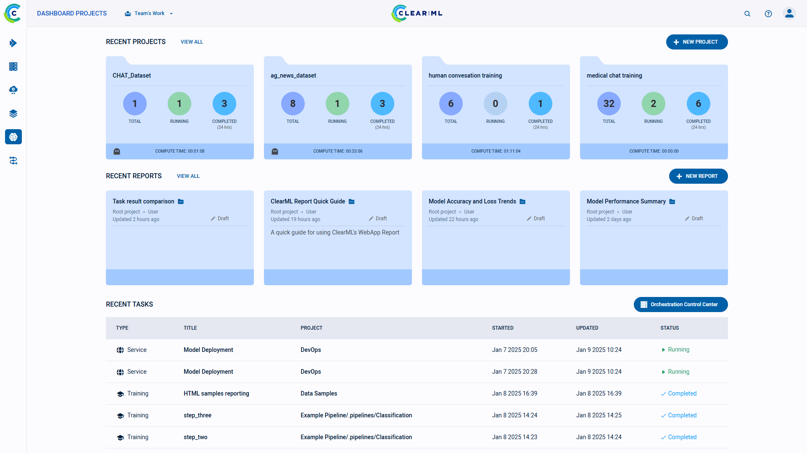

The **ClearML Web UI** is the graphical user interface for the ClearML platform, which includes:
* Experiment management
* Browsing
* Resource utilization monitoring
* Profile management
* Direct access to the ClearML community (Slack Channel, Youtube, and GitHub).

The ClearML Web UI is composed of the following pages:
* [Dashboard](webapp_home.md)  - 
  The dashboard for recent activity and quick access to experiments and projects.
* [Projects](webapp_projects_page.md)  - 
  The main experimentation page. Access your experiments and models as they are organized into projects.
  The [experiments](webapp_exp_table.md) and [models](webapp_model_table.md) are displayed in tables
  which let you:
    * [Track ongoing experiments and visualize their results](webapp_exp_track_visual.md)
    * [Reproduce previously run experiments](webapp_exp_reproducing.md)
    * [Tune experiments with no code change](webapp_exp_tuning.md)
    * [Compare experiments](webapp_exp_comparing.md)
    * [Share experiments and their models](webapp_exp_sharing.md) with other ClearML hosted service users 
    * [Archive experiments and models](webapp_archiving.md)
* [Datasets](datasets/webapp_dataset_page.md)  - View and manage your datasets. 
* [Pipelines](pipelines/webapp_pipeline_page.md)  - View and manage your pipelines.
* [Reports](webapp_reports.md)  - View and manage your reports.
* [Workers and Queues](webapp_workers_queues.md)  - The resource monitoring and queues management page.
* [Applications](applications/apps_overview.md)   - ClearML's GUI applications for no-code workflow execution.
* [Settings](webapp_profile.md) (available through the profile menu ) - 
  Manage your ClearML user account:
  * Set WebApp preferences
  * Manage workspace API credentials
  * Configure Cloud Storage Access credentials for the ClearML Web UI
  * ClearML Hosted service specific options
    * View usage information
    * Manage users and workspaces
    * Manage resource access permissions (available in the ClearML Enterprise plan)
  

## WebApp Menus 

Click the help menu button 
in the top right corner of the web UI screen to access the self-help resources including: 
* **ClearML Python Package setup** - Instruction to get started with the `clearml` Python package
* **[ClearML on Youtube](https://www.youtube.com/c/ClearML/featured)**  - Instructional videos on integrating ClearML into your workflow
* **Online Documentation**
* **Pro Tips** - Tips for working with ClearML efficiently
* **[Contact Us](https://clear.ml/contact-us)** - Quick access to ClearML contact form

Click the profile menu button  
  in the top right corner of the web UI screen to access the following: 
* **Settings** - Navigate to ClearML's [Settings](webapp_profile.md) page
* **Invite a User** to your workspace (supported in hosted service). Click **Invite a User** > input user's 
email > click **ADD** > page will redirect to the [Users & Groups](webapp_profile.md#users--groups) section of 
  the **Settings** page 
* **Switch to Workspace** - Hosted service users can be members of multiple workspaces. These workspaces are listed here. 
  Click a workspace to switch to.
* **Logout** of the workspace 
