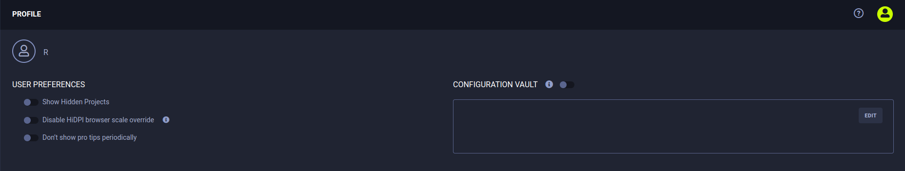

Use the Profile page to manage a **ClearML** user account, including:

* [User preferences](#setting-user-preferences) - Set **ClearML Web UI** options.
* [Cloud Storage access for the ClearML Web UI](#providing-cloud-storage-access-for-the-clearml-web-ui) - So that the **ClearML Web UI** can render data stored in a Cloud, such as debug samples.
* [ClearML credentials](#creating-clearml-credentials) - Create **ClearML** credentials to configure **ClearML** and **ClearML Agent** (if you run **ClearML Agent** commands directly).
* [Configuration vault](#configuration-vault) (supported by the Enterprise Server) - Define additional **ClearML** configuration entries that are applied to all **ClearML** and **ClearML Agent** instances (which use this profile's access credentials).
* [Switch workspaces](#switching-workspaces) - If using multiple workspaces (are a member of more than one **ClearML Hosted Service** team), switch workspaces.
* [Invite new teammates](#inviting-new-teammates) - Collaborate with new users by inviting them to a **ClearML Hosted Service** workspace.

## Setting User Preferences

## Setting user preferences

The **HiDPI browser scale override** adjusts scaling on High-DPI monitors to improve the Web UI experience. It is enabled
by default, but can be disabled.

Users that use their own **ClearML Server** can choose whether to send anonymous usage data to Allegro AI.

## Providing Cloud Storage Access for the ClearML Web UI

**To provide Cloud Storage access for the ClearML Web UI:**

* In the **Cloud Access** section, enter the following credentials:

    * **Bucket** - The name of a Cloud bucket.
    * **Key** - The access key.
    * **Secret / SAS** - The secret key or shared access signature for Azure Storage.
    * **Region** - The region for AWS S3.
    * **Host (Endpoint)** - The host for non-AWS S3 servers.

## Creating ClearML Credentials

**ClearML** credentials include:
* Access key
* Secret key
* Web server
* API server
* File servers host URLs

**ClearML Hosted Service** users need credentials for each workspace they use. Users with their own self-hosted **ClearML Server**
need only one set of credentials.

**ClearML** credentials can be created for a current workspace. To create **ClearML** credentials for another workspace,
switch to it.

**To create ClearML credentials:**

1. Click the Profile button 
   (upper right corner).

1. In **WORKSPACES**, use the current workspace or select another (self-hosted **ClearML Server** users have one workspace).

1. In **App Credentials** **>** **+ Create new credentials**.

## Configuration Vault

:::note Feature Support
The configuration vault is only supported by the **ClearML Enterprise Server**
:::

Use the configuration vault to enter global ClearML configuration entries in any of ClearML supported configuration 
formats: HOCON / JSON / YAML. When the vault is enabled, the inputted configurations will be used by ClearML Agents and the ClearML SDK running with the user's credentials.
New entries will extend the configuration in the ClearML [configuration file](../configs/clearml_conf.md), and
existing configurations will be overridden.

**To edit vault contents:**
* Click **EDIT** or double click the vault box
* Insert / edit the configurations in the vault 
* Press **OK**

**To apply vault contents:**
* Click the toggle atop the vault to enable / disable the configurations
* Once enabled, the configurations will be merged to the configuration file during ClearML and ClearML Agent usage 

## Switching Workspaces

:::note Feature Support
Switching workspaces does not apply to users of a self-hosted **ClearML Server**
:::

**ClearML Hosted Service** users who are members of multiple teams can switch from one workspace to another.

**Switch workspaces in one of the following ways:**

* Profile button - Click  (upper right corner on any page) **>**
  Click the workspace to switch to.
* Profile page - In the **WORKSPACES** section, click **SWITCH TO WORKSPACE** **>** Click the workspace to switch to.

## Inviting New Teammates

:::note Feature Support
Inviting new teammates does not apply to users of a self-hosted **ClearML Server**.
:::

**ClearML Hosted Service** users can invite other users to collaborate in their workspace. On the Profile page, the **WORKSPACES**
section shows the current members of the team, and whether the team has reached its maximum number of members.

**To invite a user to collaborate in your workspace:**

1. Create an invitation hyperlink with one of these options:

    * Profile button - Click 
      **>** **Invite a User** **>** Copy the invitation hyperlink.

    * Profile page - In **WORKSPACES** **>** **Members** **>** Click **INVITE USER** **>** Copy the invitation hyperlink.

1. Send the invitation hyperlink to an invitee.

## Leaving a Workspace

A member of a workspace can leave the workspace and no longer be a member of that team.

**To leave a workspace:**

1. On the Profile page, in **WORKSPACES**, select the workspace to leave.

1. In **Members** **>** **Leave workspace**.
