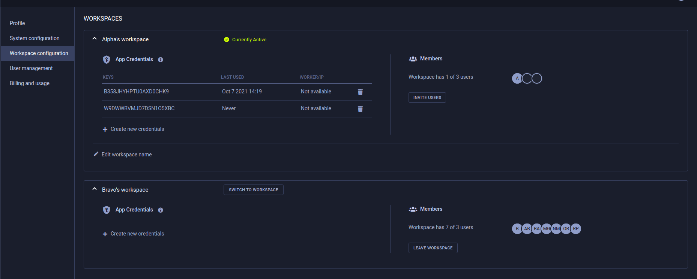
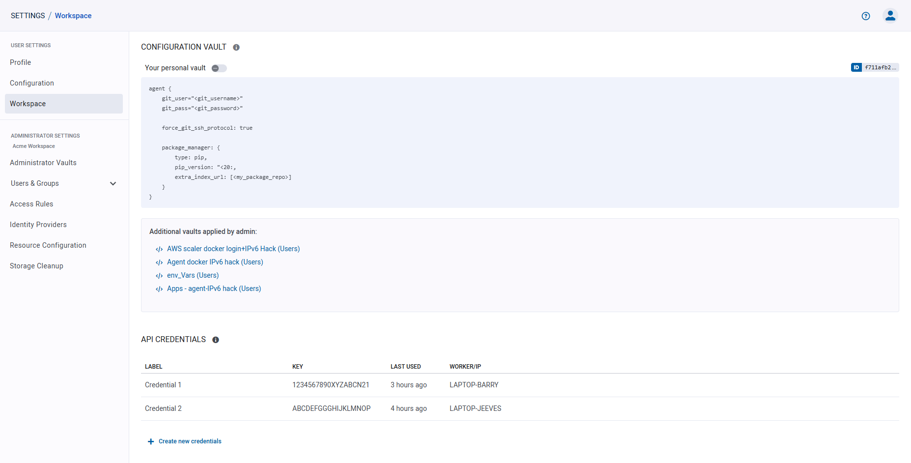
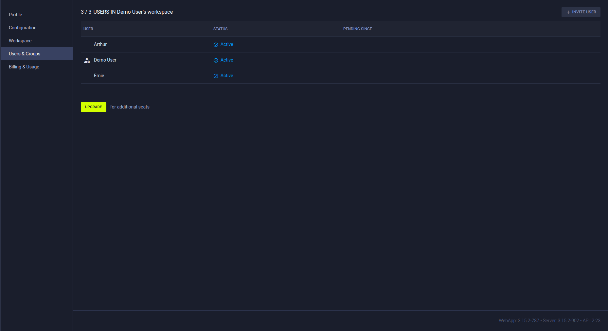
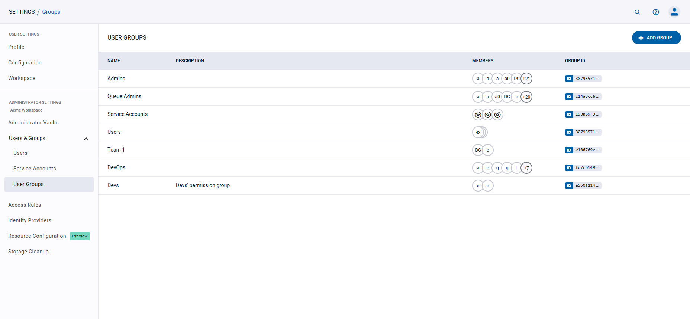
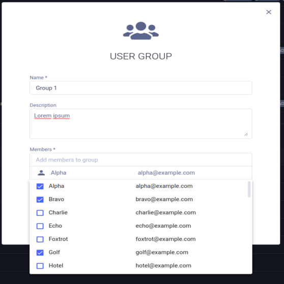
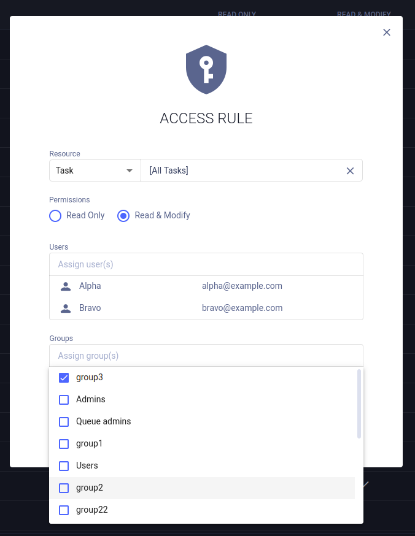
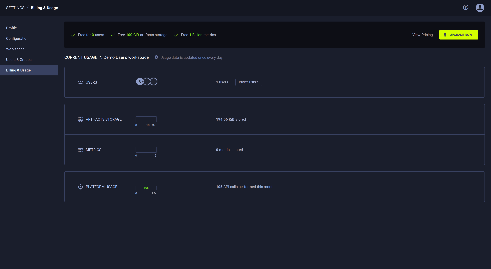
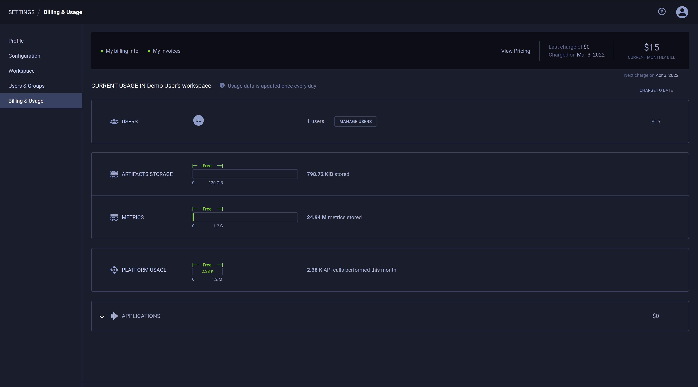

Use the **Settings** page to manage your ClearML account and configure your workspace settings.

To navigate to the Settings page, click the  
button in the top right corner of the web UI screen, then click **Settings**. 

The Settings page consists of the following sections:
* [Profile](#profile) - You basic user information
* [Configuration](#configuration) - Control general system behavior settings and input storage access credentials
* [Workspace](#workspace)  
    * [ClearML credentials](#clearml-credentials) - Create client credentials for ClearML and ClearML Agent to use 
    * [Configuration vault](#configuration-vault) (ClearML Enterprise Server) - Define global ClearML client settings
      that are applied to all ClearML and ClearML Agent instances (which use the workspace's access 
      credentials)
* [Users & Groups](#users--groups) - Manage the users that have access to a workspace
* [Access Rules](#access-rules) (ClearML Enterprise Server) - Manage per-resource access privileges 
* [Usage & Billing](#usage--billing) (ClearML Hosted Service) - View current usage information and billing details 

## Profile 
The profile tab presents user information.

**To edit the username:**
1. Hover over the username
1. Click  
1. Change the name
1. Click  button

## Configuration
### Customizing UI Behavior

Under **USER PREFERENCES**, users can set a few web UI options:
* **Show Hidden Projects** - Show ClearML infrastructure projects alongside your own projects. Disabled by default.
* **HiDPI browser scale override** - Adjust scaling on High-DPI monitors to improve the web UI experience. 
  Enabled by default.
* **Don't show pro tips periodically** - Stop showing ClearML usage tips on login. Disabled by default.

:::info Self-hosted ClearML Server 
The self-hosted ClearML Server has an additional option to enable sharing anonymous telemetry data with the ClearML 
engineering team.
:::

### Browser Cloud Storage Access
Provide cloud storage access, so the browser will be able to display your cloud stored data, such as debug samples.

In the **Web App Cloud Access** section, enter the following credentials:
* **Bucket** - The name of a Cloud bucket.
* **Key** - The access key.
* **Secret / SAS** - The secret key or shared access signature if required.
* **Region** - The region for AWS S3.
* **Host (Endpoint)** - The host for non-AWS S3 servers.

## Workspace

### Multiple Workspaces

:::info ClearML Hosted Service Feature
Multiple workspaces is only available on the ClearML Hosted Service
:::

ClearML Hosted Service users can be members of multiple workspaces, which are listed under **WORKSPACE**. 

To switch to another workspace, click on the **SWITCH TO WORKSPACE** button next to the name of the workspace you want 
to switch to. 
 

### ClearML Credentials

Generate ClearML credentials, made up of an access and secret key pair, and insert them into your [configuration file](../configs/clearml_conf.md) 
or Jupyter Notebook to grant the ClearML SDK and the ClearML Agent API access to the server. 

You can create credentials for any workspace that you are a member of. 

**To create ClearML credentials:**

1. In **WORKSPACE**, expand the desired workspace's panel (self-deployed ClearML Server users have one workspace)

1. In **App Credentials**, click **+ Create new credentials**

1. In the dialog that pops up, you can input a label for the new credentials 

The dialog displays new credentials, formatted as a ready-to-copy configuration file section (including server configuration 
information).

You can edit the labels of credentials in your own workspace, or credentials that you created in other workspaces.

**To edit the credentials label:** hover over the desired credentials, and click  

You can revoke any credentials in your own workspace, or credentials that you created in other workspaces. Once revoked, 
these credentials cannot be recovered.

**To revoke ClearML credentials:** hover over the desired credentials, and click 

### Changing Your Workspace Name
To change the name of your own workspace, click **Edit workspace name**   
(under App credentials) **>** modify the name **>** click . 

### Adding Users to Your Workspace

To invite a user to your workspace, in the **MEMBERS** section: 
1. Press the **INVITE USERS** button 
1. Input the email in the dialog that pops up
1. Click **ADD** 

A dialog box will appear with an invitation link to send to the invited users. Existing members will receive an in-app 
notification informing them that they can join your workspace. 

After inviting users, the page will redirect to the [Users & Groups](#users--groups) section, where the
pending invitations are displayed. 

### Leaving a Workspace

You can leave any workspace you’ve previously joined (except your personal workspace).

When leaving a workspace, you lose access to its resources (tasks, models, etc.) and your previously created access 
credentials to that workspace are revoked. Tasks and associated artifacts that you logged to that workspace will remain 
in that workspace. You can rejoin the workspace only if you are re-invited.

**To leave a workspace:**

1. In **WORKSPACE**, expand the desired workspace's panel 
1. In **Members** **>** Click **LEAVE WORKSPACE**.

### Configuration Vault

:::info Enterprise Feature
This feature is available under the ClearML Enterprise plan
:::

Use the configuration vault to store global ClearML configuration entries that can extend the ClearML [configuration file](../configs/clearml_conf.md) 
of any ClearML Agents or the ClearML SDK running with your credentials. Productivity tip: Keep the vault disabled while 
you edit your configuration, and enable it when the configuration is ready.

New entries will extend the configuration in the ClearML [configuration file](../configs/clearml_conf.md), and existing 
file entries will be overridden by the vault values.

Fill in values using any of ClearML supported configuration formats: HOCON / JSON / YAML.

**To edit vault contents:**
1. Click **EDIT** or double-click the vault box
1. Insert / edit the configurations in the vault 
1. Press **OK**

**To apply vault contents:**
* Click the toggle atop the vault to enable / disable the configurations
* Once enabled, the configurations will be merged to the configuration file during ClearML and ClearML Agent usage 

## Users & Groups  

ClearML Hosted Service users can add users to their workspace.

:::info Hosted Service Feature
Inviting new teammates is only available on the ClearML Hosted Service
:::

### Users
The **USERS** table lists workspace members and shows whether the maximum number of members has been reached. 
Each row of the table includes: 
* Username 
* User status (`Active` or `Pending`) 
* If the user's invitation is pending, the date the user was added
* [User groups](#user-groups) (ClearML Enterprise feature)

#### Inviting New Teammates

To invite a user to your workspace, press the **+ INVITE USER** button, and input the email in the dialog that pops up.

#### Removing Teammates
To remove a user from a workspace:
1. Hover over the user's row on the table
1. Click the  button

Removed users lose access to your workspace’s resources (tasks, models, etc.) and their existing access credentials are 
revoked. Tasks and associated artifacts logged to your workspace by a removed user will remain in your workspace. The 
user can only rejoin your workspace when you re-invite them. 

### User Groups

:::important Enterprise Feature
This feature is available under the ClearML Enterprise plan, as part of the [Access Rules](#access-rules) 
feature.
:::

Administrators can define user groups, which can be used for access privilege management. Users can be assigned to 
multiple user groups.

The system includes three pre-configured groups that can't be removed: 
* `Users` - All users. Can't be modified
* `Admins` - Have RW access to all resources (except queue modification), and can grant users / user groups access 
  permissions to workspace resources
* `Queue admins` -  Can create / delete / rename queues

The user group table lists all the active user groups. Each row includes a group's name, description, and member list. 

#### To create a user group:
1. Click **+ ADD GROUP**
1. In the dialog, add a group name and description
1. Add members to the group. When clicking the input box, a list of workspace members appears, from which group members 
   can be selected. Filter the list by typing part of the username. To remove a member, Hover over a user's row and click 
   the  button
1. Click **SAVE**

#### To edit a user group:
1. Hover over the user group's row on the table
1. Click the  button
1. Edit the group's name and / or description
1. Edit group members (see details [here](#to-create-a-user-group))
1. Click **Save**

#### To delete a user group:
1. Hover over the user group's row on the table
1. Click the  button

When a user group is deleted, its members will lose the access privileges that had been granted to the group (unless 
otherwise provided individually or to another group they are members of). 

## Access Rules

:::important Enterprise Feature 
This feature is available under the ClearML Enterprise plan
:::

Workspace administrators can use the **Access Rules** page to manage workspace permissions, by specifying which users 
and / or user groups have access permissions to the following workspace resources:
 
* [Projects](../fundamentals/projects.md)
* [Tasks](../fundamentals/task.md) 
* [Models](../fundamentals/artifacts.md)
* [Dataviews](../hyperdatasets/dataviews.md) 
* [Datasets](../hyperdatasets/dataset.md)
* [Queues](../fundamentals/agents_and_queues.md#what-is-a-queue) 

By default, all users have **READ & MODIFY** access to all resources.

### Creating Access Rules
Access privileges can be viewed, defined, and edited in the **Access Rules** table. 

1. Click **+ ADD RULES** to access the rule creation dialog
1. Select the resource to grant privileges to. To select a specific resource object (e.g. a 
   specific project or task), click the input box, and select the object from the list that appears. Filter the 
   list by typing part of the desired object name
1. Select the permission type - **Read Only** or **Read & Modify**
1. Assign users and / or [user groups](#user-groups) to be given access. Click the desired input box, and select the 
   users / groups from the list that appears. Filter the list by typing part of the desired object name. To revoke 
   access, hover over a user's or group's row and click the  
   button
1. Click **SAVE**

Access is inherited according to resource hierarchy. For example, if a user is given access to a project, the user will 
also have access to the project's contents (tasks, models, etc.). A user who is granted access to a specific task will 
not have access to another task in the project, unless explicitly granted.  

### Editing Access Rules
1. Hover over the access rule's row on the table
1. Click the  button
1. Change the resource, resource object, and permission type as desired
1. Edit access rule users / groups (see details [here](#creating-access-rules))
1. Click **SAVE**

### Deleting Access Rules
1. Hover over the access rule's row on the **Access Rules** table
1. Click the  button

All users and access groups who had been assigned to the deleted access rule, will lose the access privileges granted by
that rule (unless otherwise provided by a different rule)

### Filtering Access Rules Table

The access rules table can be filtered by resource type and by target resource and users / groups. 
* **To filter by resource**, click the **View** dropdown menu and select the desired resource
* **To filter by target resource or users / groups**, click 
on the respective column and select the users / groups to view from the list that appears. 
  
## Usage & Billing

The **USAGE & BILLING** section displays your ClearML workspace usage information including: 
* Number of workspace users
* Available storage
* Number of monthly API calls  

To add users to your workspace, click **INVITE USERS** in the **USERS** section. This will redirect you to the 
**USER MANAGEMENT** page, where you can invite users (see details [here](#inviting-new-teammates))

### ClearML Pro 

If you use up your free resources, consider upgrading your account! See the [ClearML pricing page](https://clear.ml/pricing/) 
for additional plans information.

With the ClearML Pro plan, the **USAGE & BILLING** page additionally shows estimated charges for the current billing 
period and provides access to billing information.

**To Upgrade your account to ClearML Pro**, click **UPGRADE** in the top right corner of the page. This will open a 
wizard where you will be able to read the terms and conditions and input your billing information. 

**To update your billing information:**
1. Click **My billing info** in the top left of the page, which will open a dialog with your current information
1. Click **Update payment methods**, which will open a window where you can update your information

Access all of your previous invoices by clicking **My invoices** in the top left of the page. This will open the 
**PAYMENT HISTORY** window, where you can download any of your invoices. Click **EMAIL INVOICES** to receive details of 
your past transactions, licenses and downloads to your email.
