Use the **Settings** page to manage your ClearML account and configure your workspace settings.

To navigate to the Settings page, click the  
button in the top right corner of the web UI screen, then click **Settings**. 

The Settings page consists of the following sections:
* User Settings:
  * [Profile](#profile) - You basic user information
  * [Configuration](#configuration) - Control general system behavior settings and input storage access credentials
  * [Workspace](#workspace)  
      * [ClearML credentials](#clearml-credentials) - Create client credentials for ClearML and ClearML Agent to use 
      * [Configuration vault](#configuration-vault) (ClearML Enterprise Server) - Define global ClearML client settings
        that are applied to all ClearML and ClearML Agent instances (which use the workspace's access 
        credentials)
* Administrator Settings:
  * [Administrator Vaults](#administrator-vaults) (ClearML Enterprise Server) - Manage user-group level configuration 
    vaults to apply ClearML client settings to all members of the user groups
  * [Users & Groups](#users--groups) - Manage the users that have access to a workspace
  * [Access Rules](#access-rules) (ClearML Enterprise Server) - Manage per-resource access privileges 
  * [Identity Providers](#identity-providers) (ClearML Enterprise Server) - Manage server identity providers
  * [Resource Configuration](#resource-configuration) (ClearML Enterprise Server) - Define the available resources and the way in which they 
  will be allocated to different workloads 
  * [Usage & Billing](#usage--billing) (ClearML Hosted Service) - View current usage information and billing details 

## Profile 
The profile tab presents user information.

**To edit the username:**
1. Hover over the username
1. Click  
1. Change the name
1. Click  button

## Configuration
### Customizing UI Behavior

Under **USER PREFERENCES**, users can set a few web UI options:
* **Show Hidden Projects** - Show ClearML infrastructure projects alongside your own projects. Disabled by default. When 
enabled, these projects are labeled with .
* **Don't show ClearML examples** - Hide the preloaded ClearML example content (project, pipeline, dataset, etc.). 
* **Disable HiDPI browser scale override** - ClearML dynamically sets the browser scaling factor for an optimal page layout. 
Disable for default desktop scale. 
* **Don't show pro tips periodically** - Stop showing ClearML usage tips on login. Disabled by default.
* **Block running user's scripts in the browser** - Block any user and 3rd party scripts from running anywhere in the 
WebApp. Note that if enabled, the WebApp will not display debug samples, [Hyper-Dataset frame previews](../hyperdatasets/previews.md), 
and embedded resources in [reports](webapp_reports.md).
* **Hide specific container arguments** - Specify which Docker environment variable values should be hidden in logs. 
When printed, the variable values are replaced with `********`. By default, `CLEARML_API_SECRET_KEY`, `CLEARML_AGENT_GIT_PASS`,
`AWS_SECRET_ACCESS_KEY`, and `AZURE_STORAGE_KEY` values are redacted. To modify the hidden container argument list, click **Edit**.

:::info Self-hosted ClearML Server 
The self-hosted ClearML Server has an additional option to enable sharing anonymous telemetry data with the ClearML 
engineering team.
:::

### Browser Cloud Storage Access
Provide cloud storage access, so the browser will be able to display your cloud stored data, such as debug samples.

In the **Web App Cloud Access** section, enter the following credentials:
* **Bucket** - The name of a Cloud bucket.
* **Key** - The access key.
* **Secret / SAS** - The secret key or shared access signature if required.
* **Region** - The region for AWS S3.
* **Host (Endpoint)** - The host for non-AWS S3 servers.

## Workspace

### Multiple Workspaces

:::info ClearML Hosted Service Feature
Multiple workspaces is only available on the ClearML Hosted Service
:::

ClearML Hosted Service users can be members of multiple workspaces, which are listed under **WORKSPACE**. 

To switch to another workspace, click on the **SWITCH TO WORKSPACE** button next to the name of the workspace you want 
to switch to. 
 
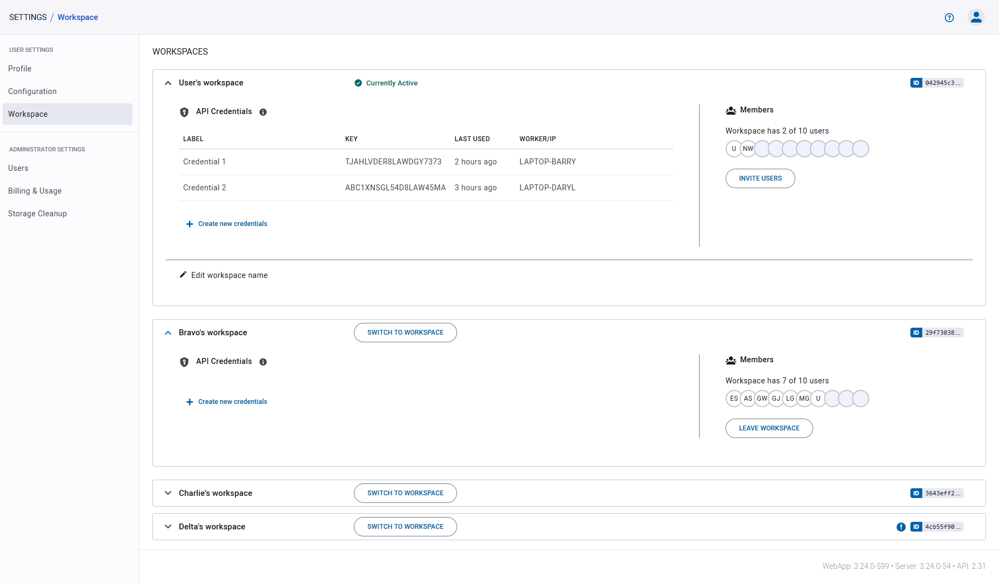

### ClearML Credentials

Generate ClearML credentials, made up of an access and secret key pair, and insert them into your [configuration file](../configs/clearml_conf.md) 
or Jupyter Notebook to grant the ClearML SDK and the ClearML Agent API access to the server. 

You can create credentials for any workspace that you are a member of. 

**To create ClearML credentials:**

1. In **WORKSPACE**, expand the desired workspace's panel (self-deployed ClearML Server users have one workspace)

1. In **App Credentials**, click **+ Create new credentials**

1. In the dialog that pops up, you can input a label for the new credentials 

The dialog displays new credentials, formatted as a ready-to-copy configuration file section (including server configuration 
information).

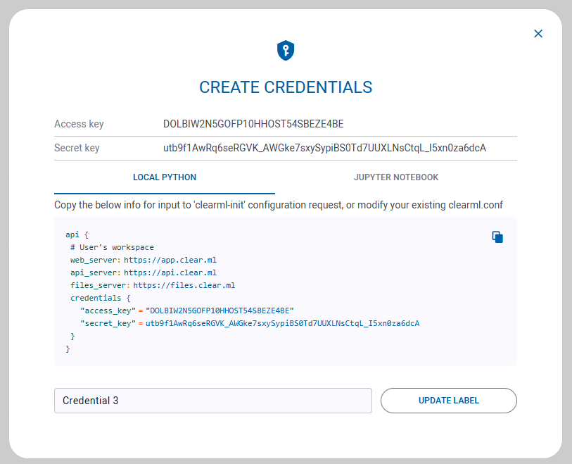

You can edit the labels of credentials in your own workspace, or credentials that you created in other workspaces.

**To edit the credentials label:** hover over the desired credentials, and click  

You can revoke any credentials in your own workspace, or credentials that you created in other workspaces. Once revoked, 
these credentials cannot be recovered.

**To revoke ClearML credentials:** hover over the desired credentials, and click 


### Changing Your Workspace Name
To change the name of your own workspace, click **Edit workspace name**   
(under App credentials) **>** modify the name **>** click . 

### Adding Users to Your Workspace

To invite a user to your workspace, in the **MEMBERS** section: 
1. Press the **INVITE USERS** button 
1. Input the email in the dialog that pops up
1. Click **ADD** 

A dialog box will appear with an invitation link to send to the invited users. Existing members will receive an in-app 
notification informing them that they can join your workspace. 

After inviting users, the page will redirect to the [Users & Groups](#users--groups) section, where the
pending invitations are displayed. 

### Leaving a Workspace

You can leave any workspace you've previously joined (except your personal workspace).

When leaving a workspace, you lose access to its resources (tasks, models, etc.) and your previously created access 
credentials to that workspace are revoked. Tasks and associated artifacts that you logged to that workspace will remain 
in that workspace. You can rejoin the workspace only if you are re-invited.

**To leave a workspace:**

1. In **WORKSPACE**, expand the desired workspace's panel 
1. In **Members** **>** Click **LEAVE WORKSPACE**.


### Configuration Vault

:::info Enterprise Feature
This feature is available under the ClearML Enterprise plan
:::

Use the configuration vault to store global ClearML configuration entries that can extend the ClearML [configuration file](../configs/clearml_conf.md) 
of any ClearML Agents or the ClearML SDK running with your credentials. Productivity tip: Keep the vault disabled while 
you edit your configuration, and enable it when the configuration is ready.

New entries will extend the configuration in the ClearML [configuration file](../configs/clearml_conf.md), and existing 
file entries will be overridden by the vault values.

Fill in values using any of ClearML supported configuration formats: HOCON / JSON / YAML.

**To edit vault contents:**
1. Click **EDIT** or double-click the vault box
1. Insert / edit the configurations in the vault 
1. Press **OK**

**To apply vault contents:**
* Click the toggle atop the vault to enable / disable the configurations
* Once enabled, the configurations will be merged to the configuration file during ClearML and ClearML Agent usage 


## Administrator Vaults

:::info Enterprise Feature
This feature is available under the ClearML Enterprise plan
:::

Administrators can define multiple [configuration vaults](#configuration-vault) which will each be applied to designated 
[user groups](#user-groups). Use configuration vaults to extend and/or override entries in the local ClearML [configuration file](../configs/clearml_conf.md)
where a ClearML task is executed. Configuration vault values will be applied to tasks run by members of the designated user groups. 

To apply its contents, a vault should be enabled. New entries will extend the configuration in the local ClearML [configuration file](../configs/clearml_conf.md). 
Most existing configuration file entries will be overridden by the vault values.

:::info 
The following configuration values are machine and/or agent specific, so they can't be set in a configuration vault:
* `agent.cuda_version`
* `agent.cudnn_version`
* `agent.default_python`
* `agent.worker_id` 
* `agent.worker_name`
* `agent.debug`
:::

**To create a vault:**
1. Click **+ Add Vault**
1. Fill in vault details:
   1. Vault name - Name that appears in the Administrator Vaults table
   1. User Group - Specify the User Group that the vault affects
   1. Format - Specify the configuration format: HOCON / JSON / YAML.
1. Fill in the configuration values (click  
to view configuration file reference). To import and existing configuration file, click . 
1. Click **Save** 

The **Administrator Vaults** table lists all currently defined vaults, and the following details:
* Active - Toggle to enable / disable the vault
* Name - Vault name
* Group - User groups to apply this vault to 
* ID - Vault ID (click to copy)
* Vault Content - Vault content summary
* Update - Last update time

Hover over a vault in the table to Download, Edit, or Delete a vault.  


## Users & Groups  

ClearML Hosted Service users can add users to their workspace.

:::info Hosted Service Feature
Inviting new teammates is only available on the ClearML Hosted Service
:::

### Users
The **USERS** table lists workspace members and shows whether the maximum number of members has been reached. 
Each row of the table includes: 
* Username 
* User status (`Active` or `Pending`) 
* If the user's invitation is pending, the date the user was added
* [User groups](#user-groups) (ClearML Enterprise feature)

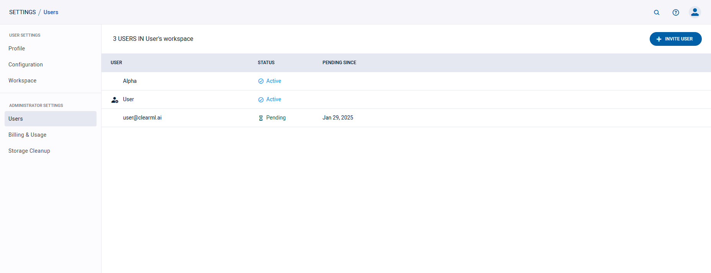

#### Inviting New Teammates

To invite a user to your workspace, press the **+ INVITE USER** button, and input the email in the dialog that pops up.
Once invited, the added users can immediately access your workspace. 

#### Removing Teammates
To remove a user from a workspace:
1. Hover over the user's row on the table
1. Click the  button

Removed users lose access to your workspace's resources (tasks, models, etc.) and their existing access credentials are 
revoked. Tasks and associated artifacts logged to your workspace by a removed user will remain in your workspace. The 
user can only rejoin your workspace when you re-invite them. 

### Service Accounts

:::important Enterprise Feature
This feature is available under the ClearML Enterprise plan.
:::

Service accounts are ClearML users that provide services with access to the ClearML API, but not the 
UI. Administrators can create access credentials for service accounts to use them for different ClearML Agents, 
automations, and more. 

A service account has all the privileges of a normal user in ClearML, with the following limitations:
* Service accounts cannot be used to access the UI
* Service accounts can be used to facilitate running tasks under the identity of each task's owner ("Impersonation"). 
  * Used to run an agent using the command-line, this will allow you to specify the `--use-owner-token` option.
  * Used to run the ClearML Agent Helm Chart, this will allow you to specify `values.agentk8s.useOwnerToken: true` option.
  * Used to run an Autoscaler application, this will allow you to make use of the `Apply Task Owner Vault Configuration`
  option.

:::info Access Rules 
When [access controls](#access-rules) are provisioned, they apply to service accounts the same as for ClearML users.
Therefore, in order to use a service account to run an agent in daemon mode, the service account must have access to the 
queue the agent will service.
:::

The **SERVICE ACCOUNTS** table lists workspace service accounts. 
Each row of the table includes: 
* Name - Service account name 
* [User groups](#user-groups)
* User ID
* Credentials - Number of credentials currently available to the account
* Last active time

Hover over a service account in the table to **Edit** or **Delete** it.

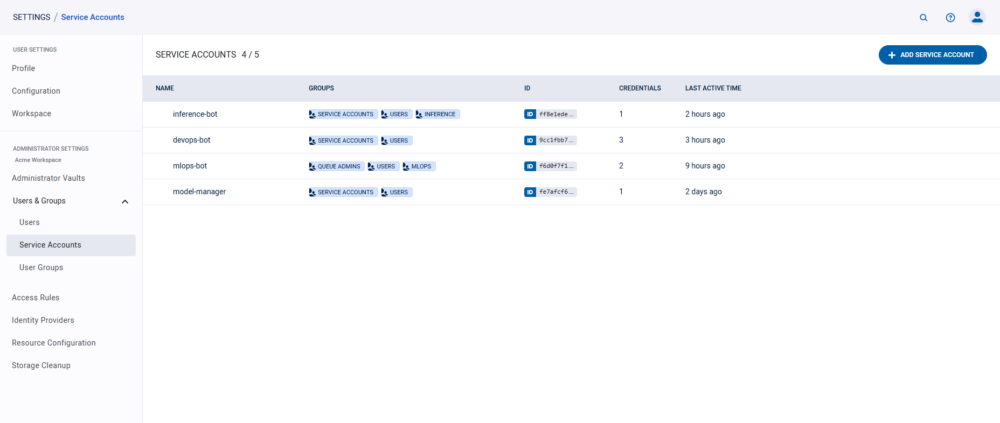

#### Creating a Service Account

To create a service account:
1. Click **+ ADD SERVICE ACCOUNT**
2. In the **ADD SERVICE ACCOUNT** modal input a name for the new account. Select `Allow impersonation` to allow the 
   service account to assume the identity of a task owner 
4. Click **Save**

:::info Impersonation 
Service accounts are members of the `Users` group, meaning they can access the resources available to all users. When 
impersonation is enabled, a task run by the service account (i.e. by an agent or autoscaler using the service accounts' 
credentials) is executed as if by the owner of the task, meaning it will have access to the task owner's configuration 
vaults and to the resources that the task owner has access to. Impersonating an admin user does not mean the task's code 
will have admin privileges.

In case impersonation is not enabled: 
* If you run an agent with `--use_owner_token` then the agent will fail. 
* If you run an agent without `--use_owner_token`, the task will run with the service account's access rules, so make 
  sure the account uses resources it has access to
:::

When a service account is created, an initial set of credentials is automatically generated. The dialog displays new 
credentials, formatted as a ready-to-copy configuration file section.

#### Service Account Credentials 

To generate new credentials for a service account:
1. Hover over the account's row on the table
2. Click the  button, which
   opens the editing panel
3. Click **Create new credentials**

The dialog displays new credentials, formatted as a ready-to-copy configuration file section.

To revoke a set of credentials:
1. In the editing panel, hover of the relevant credential's row
2. Click the  button

#### Deleting Service Account
Deleting a service account will revoke its credentials, causing agents using the account's credentials to fail. 
Tasks and associated artifacts logged to your workspace by a service account will remain in your workspace.

To delete a service account:
1. Hover over the account's row on the table
1. Click the  button

### User Groups

:::important Enterprise Feature
This feature is available under the ClearML Enterprise plan, as part of the [Access Rules](#access-rules) 
feature.
:::

Administrators can define user groups, which can be used for access privilege management. Users can be assigned to 
multiple user groups.

The system includes three pre-configured groups that can't be removed: 
* `Users` - All users (including [service accounts](#service-accounts)). Can't be modified
* `Admins` - Have RW access to all resources (except queue modification), and can grant users / user groups access 
  permissions to workspace resources
* `Queue admins` - Can create / delete / rename queues

The user group table lists all the active user groups. Each row includes a group's name, description, member list, and ID. 


#### To create a user group:
1. Click **+ ADD GROUP**
1. In the dialog, add a group name and description
1. Add members to the group. When clicking the input box, a list of workspace members appears, from which group members 
   can be selected. Filter the list by typing part of the username. To remove a member, Hover over a user's row and click 
   the  button
1. Click **SAVE**


#### To edit a user group:
1. Hover over the user group's row on the table
1. Click the  button
1. Edit the group's name and/or description
1. Edit group members (see details [here](#to-create-a-user-group))
1. Click **Save**

#### To delete a user group:
1. Hover over the user group's row on the table
1. Click the  button

When a user group is deleted, its members will lose the access privileges that had been granted to the group (unless 
otherwise provided individually or to another group they are members of). 

## Access Rules

:::important Enterprise Feature 
This feature is available under the ClearML Enterprise plan
:::

Workspace administrators can use the **Access Rules** page to manage workspace permissions, by specifying which users,
service accounts, and/or user groups have access permissions to the following workspace resources:
 
* [Projects](../fundamentals/projects.md)
* [Tasks](../fundamentals/task.md) 
* [Models](../fundamentals/artifacts.md)
* [Dataviews](../hyperdatasets/dataviews.md) 
* [Datasets](../hyperdatasets/dataset.md)
* [Queues](../fundamentals/agents_and_queues.md#what-is-a-queue) 

By default, all users have **READ & MODIFY** access to all resources.

### Creating Access Rules
Access privileges can be viewed, defined, and edited in the **Access Rules** table. 

1. Click **+ ADD RULES** to access the rule creation dialog
1. Select the resource to grant privileges to. To select a specific resource object (e.g. a 
   specific project or task), click the input box, and select the object from the list that appears. Filter the 
   list by typing part of the desired object name
1. Select the permission type - **Read Only** or **Read & Modify**
1. Assign users, [service accounts](#service-accounts), and/or [user groups](#user-groups) to be given access. Click the 
   desired input box, and select the users / service accounts / groups from the list that appears. Filter the list by 
   typing part of the desired object name. To revoke 
   access, hover over a user's, service account's, or group's row and click the  
   button
1. Click **SAVE**

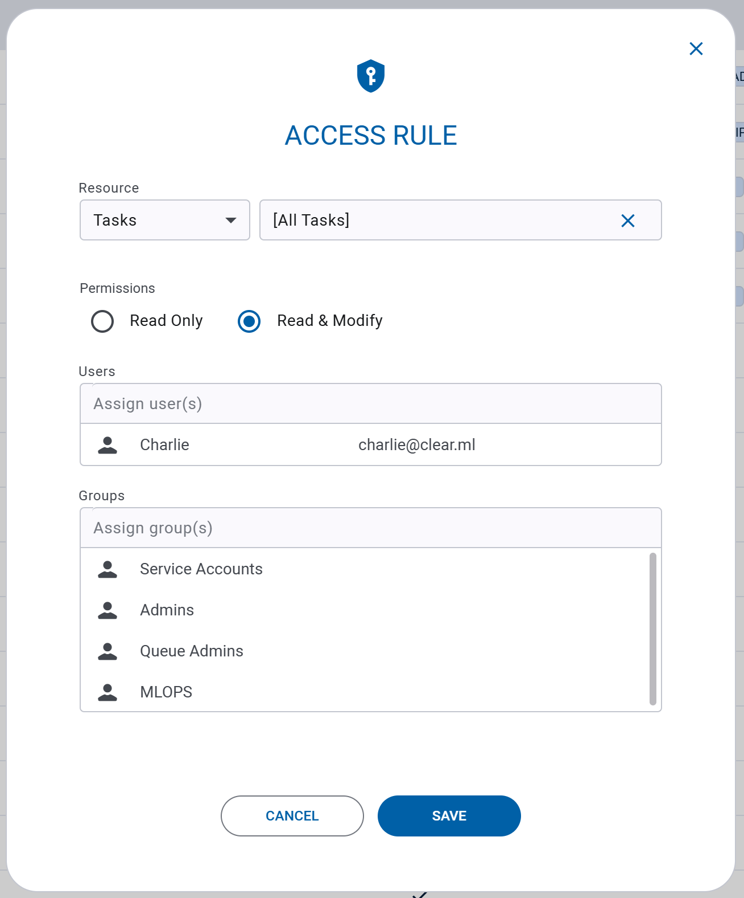

Access is inherited according to resource hierarchy. For example, if a user is given access to a project, the user will 
also have access to the project's contents (tasks, models, etc.). A user who is granted access to a specific task will 
not have access to another task in the project, unless explicitly granted.  

### Editing Access Rules
1. Hover over the access rule's row on the table
1. Click the  button
1. Change the resource, resource object, and permission type as desired
1. Edit access rule users / service accounts / groups (see details [here](#creating-access-rules))
1. Click **SAVE**

### Deleting Access Rules
1. Hover over the access rule's row on the **Access Rules** table
1. Click the  button

All users, service accounts, and user groups who had been assigned to the deleted access rule, will lose the access privileges granted by
that rule (unless otherwise provided by a different rule).

### Filtering Access Rules Table

The access rules table can be filtered by resource type and by target resource and users / groups. 
* **To filter by resource**, click the **View** dropdown menu and select the desired resource
* **To filter by target resource or users / groups / service accounts**, click 
on the respective column and select the users / groups / service accounts to view from the list that appears. 

## Identity Providers

:::important Enterprise Feature 
This feature is available under the ClearML Enterprise plan
:::

Administrators can connect identity service providers to the server: configure an identity connection, which allows
ClearML to communicate with your identity provider, retrieve user information, authenticate users, and more. Once an identity 
provider connection is configured and enabled, the option appears in your server login page.

**To create a new connection**:
1. Click **+ New Connection**
2. In the **New Provider Connection** modal, select a protocol (OIDC or SAML) and a provider 
   * OIDC providers:
     * Auth0 
     * AWS Cognito 
     * Google 
     * Keycloak 
     * Microsoft AD 
     * Microsoft Azure 
     * Okta 
     * Ping 
     * Custom
   * SAML providers
     * Duo 
     * Google
     * Jumpcloud
     * Microsoft AD
     * Custom
3. Click **Next**
4. Provide the **Provider Connection Configuration**. Note that some of the information, such as the `Client ID`,
   `Client Secret`, and the `Authorization Endpoint`, must be obtained from your identity provider's ClearML App settings
   and copied to the relevant field.
   
   <Collapsible title="OIDC Providers" type="configuration">

      * ClearML WebApp URL - The external URL for the ClearML WebApp. Used to construct the Callback URL used by the 
      identity provider
      * Callback URL - Copy the field's content into the `Callback URL` field in your provider's ClearML App / integration
      (sometimes the field is called `Redirect URL`). Used by the identity provider to redirect the session back to the ClearML 
      Server. 
      * Display name - Unique name to be used in the ClearML Login screen. Make sure no two 
      connections have the same name.
      * Client ID - The Client ID of your identity provider's ClearML App. Copy this value from your identity provider's 
       ClearML App settings
      * Client Secret - The client secret generated by your identity provider for the ClearML App. Copy this value from your identity 
       provider's ClearML App settings
      * Authorization Endpoint - Used to authorize each user login. Copy this value from your identity provider's ClearML App settings
      * Access Token Endpoint - Used to obtain an access token as part of the login process. Copy this value from your 
       identity provider's ClearML App settings
      * Revocation Endpoint - Used to revoke an access token. Copy this value from your identity provider's 
       ClearML App settings
      * Obtain user information from Identity Token - Select to retrieve user information from the identity token generated 
       by the provider. If not selected, provide a **User Info Endpoint** which is used to obtain additional user information 
       as part of the login process. Copy this value from your identity provider's ClearML App settings 
      * Email verification - Only allow signup/login to users with a verified email address. If selected, make sure that 
       your identity provider returns an `email_verified` claim in generated tokens.
      * Create new users on first login - Select to automatically create a ClearML user for new users logging in using 
       this connection. If not selected, 
       only existing ClearML users or users who were invited using their email address can log in using this connection.
      * Verify token signature - Select to verify 
       signatures for tokens returned by the identity provider. This requires the `JWKS URI` to be configured. Make sure your 
       identity provider's ClearML App is set up to sign tokens. 
      * Additional Settings
        * Code challenge method - Select one of the methods from the dropdown menu (`None`, `Plain`, or `S256`). This setting 
         should match the one defined in your identity provider's ClearML App settings
        * Standard Userinfo scopes - Comma-separated list of scopes. Used to control access to user information. In case 
         you need to add another scope, use the `Additional scopes` field below.
        * Additional scopes - Comma-separated list of any additional scopes required by your identity provider
      * Claims mappings - Maps ClearML claim names to the names defined in your identity provider's ClearML App settings
        * user id - The user's unique ID
        * email - The user's email address
        * name - The user's full name 
        * given name - The user's given name (optional if **name** is specified)
        * family name - The user's family name (surname, optional if **name** is specified)
        * picture - The user's avatar or picture URL 
      * User Groups Synchronization - Supports synchronizing group membership. If enabled, and the groups claim is returned 
       by the provider, the server will attempt to match each group to an existing ClearML group and assign the ClearML user 
       to the matched ClearML group. The server will also make sure the ClearML user is removed from the group if 
       a previous membership has been revoked.

   </Collapsible> 

   <Collapsible title="SAML Providers" type="configuration">

      * ClearML Webapp URL - The external URL for the ClearML WebApp. This is used to construct the Callback URL used by 
       the identity provider
      * Reply/ACS URL - Copy this field's content into the `Assertion Consumer Service URL` field in your provider's 
       ClearML App. Used by the identity provider to redirect the session back to the ClearML Server. 
      * Display name - Unique name to be used in the ClearML Login screen. Make sure no two 
       connections have the same name. 
      * Entity ID - The Entity ID of your identity provider's ClearML App. Copy this value from your identity provider's 
       ClearML App settings 
      * IDP metadata file - Provided by the identity provider and contains SAML configuration details used by the ClearML 
       Server to set up the connection. Download this from your identity provider's ClearML App settings. 
      * Security Settings
        * Require signed assertions - Assume IDP assertions or responses are signed by the identity provider. If enabled, 
         make sure your identity provider's ClearML App is configured to sign assertions or responses.
        * Sign client requests - The ClearML Server will sign requests sent to the identity provider. Make sure your 
         identity provider's ClearML App is configured to accept signed client requests and its Client Certificate section 
         there is set up with the same value for the Public Key.
           1. Sign requests sent to the identity provider. Use the following shell commands to generate a public/private key pair:
      
           ```
           openssl genrsa -out server.key 2048
           chmod 600 server.key
           openssl req -new -key server.key -out server.csr
           openssl x509 -req -days 3650 -in server.csr -signkey server.key -out server.cer
           ```
           
          2. Paste the content of the `server.cer` file into the `Public Key` field below and the content of the `server.key` 
          file into the `Private Key` field below. Make sure your identity provider's ClearML App is configured to accept 
          signed client requests and its `Client Certificate` section there is set up with the same value for the `Public Key`.  

      * Claims mappings - Maps ClearML Claim names to the names defined in your identity provider's ClearML App settings
        * user id - The user's unique ID
        * email - The user's email address
        * name - The user's full name 
        * given name - The user's given name (optional if **name** is specified)
        * family name - The user's family name (surname, optional if **name** is specified)
        * picture - The user's avatar or picture URL 
      * User Groups Synchronization - Supports synchronizing group membership. If enabled, and the groups claim is returned 
      by the provider, the server will attempt to match each group to an existing ClearML group and assign the ClearML user 
      to the matched ClearML group. The server will also make sure the ClearML user is removed from the group if 
      a previous membership has been revoked.

   </Collapsible> 

1. Click **Test Provider** to make sure that the connection is working. This calls the identity provider, and displays 
  the returned information, so you can verify that the information was mapped correctly. An error will be displayed, if the provider fails to connect.

  

2. Click **Save**

The **Provider Connections** table lists all currently defined connections, and the following details:
* Active - Toggle to enable / disable the provider connection
* Name - Connection name
* Provider - Connection's provider 
* Protocol - Connection's protocol
* ID - Connection's ID (click to copy)
* Last Update - Last update time

Hover over a connection in the table to **Edit** or **Delete** it.  
 


## Resource Configuration

Administrators can define [Resource Policies](../webapp/resource_policies.md) to implement resource quotas and 
reservations for different user groups to prioritize workload usage across available resources. 

Under the **Resource Configuration** section, administrators define the available resources and the way in which they 
will be allocated to different workloads. 

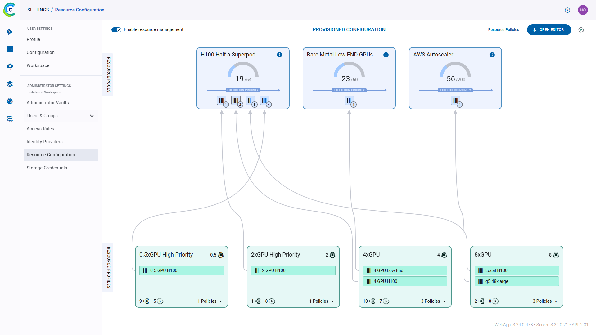

The Resource Configuration settings page shows the [currently provisioned](#applying-resource-configuration) configuration: 
the defined resource pools, resource profiles, and the resource allocation architecture. 

### Resource Pools
A resource pool is an aggregation of resources available for use, such as a Kubernetes cluster or a GPU superpod. 
Administrators specify the total number of resources available in each pool. The resource policy manager ensures 
workload assignment up to the available number of resources.

Administrators control the execution priority within a pool across the resource profiles making use of it (e.g. if jobs 
of profile A and jobs of profile B currently need to run in a pool,  allocate resources for profile A jobs first or vice 
versa).

The resource pool cards are displayed on the top of the Resource Configuration settings page. Each card displays the 
following information: 

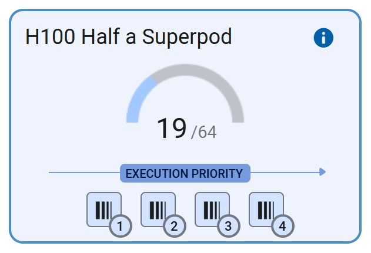

* Pool name
* Number of resources currently in use out of the total available resources
* Execution Priority - List of [linked profiles](#connecting-profiles-to-pools) in order of execution priority. 

### Resource Profiles 
Resource profiles represent the resource consumption requirements of jobs, such as the number of GPUs needed. They are 
the interface that administrators use to provide users with access to the available resource pools based on their job 
resource requirements via [Resource Policies](../webapp/resource_policies.md).

Administrators can control the resource pool allocation precedence within a profile (e.g. only run jobs on `pool B` if 
`pool A` cannot currently satisfy the profile's resource requirements).

Administrators can control the queuing priority within a profile across resource policies making use of it (e.g. if the 
R&D team and DevOps team both have pending jobs - run the R&D team's jobs first or vice versa).

The resource profile cards are displayed on the bottom of the Resource Configuration settings page. Each card displays 
the following information: 

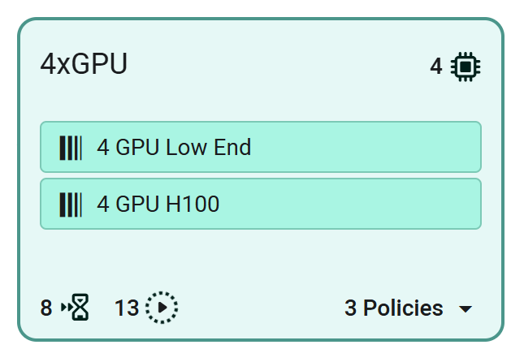

* Profile name
*  - Number
of resources allocated to jobs in this profile
* List of [pool links](#connecting-profiles-to-pools)
*  - Number of currently pending jobs
*  - Number of currently running jobs
* Number of resource policies. Click to open resource policy list and to order queuing priority.  

### Example  Workflow

You have GPUs spread across a local H100 and additional bare metal servers, as well as on AWS (managed 
by an autoscaler). Assume that currently most of your resources are already assigned to jobs, and only 16 resources are available: 8 in the 
H100 resource pool and 8 in the Bare Metal pool:

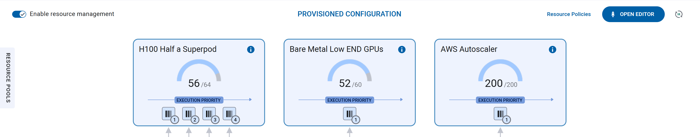

Teams' jobs have varying resource requirements of 0.5, 2, 4, and 8 GPUs. Resource profiles are defined to reflect these:

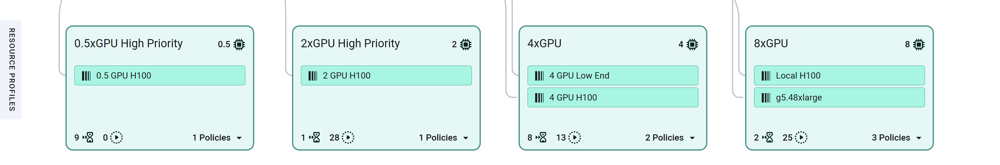

The different jobs will be routed to different resource pools by connecting the profiles to the resource pools. Jobs 
enqueued through the profiles will be run in the pools where there are available resources in order of their priority. 
For example, the H100 pool will run jobs with the following precedence: 2 GPU jobs first, then 4GPU ones, then 8 GPU, 
and lastly 0.5 GPU. 

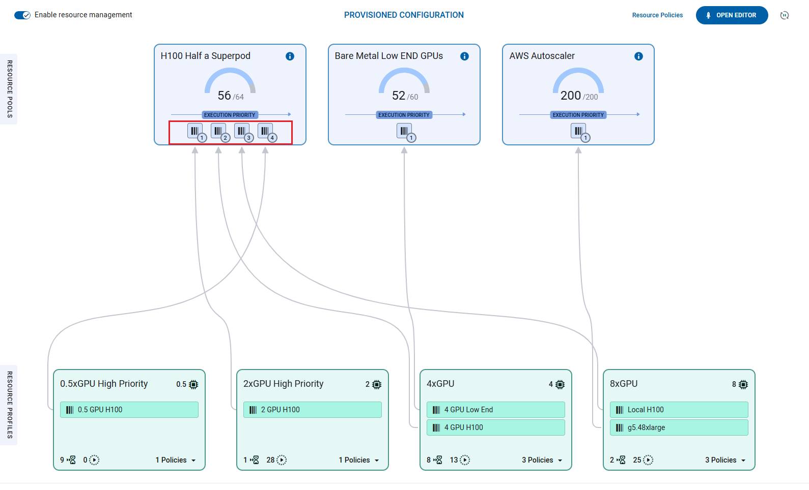

Resource policies are implemented for two teams:
* Dev team
* Research Team 

Each team has a resource policy configured with 8 reserved resources and a 16 resource limit. Both teams make use of the
4xGPU profile (i.e. each job running through this profile requires 4 resources). 

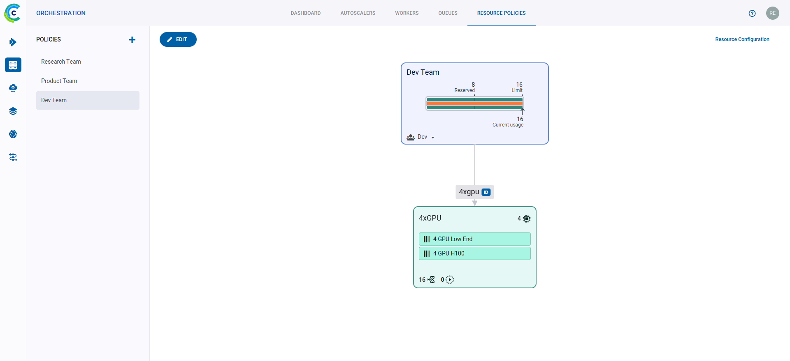

The Dev team is prioritized over the Research team by placing it higher in the Resource Profile's Policies Priority list:

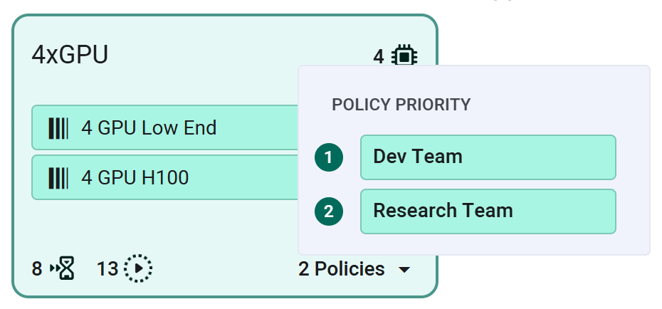

Both the Dev team and the Research team enqueue four 4-resource jobs each: Dev team jobs will be allocated resources 
first. The `4xGPU` resource profile is connected to two resource pools: `Bare Metal Low END GPUs` (with the 
`4 GPU Low End` link) and `H100 Half a Superpod` (with the `4 GPU H100 link`). 

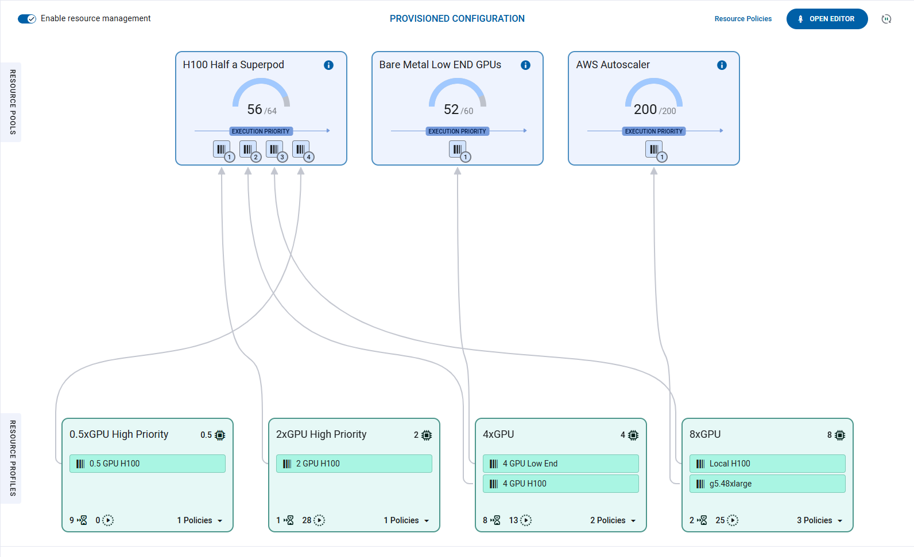

Resources are assigned from the `Bare Metal` pool first (precedence set on the resource profile card):

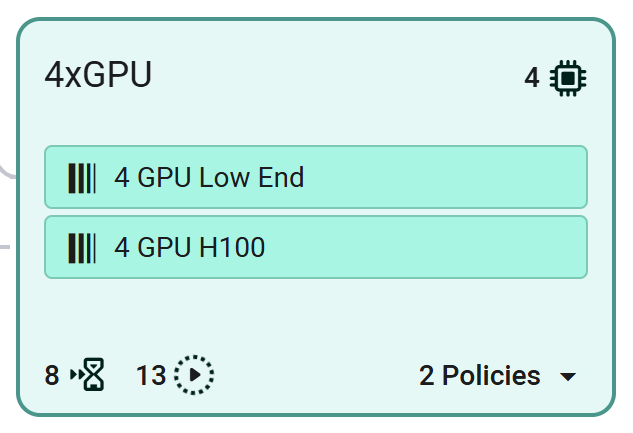

If the first pool cannot currently satisfy the profile’s resource requirements, resources are assigned from the next 
listed pool. Let's look at the first pool in the image below. Notice that the pool has 8 available resources, therefore 
it can run two 4-resource jobs.

<div class="max-w-50">

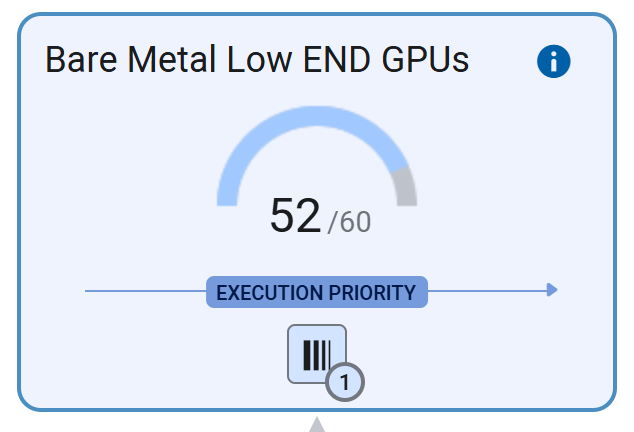

</div>

Since the Bare Metal pool does not have any more available resources, additional jobs will be assigned resources from 
the next pool that the Resource Profile is connected to. The H100 pool has 8 available resources. There are still 2 jobs 
pending from the Dev team requiring 8 resources in total, and 4 jobs from the Research team requiring 16 resources in
total. In order to honor the Research team’s resource reservation, its first two jobs will be assigned the required 8
resources from the H100 pool.

All available resources having been assigned - 2 jobs of each team will remain pending until some of the currently 
running jobs finish and resources become available.

### Applying Resource Configuration 
Administrators can globally activate/deactivate resource policy management. To enable the currently provisioned 
configuration, click on the `Enable resource management` toggle. Enabling resource management will service the policy 
queues according to the provisioned resource profile and pool assignments. Disabling the resource management will stop 
serving the policy queues. Tasks on these queues will remain pending until resource policy management is reenabled.

Administrators can add, edit, delete, and connect resource pools and profiles in the Resource Configuration settings 
page.

To make any change (create, delete, or modify a component) to the resource configuration, follow the following steps:
1. Click **Open Editor** to go into Editing mode 
1. After making the desired changes you have the following options:
    * **Save** - Save the changes you made. These changes will not be applied until you click on Provision 
    * **Provision** - Apply the resource policy’s saved changes 
    * **Reset Configuration** - Set the editor to the currently provisioned values. This will delete any unprovisioned 
    changes (both saved and unsaved)
1. Click **Exit** to leave Editor mode. The page will show the provisioned configuration. Unprovisioned saved changes will 
still be available in Editor mode. 

#### Resource Pool 

**To create a resource pool:** 
1. Click **+ Add Pool**
1. In the **Create Pool** modal, input:
    * Name - The resource pool’s name. This will appear in the Pool’s information card in the Resource Configuration settings page
    * Number of Resources - Number of resources available in this pool
    * Description - Optional free form text for additional descriptive information
1. Click **Create**

**To modify a resource pool** 
1. Click  on the relevant 
resource pool card **>** click **Edit**
1. In the **Edit Pool** modal, change the pool’s name, number of resources, or description
1. Click **Save**

You can also change the Execution Priority of the [linked resource profiles](#connecting-profiles-to-pools). Click and 
drag the profile connection anchor  
to change its position in the order of priority.

#### Resource Profile 
**To create a resource profile:** 
1. Click **+ Add Profile**
1. In the **Create Profile** modal, input:
    * Name - The resource profile’s name. This will appear in the profile’s information card in the Resource Configuration settings page
    * Resource Allotment - Number of resources allocated to each job running in this profile
3. Click **Create**

**To modify a resource profile:**
1. Click  on the relevant 
resource profile card > click **Edit**
1. In the **Edit Profile** modal, change the pool's name, number of resources, or description
1. Click **Save**

To control which pool's resources will be assigned first, click and drag the pool connection anchor  
to change its position in order of priority.

You can also change the Execution Priority of the resource policies making use of this profile. Open the policy list, 
then click the policy anchor 
and drag the policy to change its position in order of priority.  

**To delete a resource profile:**
1. Click  on the relevant resource pool card 
1. Click Delete

#### Connecting Profiles to Pools
Connect a resource profile to a resource pool to allow jobs assigned to the profile to make use of the pool’s resources. 

**To connect a profile to a pool:**
1. Click **Open Editor**
1. Drag the  
of the relevant profile to the resource pool you want to connect the profile to. This opens the **Connect Profile** modal 
1. In the **Connect Profile** modal, input a name for this connection. This connection name will appear on the profile 
card

The settings page will show a line linking the profile and the pool cards. The linked profile appears on the pool card, 
showing its place in the order of execution. To change the profile's priority placement, drag its connection anchor  
to a new position.

**To disconnect a profile from a pool:**
1. Click **Open Editor**
1. On the relevant profile card, hover over connection name and click `X`

Jobs assigned to this resource profile will no longer be able to utilize the pool’s resources.

## Usage & Billing

The **USAGE & BILLING** section displays your ClearML workspace usage information including: 
* Number of workspace users
* Available storage
* Number of monthly API calls  


To add users to your workspace, click **INVITE USERS** in the **USERS** section. This will redirect you to the 
**USER MANAGEMENT** page, where you can invite users (see details [here](#inviting-new-teammates)).

### ClearML Pro 

If you use up your free resources, consider upgrading your account! See the [ClearML pricing page](https://clear.ml/pricing/) 
for additional plans information.

With the ClearML Pro plan, the **USAGE & BILLING** page additionally shows estimated charges for the current billing 
period and provides access to billing information.

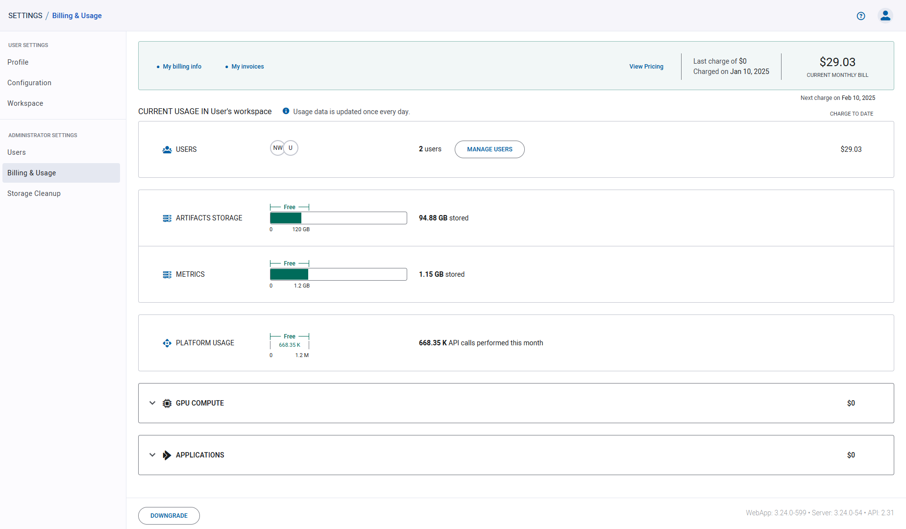

**To Upgrade your account to ClearML Pro**, click **UPGRADE** in the top right corner of the page. This will open a 
wizard where you will be able to read the terms and conditions and input your billing information. 

**To update your billing information:**
1. Click **My billing info** in the top left of the page, which will open a dialog with your current information
1. Click **Update payment methods**, which will open a window where you can update your information

Access all of your previous invoices by clicking **My invoices** in the top left of the page. This will open the 
**PAYMENT HISTORY** window, where you can download any of your invoices. Click **EMAIL INVOICES** to receive details of 
your past transactions, licenses and downloads to your email.
