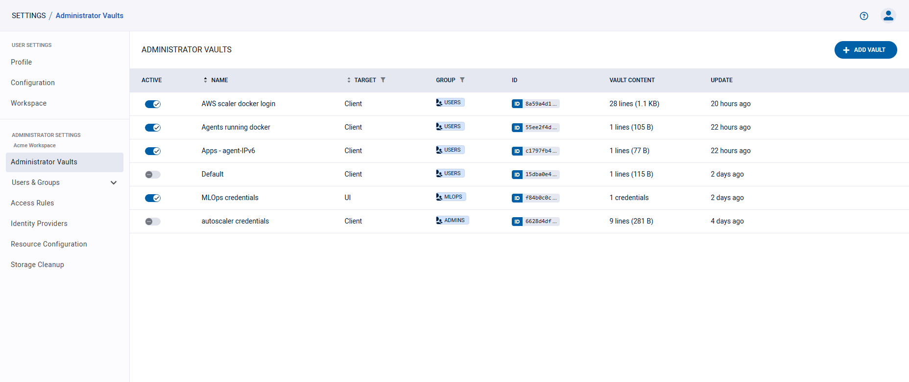
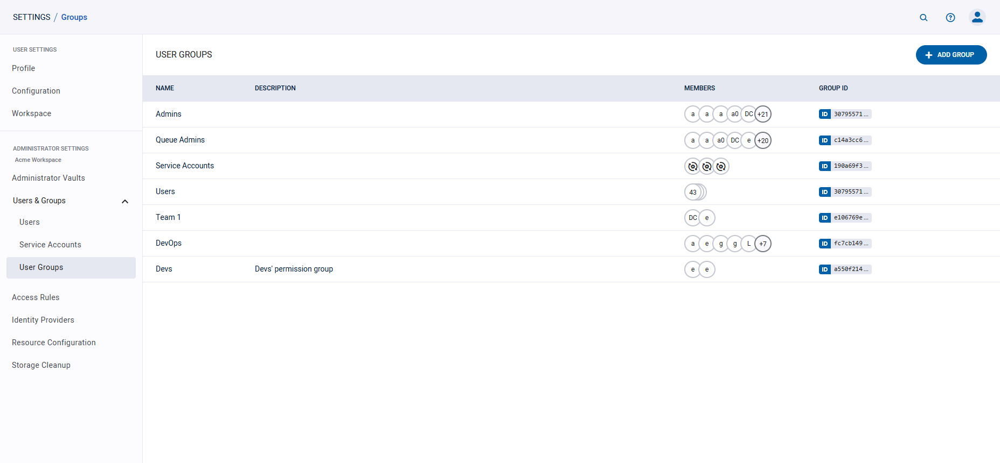
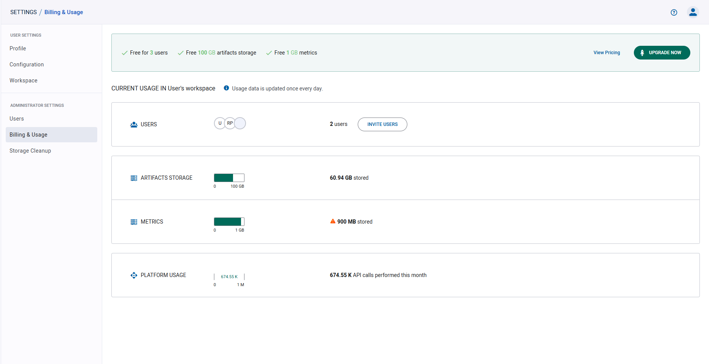

Use the **Settings** page to manage your ClearML account and configure your workspace settings.

To navigate to the Settings page, click the  
button in the top right corner of the web UI screen, then click **Settings**. 

The Settings page consists of the following sections:
* [Profile](#profile) - You basic user information
* [Configuration](#configuration) - Control general system behavior settings and input storage access credentials
* [Workspace](#workspace)  
    * [ClearML credentials](#clearml-credentials) - Create client credentials for ClearML and ClearML Agent to use 
    * [Configuration vault](#configuration-vault) (ClearML Enterprise Server) - Define global ClearML client settings
      that are applied to all ClearML and ClearML Agent instances (which use the workspace's access 
      credentials)
* [Administrator Vaults](#administrator-vaults) (ClearML Enterprise Server) - Manage user-group level configuration 
  vaults to apply ClearML client settings to all members of the user groups
* [Users & Groups](#users--groups) - Manage the users that have access to a workspace
* [Access Rules](#access-rules) (ClearML Enterprise Server) - Manage per-resource access privileges 
* [Identity Providers](#identity-providers) (ClearML Enterprise Server) - Manage server identity providers
* [Usage & Billing](#usage--billing) (ClearML Hosted Service) - View current usage information and billing details 

## Profile 
The profile tab presents user information.

**To edit the username:**
1. Hover over the username
1. Click  
1. Change the name
1. Click  button

## Configuration
### Customizing UI Behavior

Under **USER PREFERENCES**, users can set a few web UI options:
* **Show Hidden Projects** - Show ClearML infrastructure projects alongside your own projects. Disabled by default. When 
enabled, these projects are labeled with .
* **Don't show ClearML Examples** - Hide the preloaded ClearML example content (project, pipeline, dataset, etc.) 
* **HiDPI browser scale override** - Adjust scaling on High-DPI monitors to improve the web UI experience. 
  Enabled by default.
* **Don't show pro tips periodically** - Stop showing ClearML usage tips on login. Disabled by default.
* **Hide specific container arguments** - Specify which Docker environment variable values should be hidden in logs. 
When printed, the variable values are replaced with `********`. By default, `CLEARML_API_SECRET_KEY`, `CLEARML_AGENT_GIT_PASS`,
`AWS_SECRET_ACCESS_KEY`, and `AZURE_STORAGE_KEY` values are redacted.  

:::info Self-hosted ClearML Server 
The self-hosted ClearML Server has an additional option to enable sharing anonymous telemetry data with the ClearML 
engineering team.
:::

### Browser Cloud Storage Access
Provide cloud storage access, so the browser will be able to display your cloud stored data, such as debug samples.

In the **Web App Cloud Access** section, enter the following credentials:
* **Bucket** - The name of a Cloud bucket.
* **Key** - The access key.
* **Secret / SAS** - The secret key or shared access signature if required.
* **Region** - The region for AWS S3.
* **Host (Endpoint)** - The host for non-AWS S3 servers.

## Workspace

### Multiple Workspaces

:::info ClearML Hosted Service Feature
Multiple workspaces is only available on the ClearML Hosted Service
:::

ClearML Hosted Service users can be members of multiple workspaces, which are listed under **WORKSPACE**. 

To switch to another workspace, click on the **SWITCH TO WORKSPACE** button next to the name of the workspace you want 
to switch to. 
 


### ClearML Credentials

Generate ClearML credentials, made up of an access and secret key pair, and insert them into your [configuration file](../configs/clearml_conf.md) 
or Jupyter Notebook to grant the ClearML SDK and the ClearML Agent API access to the server. 

You can create credentials for any workspace that you are a member of. 

**To create ClearML credentials:**

1. In **WORKSPACE**, expand the desired workspace's panel (self-deployed ClearML Server users have one workspace)

1. In **App Credentials**, click **+ Create new credentials**

1. In the dialog that pops up, you can input a label for the new credentials 

The dialog displays new credentials, formatted as a ready-to-copy configuration file section (including server configuration 
information).


You can edit the labels of credentials in your own workspace, or credentials that you created in other workspaces.

**To edit the credentials label:** hover over the desired credentials, and click  

You can revoke any credentials in your own workspace, or credentials that you created in other workspaces. Once revoked, 
these credentials cannot be recovered.

**To revoke ClearML credentials:** hover over the desired credentials, and click 


### Changing Your Workspace Name
To change the name of your own workspace, click **Edit workspace name**   
(under App credentials) **>** modify the name **>** click . 

### Adding Users to Your Workspace

To invite a user to your workspace, in the **MEMBERS** section: 
1. Press the **INVITE USERS** button 
1. Input the email in the dialog that pops up
1. Click **ADD** 

A dialog box will appear with an invitation link to send to the invited users. Existing members will receive an in-app 
notification informing them that they can join your workspace. 

After inviting users, the page will redirect to the [Users & Groups](#users--groups) section, where the
pending invitations are displayed. 

### Leaving a Workspace

You can leave any workspace you've previously joined (except your personal workspace).

When leaving a workspace, you lose access to its resources (tasks, models, etc.) and your previously created access 
credentials to that workspace are revoked. Tasks and associated artifacts that you logged to that workspace will remain 
in that workspace. You can rejoin the workspace only if you are re-invited.

**To leave a workspace:**

1. In **WORKSPACE**, expand the desired workspace's panel 
1. In **Members** **>** Click **LEAVE WORKSPACE**.


### Configuration Vault

:::info Enterprise Feature
This feature is available under the ClearML Enterprise plan
:::

Use the configuration vault to store global ClearML configuration entries that can extend the ClearML [configuration file](../configs/clearml_conf.md) 
of any ClearML Agents or the ClearML SDK running with your credentials. Productivity tip: Keep the vault disabled while 
you edit your configuration, and enable it when the configuration is ready.

New entries will extend the configuration in the ClearML [configuration file](../configs/clearml_conf.md), and existing 
file entries will be overridden by the vault values.

Fill in values using any of ClearML supported configuration formats: HOCON / JSON / YAML.

**To edit vault contents:**
1. Click **EDIT** or double-click the vault box
1. Insert / edit the configurations in the vault 
1. Press **OK**

**To apply vault contents:**
* Click the toggle atop the vault to enable / disable the configurations
* Once enabled, the configurations will be merged to the configuration file during ClearML and ClearML Agent usage 


## Administrator Vaults

:::info Enterprise Feature
This feature is available under the ClearML Enterprise plan
:::

Administrators can define multiple [configuration vaults](#configuration-vault) which will each be applied to designated 
[user groups](#user-groups). Use configuration vaults to extend and/or override entries in the local ClearML [configuration file](../configs/clearml_conf.md)
where a ClearML task is executed. Configuration vault values will be applied to tasks run by members of the designated user groups. 

To apply its contents, a vault should be enabled. New entries will extend the configuration in the local ClearML [configuration file](../configs/clearml_conf.md). 
Most existing configuration file entries will be overridden by the vault values.

:::info 
The following configuration values are machine and/or agent specific, so they can't be set in a configuration vault:
* `agent.cuda_version`
* `agent.cudnn_version`
* `agent.default_python`
* `agent.worker_id` 
* `agent.worker_name`
* `agent.debug`
:::

**To create a vault:**
1. Click **+ Add Vault**
1. Fill in vault details:
   1. Vault name - Name that appears in the Administrator Vaults table
   1. User Group - Specify the User Group that the vault affects
   1. Format - Specify the configuration format: HOCON / JSON / YAML.
1. Fill in the configuration values (click  
to view configuration file reference). To import and existing configuration file, click . 
1. Click **Save** 

The **Administrator Vaults** table lists all currently defined vaults, and the following details:
* Active - Toggle to enable / disable the vault
* Name - Vault name
* Group - User groups to apply this vault to 
* ID - Vault ID (click to copy)
* Vault Content - Vault content summary
* Update - Last update time

Hover over a vault in the table to Download, Edit, or Delete a vault.  



## Users & Groups  

ClearML Hosted Service users can add users to their workspace.

:::info Hosted Service Feature
Inviting new teammates is only available on the ClearML Hosted Service
:::

### Users
The **USERS** table lists workspace members and shows whether the maximum number of members has been reached. 
Each row of the table includes: 
* Username 
* User status (`Active` or `Pending`) 
* If the user's invitation is pending, the date the user was added
* [User groups](#user-groups) (ClearML Enterprise feature)


#### Inviting New Teammates

To invite a user to your workspace, press the **+ INVITE USER** button, and input the email in the dialog that pops up.

#### Removing Teammates
To remove a user from a workspace:
1. Hover over the user's row on the table
1. Click the  button

Removed users lose access to your workspace's resources (tasks, models, etc.) and their existing access credentials are 
revoked. Tasks and associated artifacts logged to your workspace by a removed user will remain in your workspace. The 
user can only rejoin your workspace when you re-invite them. 

### User Groups

:::important Enterprise Feature
This feature is available under the ClearML Enterprise plan, as part of the [Access Rules](#access-rules) 
feature.
:::

Administrators can define user groups, which can be used for access privilege management. Users can be assigned to 
multiple user groups.

The system includes three pre-configured groups that can't be removed: 
* `Users` - All users. Can't be modified
* `Admins` - Have RW access to all resources (except queue modification), and can grant users / user groups access 
  permissions to workspace resources
* `Queue admins` - Can create / delete / rename queues

The user group table lists all the active user groups. Each row includes a group's name, description, member list, and ID. 



#### To create a user group:
1. Click **+ ADD GROUP**
1. In the dialog, add a group name and description
1. Add members to the group. When clicking the input box, a list of workspace members appears, from which group members 
   can be selected. Filter the list by typing part of the username. To remove a member, Hover over a user's row and click 
   the  button
1. Click **SAVE**


#### To edit a user group:
1. Hover over the user group's row on the table
1. Click the  button
1. Edit the group's name and/or description
1. Edit group members (see details [here](#to-create-a-user-group))
1. Click **Save**

#### To delete a user group:
1. Hover over the user group's row on the table
1. Click the  button

When a user group is deleted, its members will lose the access privileges that had been granted to the group (unless 
otherwise provided individually or to another group they are members of). 

## Access Rules

:::important Enterprise Feature 
This feature is available under the ClearML Enterprise plan
:::

Workspace administrators can use the **Access Rules** page to manage workspace permissions, by specifying which users 
and/or user groups have access permissions to the following workspace resources:
 
* [Projects](../fundamentals/projects.md)
* [Tasks](../fundamentals/task.md) 
* [Models](../fundamentals/artifacts.md)
* [Dataviews](../hyperdatasets/dataviews.md) 
* [Datasets](../hyperdatasets/dataset.md)
* [Queues](../fundamentals/agents_and_queues.md#what-is-a-queue) 

By default, all users have **READ & MODIFY** access to all resources.

### Creating Access Rules
Access privileges can be viewed, defined, and edited in the **Access Rules** table. 

1. Click **+ ADD RULES** to access the rule creation dialog
1. Select the resource to grant privileges to. To select a specific resource object (e.g. a 
   specific project or task), click the input box, and select the object from the list that appears. Filter the 
   list by typing part of the desired object name
1. Select the permission type - **Read Only** or **Read & Modify**
1. Assign users and/or [user groups](#user-groups) to be given access. Click the desired input box, and select the 
   users / groups from the list that appears. Filter the list by typing part of the desired object name. To revoke 
   access, hover over a user's or group's row and click the  
   button
1. Click **SAVE**


Access is inherited according to resource hierarchy. For example, if a user is given access to a project, the user will 
also have access to the project's contents (tasks, models, etc.). A user who is granted access to a specific task will 
not have access to another task in the project, unless explicitly granted.  

### Editing Access Rules
1. Hover over the access rule's row on the table
1. Click the  button
1. Change the resource, resource object, and permission type as desired
1. Edit access rule users / groups (see details [here](#creating-access-rules))
1. Click **SAVE**

### Deleting Access Rules
1. Hover over the access rule's row on the **Access Rules** table
1. Click the  button

All users and access groups who had been assigned to the deleted access rule, will lose the access privileges granted by
that rule (unless otherwise provided by a different rule)

### Filtering Access Rules Table

The access rules table can be filtered by resource type and by target resource and users / groups. 
* **To filter by resource**, click the **View** dropdown menu and select the desired resource
* **To filter by target resource or users / groups**, click 
on the respective column and select the users / groups to view from the list that appears. 

## Identity Providers

:::important Enterprise Feature 
This feature is available under the ClearML Enterprise plan
:::

Administrators can connect identity service providers to the server: configure an identity connection, which allows
ClearML to communicate with your identity provider, retrieve user information, authenticate users, and more. Once an identity 
provider connection is configured and enabled, the option appears in your server login page.

**To create a new connection**:
1. Click **+ New Connection**
2. In the **New Provider Connection** modal, select a protocol (OIDC or SAML) and a provider 
   * OIDC providers:
     * Auth0 
     * AWS Cognito 
     * Google 
     * Keycloak 
     * Microsoft AD 
     * Microsoft Azure 
     * Okta 
     * Ping 
     * Custom
   * SAML providers
     * Duo 
     * Google
     * Jumpcloud
     * Microsoft AD
     * Custom
3. Click **Next**
4. Provide the **Provider Connection Configuration**. Note that some of the information, such as the `Client ID`,
   `Client Secret`, and the `Authorization Endpoint`, must be obtained from your identity provider's ClearML App settings
   and copied to the relevant field.
   
   <Collapsible title="OIDC Providers" type="configuration">

      * ClearML WebApp URL - The external URL for the ClearML WebApp. Used to construct the Callback URL used by the 
      identity provider
      * Callback URL - Copy the field's content into the `Callback URL` field in your provider's ClearML App / integration
      (sometimes the field is called `Redirect URL`). Used by the identity provider to redirect the session back to the ClearML 
      Server. 
      * Display name - Unique name to be used in the ClearML Login screen. Make sure no two 
      connections have the same name.
      * Client ID - The Client ID of your identity provider's ClearML App. Copy this value from your identity provider's 
       ClearML App settings
      * Client Secret - The client secret generated by your identity provider for the ClearML App. Copy this value from your identity 
       provider's ClearML App settings
      * Authorization Endpoint - Used to authorize each user login. Copy this value from your identity provider's ClearML App settings
      * Access Token Endpoint - Used to obtain an access token as part of the login process. Copy this value from your 
       identity provider's ClearML App settings
      * Revocation Endpoint - Used to revoke an access token. Copy this value from your identity provider's 
       ClearML App settings
      * Obtain user information from Identity Token - Select to retrieve user information from the identity token generated 
       by the provider. If not selected, provide a **User Info Endpoint** which is used to obtain additional user information 
       as part of the login process. Copy this value from your identity provider's ClearML App settings 
      * Email verification - Only allow signup/login to users with a verified email address. If selected, make sure that 
       your identity provider returns an `email_verified` claim in generated tokens.
      * Create new users on first login - Select to automatically create a ClearML user for new users logging in using 
       this connection. If not selected, 
       only existing ClearML users or users who were invited using their email address can log in using this connection.
      * Verify token signature - Select to verify 
       signatures for tokens returned by the identity provider. This requires the `JWKS URI` to be configured. Make sure your 
       identity provider's ClearML App is set up to sign tokens. 
      * Additional Settings
        * Code challenge method - Select one of the methods from the dropdown menu (`None`, `Plain`, or `S256`). This setting 
         should match the one defined in your identity provider's ClearML App settings
        * Standard Userinfo scopes - Comma-separated list of scopes. Used to control access to user information. In case 
         you need to add another scope, use the `Additional scopes` field below.
        * Additional scopes - Comma-separated list of any additional scopes required by your identity provider
      * Claims mappings - Maps ClearML claim names to the names defined in your identity provider's ClearML App settings
        * user id - The user's unique ID
        * email - The user's email address
        * name - The user's full name 
        * given name - The user's given name (optional if **name** is specified)
        * family name - The user's family name (surname, optional if **name** is specified)
        * picture - The user's avatar or picture URL 
      * User Groups Synchronization - Supports synchronizing group membership. If enabled, and the groups claim is returned 
       by the provider, the server will attempt to match each group to an existing ClearML group and assign the ClearML user 
       to the matched ClearML group. The server will also make sure the ClearML user is removed from the group if 
       a previous membership has been revoked.

   </Collapsible> 

   <Collapsible title="SAML Providers" type="configuration">

      * ClearML Webapp URL - The external URL for the ClearML WebApp. This is used to construct the Callback URL used by 
       the identity provider
      * Reply/ACS URL - Copy this field's content into the `Assertion Consumer Service URL` field in your provider's 
       ClearML App. Used by the identity provider to redirect the session back to the ClearML Server. 
      * Display name - Unique name to be used in the ClearML Login screen. Make sure no two 
       connections have the same name. 
      * Entity ID - The Entity ID of your identity provider's ClearML App. Copy this value from your identity provider's 
       ClearML App settings 
      * IDP metadata file - Provided by the identity provider and contains SAML configuration details used by the ClearML 
       Server to set up the connection. Download this from your identity provider's ClearML App settings. 
      * Security Settings
        * Require signed assertions - Assume IDP assertions or responses are signed by the identity provider. If enabled, 
         make sure your identity provider's ClearML App is configured to sign assertions or responses.
        * Sign client requests - The ClearML Server will sign requests sent to the identity provider. Make sure your 
         identity provider's ClearML App is configured to accept signed client requests and its Client Certificate section 
         there is set up with the same value for the Public Key.
           1. Sign requests sent to the identity provider. Use the following shell commands to generate a public/private key pair:
      
           ```
           openssl genrsa -out server.key 2048
           chmod 600 server.key
           openssl req -new -key server.key -out server.csr
           openssl x509 -req -days 3650 -in server.csr -signkey server.key -out server.cer
           ```
           
          2. Paste the content of the `server.cer` file into the `Public Key` field below and the content of the `server.key` 
          file into the `Private Key` field below. Make sure your identity provider's ClearML App is configured to accept 
          signed client requests and its `Client Certificate` section there is set up with the same value for the `Public Key`.  

      * Claims mappings - Maps ClearML Claim names to the names defined in your identity provider's ClearML App settings
        * user id - The user's unique ID
        * email - The user's email address
        * name - The user's full name 
        * given name - The user's given name (optional if **name** is specified)
        * family name - The user's family name (surname, optional if **name** is specified)
        * picture - The user's avatar or picture URL 
      * User Groups Synchronization - Supports synchronizing group membership. If enabled, and the groups claim is returned 
      by the provider, the server will attempt to match each group to an existing ClearML group and assign the ClearML user 
      to the matched ClearML group. The server will also make sure the ClearML user is removed from the group if 
      a previous membership has been revoked.

   </Collapsible> 

1. Click **Test Provider** to make sure that the connection is working. This calls the identity provider, and displays 
  the returned information, so you can verify that the information was mapped correctly. An error will be displayed, if the provider fails to connect.

  

2. Click **Save**

The **Provider Connections** table lists all currently defined connections, and the following details:
* Active - Toggle to enable / disable the provider connection
* Name - Connection name
* Provider - Connection's provider 
* Protocol - Connection's protocol
* ID - Connection's ID (click to copy)
* Last Update - Last update time

Hover over a connection in the table to **Edit** or **Delete** it.  
 


## Usage & Billing

The **USAGE & BILLING** section displays your ClearML workspace usage information including: 
* Number of workspace users
* Available storage
* Number of monthly API calls  



To add users to your workspace, click **INVITE USERS** in the **USERS** section. This will redirect you to the 
**USER MANAGEMENT** page, where you can invite users (see details [here](#inviting-new-teammates)).

### ClearML Pro 

If you use up your free resources, consider upgrading your account! See the [ClearML pricing page](https://clear.ml/pricing/) 
for additional plans information.

With the ClearML Pro plan, the **USAGE & BILLING** page additionally shows estimated charges for the current billing 
period and provides access to billing information.


**To Upgrade your account to ClearML Pro**, click **UPGRADE** in the top right corner of the page. This will open a 
wizard where you will be able to read the terms and conditions and input your billing information. 

**To update your billing information:**
1. Click **My billing info** in the top left of the page, which will open a dialog with your current information
1. Click **Update payment methods**, which will open a window where you can update your information

Access all of your previous invoices by clicking **My invoices** in the top left of the page. This will open the 
**PAYMENT HISTORY** window, where you can download any of your invoices. Click **EMAIL INVOICES** to receive details of 
your past transactions, licenses and downloads to your email.
