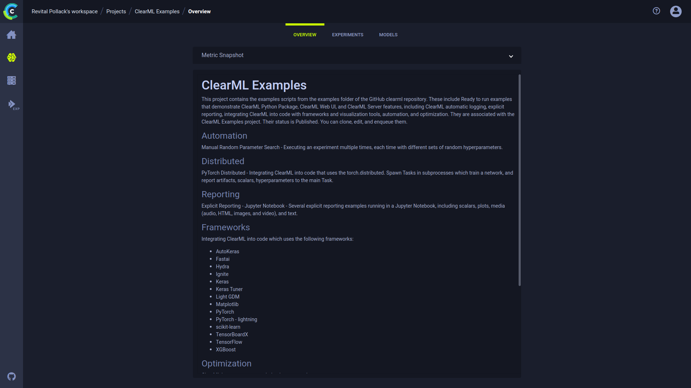

A project's **OVERVIEW** tab provides options to present a general picture of the project. The page consists of a graph 
that can show a snapshot of specified metrics' values across the project's experiments, and a space to enter and edit a 
project's description. When either overview option is utilized, the **OVERVIEW** tab becomes the project's landing page, 
meaning that it's the first thing that is seen when opening the project. 

## Metric Snapshot

On the top of the **OVERVIEW** tab, you can display a **metric snapshot**. Choose metric variants, and the plot area 
will present an aggregated view of the values for those metrics and the time that each experiment scored those values. 
This way, the project's progress can be quickly deduced.

To add metric variants to the overview:
1. Click **Select Metric & Variant**
1. Select a metric **>** Expand a variant **>** Select the last reported (`LAST`), minimal (`MIN`) and/or maximal (`MAX`) 
value to show
1. Click **Apply**

To remove metric variants:
1. Click **+ Metrics** 
1. Remove in one of the following ways:
   * On the right panel list, hover over a variant and click `X` 
   * On the left panel, uncheck metric variant
   * To remove all variants, click `Clear all`
1. Click **Apply**

When a single metric variant is selected, the plot color codes experiment status 
(`Completed`, `Aborted`, `Published`, or `Failed`). When multiple variants are selected, each color corresponds to a 
metric/variant combination. 

Hover over a point in the snapshot, and a box will appear with the details of the experiment associated with the metric 
value. Click the point to go to the experiment's details page.

## Project Description

Every project has a `description` field. The UI provides a Markdown editor to edit this field. For a quick reference for 
the MarkDown syntax that can be used, see [Markdown Formatting Quick Guide](webapp_reports.md#markdown-formatting-quick-guide).

In the Markdown document, you can write and share reports and add links to ClearML experiments 
or any network resource such as issue tracker, web repository, etc.

### Editing the Description

To edit the description in the **OVERVIEW** tab, hover over the description section, and press the **EDIT** button that
appears on the top right of the window. 

When using the Markdown editor, you can make use of features such as bullets, 
numbered lists, code blocks, headings with levels, images, and italicized and bolded text.   
