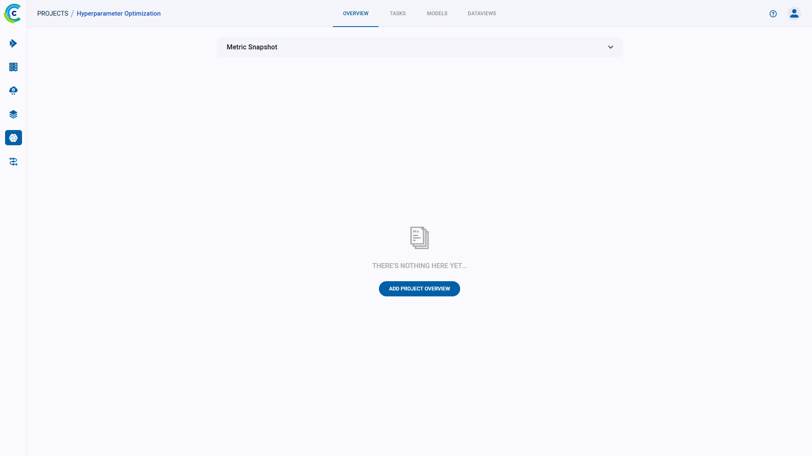

A project's **OVERVIEW** tab consists of a graph which can show a snapshot of a specific metrics value across the projects 
experiments and a space to enter a project's description with markdown viewer/editor to edit it.
The page provides options to present a general picture of the project. When either overview option is utilized, the 
**OVERVIEW** tab becomes the project's landing page, meaning that it's the first thing that is seen when opening the project. 

## Metric snapshot

On the top of the **OVERVIEW** tab, there is an option to display a **metric snapshot**. Choose a metric and variant, 
and then the window will present an aggregated view of the value for that metric value and the time that each 
experiment scored that value. This way, the project's progress can be quickly deduced.

All project experiments that measured the specified metric show up in the snapshot. Their colors vary based
on their status (`Completed`, `Aborted`, `Published`, or `Failed`). Hover over a point in the snapshot, and a box will 
appear with the details of the experiment associated with the metric value. Click the point, and you will 
be sent to the experiment's page. 

## Project description

Every project has a `description` field. The UI provides a Markdown editor to edit this field.

In the Markdown document, you can write and share reports and add links to **ClearML** experiments 
or any network resource such as issue tracker, web repository, etc.

### Editing the description

To edit the description in the **OVERVIEW** tab, hover over the description section, and press the  **EDIT** button that
appears on the top right of the window. 

When using the Markdown editor, you can make use of features such as bullets, 
numbered lists, code blocks, headings with levels, images, and italicized and bolded text.   
