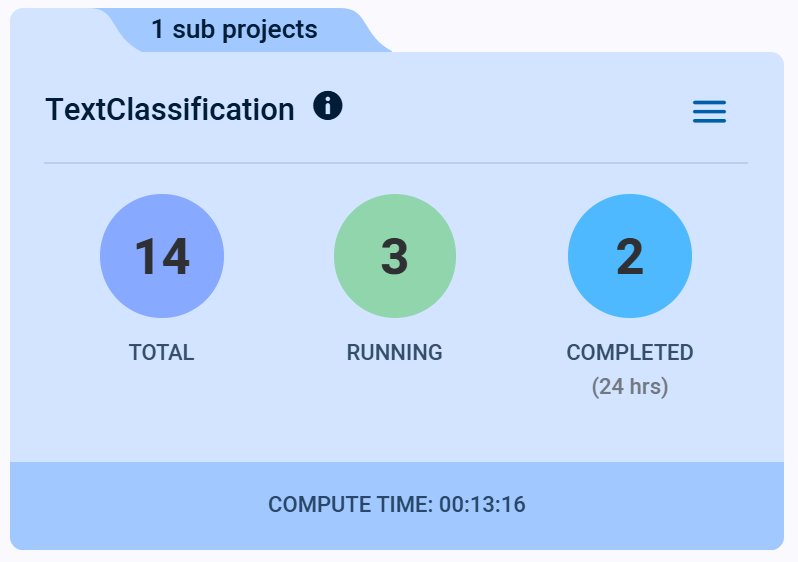
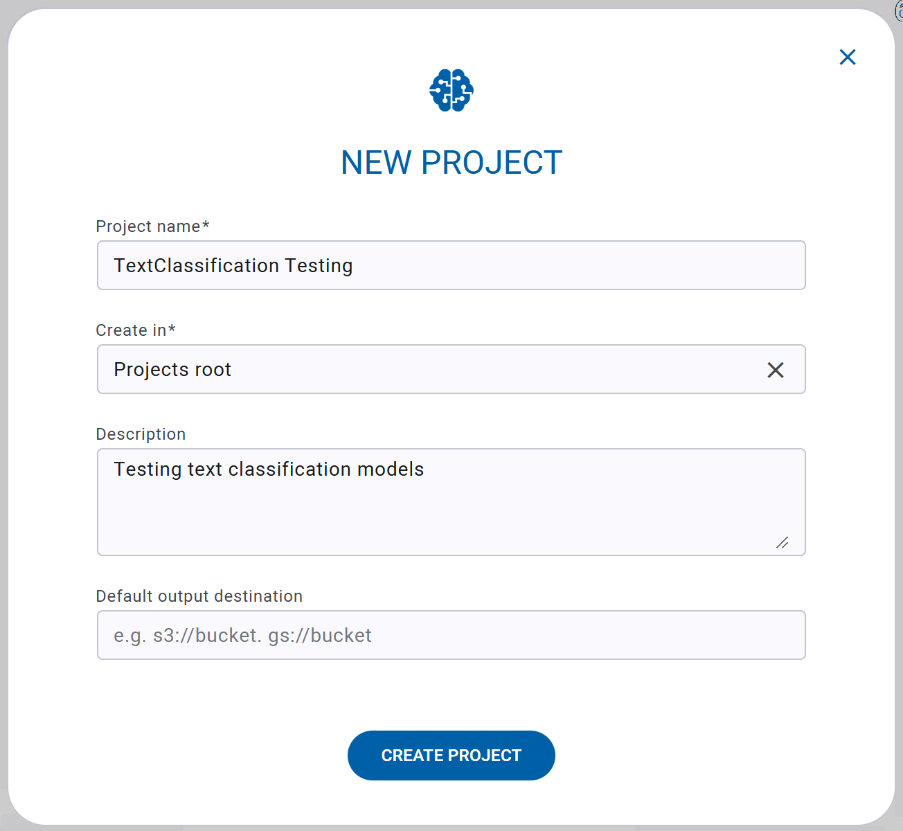

Use the Projects Page for project navigation and management. 

Your projects are displayed like folders: click a folder to access its contents. The Projects Page shows the top-level 
projects in your workspace. Projects that contain nested subprojects are identified by an extra nested project tab. 
An exception is the **All Experiments** folder, which shows all projects’ and subprojects’ contents in a single, flat
list.

If a project has any subprojects, clicking its folder will open its own project page. Access the projects’ top-level 
contents (i.e. experiments, models etc.) via the folder with the bracketed (`[ ]`) project name.

If a project does not contain any subprojects, clicking on its folder will open its experiment table (or [Project Overview](webapp_project_overview.md)
page when relevant).

## Project Folders

Project folders display summarized project information:  

When relevant, the folder has a tab which displays the number of subprojects in the project. Click the tab to view a list of 
subprojects. Click on a subproject's name to navigate to it.  

### Project Actions

Click  on the top right
of a project folder to open its context menu and access the following project actions:  

* **Rename** - Rename the project.
* **New Project** - Create a new project (by default a subproject). 
* **Move to** - Move the project into another project. If the target project does not exist, it is created on-the-fly.
* **Delete** - Delete the project. To delete a project, all of its experiments must be [archived](webapp_archiving.md) first. 

## Create New Projects

To create a new project, click the **+ NEW PROJECT** button in the top right of the page or in a project's context menu, 
which will open a **New Project** modal. 

