<div style={{position: 'relative', overflow: 'hidden', width: '100%', paddingTop: '56.25%' }} >
<iframe style={{position: 'absolute', top: '0', left: '0', bottom: '0', right: '0', width: '100%', height: '100%'}} 
        src="https://www.youtube.com/embed/D6fCvpmV8eo" 
        title="YouTube video player" 
        frameborder="0" 
        allow="accelerometer; autoplay; clipboard-write; encrypted-media; gyroscope; picture-in-picture; fullscreen" 
        allowfullscreen>
</iframe>
</div>

<br/>

With ClearML’s Reports you can write up notes, experiment findings, or really anything you want. You can create reports 
in any of your ClearML projects.

In addition to its main document, a report also contains a description field, which will appear in the report's card in 
the [Reports Page](#reports-page). Reports are searchable based on their description, so adding a description 
can make it easier to find the report later. 

Reports are editable Markdown documents, supporting:
* Multi-level headings
* Text formatting: Italics, bold, and strikethrough
* Bulleted and numbered lists
* Tables
* Code blocks
* Text and image hyperlinks
* Embedded images uploaded from your computer
* Embedded ClearML task content

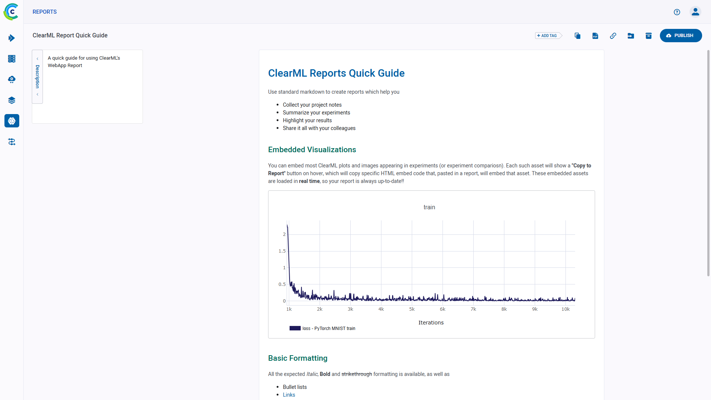

Publishing a report locks it for future editing, so you can preserve its contents. You can also share your reports, 
download a PDF copy, or simply copy the MarkDown content and reuse in your editor of choice.

Access ClearML reports through the [Reports Page](#reports-page).

## Embedding ClearML Visualizations
You can embed plots and images from your experiments into your reports: scalar graphs and other plots, and debug samples 
from an individual experiment or from an experiment comparison page. These visualizations are updated live as the 
experiment(s) updates.

To add a graphic resource: 
1. Go to the resource you want to embed in your report (a plot or debug sample from an individual experiment or 
experiment comparison) 
2. Hover over the resource and click . 
   
   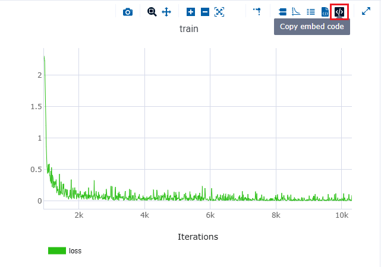

   Click `Embed in ClearML report`. This generates the embed code for accessing the resource, and copies 
   it to your clipboard. 
 
   

3. Return to your report page and paste the code snippet

   
   
## Reports Page
Use the Reports Page to navigate between and manage reports. 

You can view the reports page in Project view  
or in List view . In List 
view, all reports are shown side-by-side. In Project view, reports are organized according to their projects, and 
top-level projects are displayed. Click on a project card to view the project's reports.

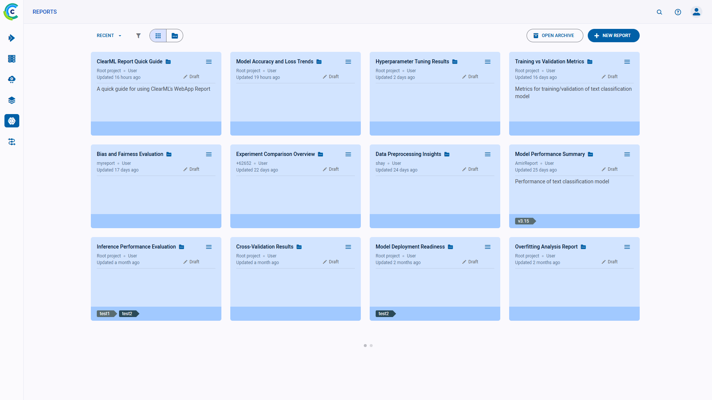

## Project Cards
In Project view, project cards display a project’s summarized report information:

<div class="max-w-50">

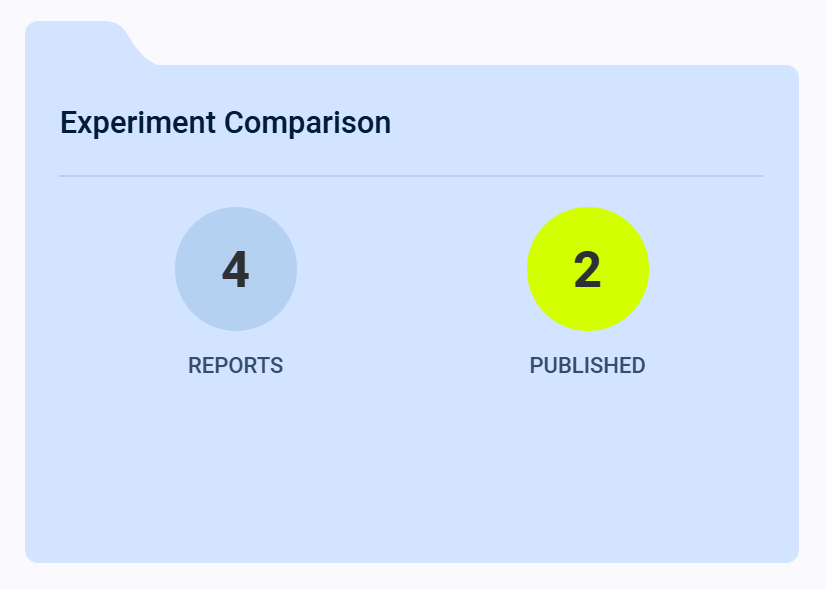

</div>

Click on a project card to view its reports.

### Report Cards

In List view, the report cards display summarized report information:

<div class="max-w-50">

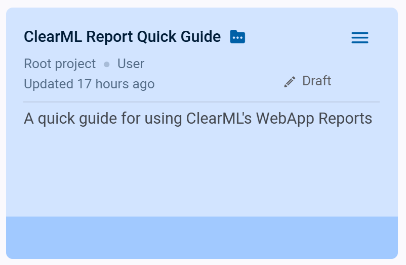

</div>

* Report name
* Report's project
* Creating user
* Last update time
* Status
* Description
* Tags 

#### Report Actions

Click  on the top right
of a report card to open its context menu and access report actions:  

<div class="max-w-50">

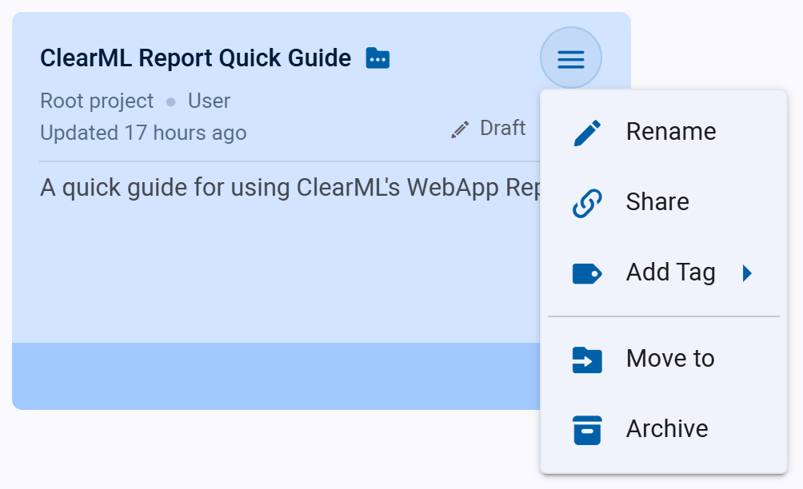

</div>

* **Rename** - Change the report’s name
* **Share** - Copy URL to share report
* **Add Tag** - Add labels to the report to help easily classify groups of reports.
* **Move to** - Move the report into another project. If the target project does not exist, it is created on-the-fly.
* **Archive** - Move report from active reports page to archive
* **Delete** - Delete the report. To delete a report, it must first be archived. 

### Create New Reports

To create a new project, click the **+ NEW REPORT** button in the top right of the page, 
which will open a **New Report** modal.


## MarkDown Formatting Quick Guide

The following is a quick reference for the MarkDown syntax that can be used in ClearML Reports.

### Heading Levels

To create headings, add `#` in front of the phrases that you want to turn into
headings. The number of `#` signs correspond to the heading level (i.e. `#` for level-1 heading, `##` for level-2, etc.): 

| MarkDown | Rendered Output |
|---|---|
| <code># H1<br/>## H2<br/>### H3<br/>#### H4<br/>##### H5<br/>###### H6</code>|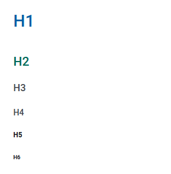|

### Text Emphasis

The following table presents the text format options: 

|Format Option| MarkDown | Rendered Output |
|---|---|---|
|Bold | \*\*This is bold text\*\* and \_\_so is this\_\_ |**This is bold text** and __so is this__|
|Italics | \*This is italic text\* and \_so is this\_|*This is italic text* and _so is this_|
|Strikethrough |\~\~Strikethrough\~\~ |~~Strikethrough~~|
|Inline Code | \`this is code\`| `this is code` |

### Blockquotes

To create a blockquote, add a `>` before each line of the quote. Nest blockquotes by adding additional 
`>` signs before each line of the nested blockquote.  

| MarkDown | Rendered Output |
|---|---|
| <code>\> Blockquote<br/>\>\> Nested quote 1<br/>\>\>\> Nested quote 2</code>|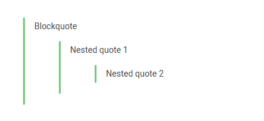|

### Lists

#### Ordered List

Create an ordered list by numbering the list items with numbers followed by periods. The list items do not have to be numbered 
correctly, but the list will be rendered numerically starting with `1.`.

| MarkDown | Rendered Output |
|---|---|
| <code>1. Item 1<br/>2. Item 2<br/>1. Item 3<br/>1. Item 4</code>|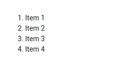|

#### Unordered List

Create an unordered list by starting each line with the `+`, `-`, or `*` signs. Different 
signs can be used to create the bullets in the same list, but they are all rendered uniformly.

You can also use checkmarks (`* [x]`), following any of the bullet signs. 

To nest lists, indent nested items 2 spaces more than their parent list item.

| MarkDown | Rendered Output |
|---|---|
| <code>+ Item 1<br/>+ Item 2<br/>&nbsp;&nbsp;- Sub-item a:<br/>&nbsp;&nbsp;&nbsp;&nbsp;\* Sub-sub-item x<br/>&nbsp;&nbsp;&nbsp;&nbsp;+ Sub-sub-item y<br/>&nbsp;&nbsp;&nbsp;&nbsp;- Sub-sub-item z<br/>\* [x] A checkmark </code>|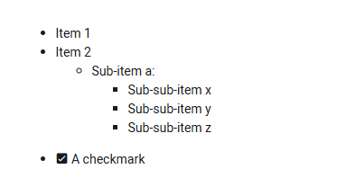|


### Tables

MarkDown code for a table looks like this:

```markdown
|          | Align Right | Align Left | Align Center |
| -------- | -----------:|:---------- |:------------:|
| 1        |           1 | 1          |      1       |
| 11       |          11 | 11         |      11      |
```

The rendered output should look like this:

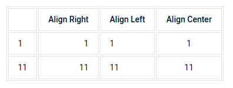

Add the table column names in the first row; each name is preceded and followed by a pipe (`|`).
In the second row, add sets of at least three hyphens (`---`) for each column, and add a pipe before and after each set 
of hyphens. In the second row, you can specify each table column's contents alignment. To align the contents to the 
left, place a colon (`:`) to the left of the hyphens. To align right, place a colon to the right of the hyphens. To 
center align, place colons on both sides of the hyphens. 

### Code

To render inline code, surround the code with single backticks (<code>\`</code>). For example \`code\` will be rendered `code`. 

To create block code, use one of the following options:
* Indent the code  
    ```
        from clearml import Task

        t = Task.init(project_name='My project', task_name='Base')
    ```

* Surround code with "fences"--three backticks (<code>```</code>):

      ```
      from clearml import Task

      t = Task.init(project_name='My project', task_name='Base')
      ```

Both of these options will be rendered as:

```
from clearml import Task

t = Task.init(project_name='My project', task_name='Base')
```

#### Syntax Highlighting 

To display syntax highlighting, specify the coding language after the first fence (e.g. <code>\```python</code>, <code>\```json</code>, <code>\```js</code>, etc.):

    ```python
    from clearml import Task

    t = Task.init(project_name='My project', task_name='Base')
    ```

The rendered output should look like this:

```py
from clearml import Task

t = Task.init(project_name='My project', task_name='Base')
```


### Links

To create a link, enclose link text inside brackets, followed by the URL link enclosed in parentheses:

```
[link text](https://clear.ml)
```

The rendered output should look like this:
[link text](https://clear.ml)

To add a title to the link, which you can see in a tooltip when hovering over the link, add the title after the URL
link in the parentheses: 

```
[link with title](https://clear.ml "ClearML Documentation")
```

The rendered output should look like this: [link with title](https://clear.ml "ClearML Documentation"). Hover over the 
link to see the link's title.

### Collapsible Sections

The MarkDown code for a collapsible panel looks like this:

| MarkDown | Rendered Output |
|---|---|
| <code><details\><br/>&nbsp<summary\>Section title</summary\><br/>&nbsp;&nbsp;Collapsible Section Contents<br/></details\></code>|<details><summary>Section title</summary>Collapsible Section Contents</details>|

The collapsible panel is surrounded by `<details>` tags. Within the `<details>` tag, add the section's title between
the `<summary>` tags. This title can be seen when the panel is collapsed. After the `</summary>` tag, add the panel
contents. 

### Horizontal Rules

Create horizontal lines using three hyphens (`---`), underscores (`___`), or asterisks (`***`): 

| MarkDown | Rendered Output |
|---|---|
| <code>---<br/><br/>___<br/><br/>***</code>|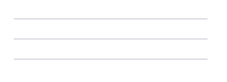|


### Images

To add an image, add an exclamation point, followed by the alt text enclosed by brackets, followed by the link to the 
image enclosed in parentheses: 

```

```

The rendered output should look like this:


To add a title to the image, which you can see in a tooltip when hovering over the image, add the title after the image's
link: 

```

```
The rendered output should look like this:


Hover over the image to see its title. 


