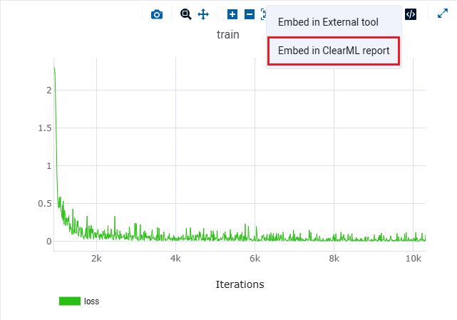
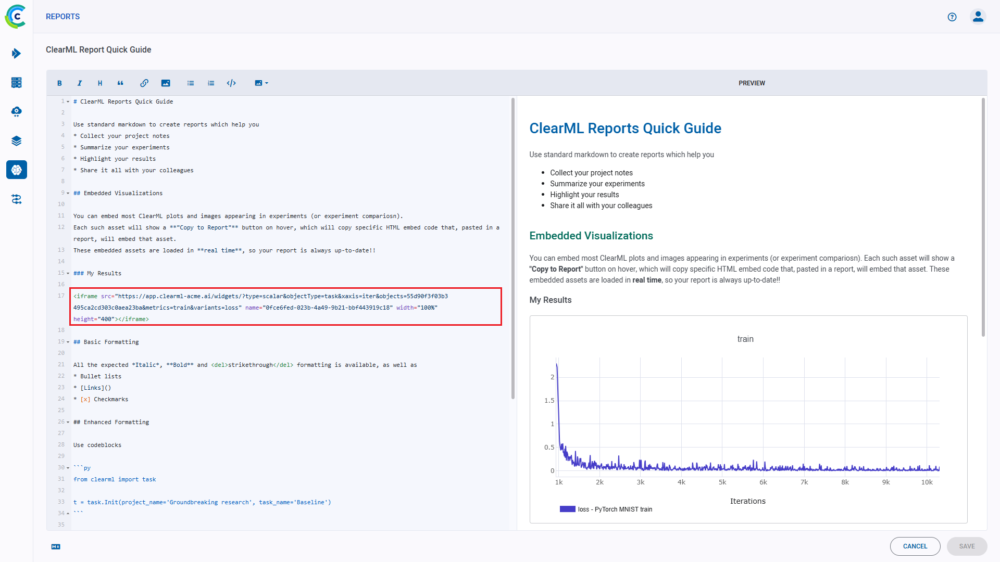
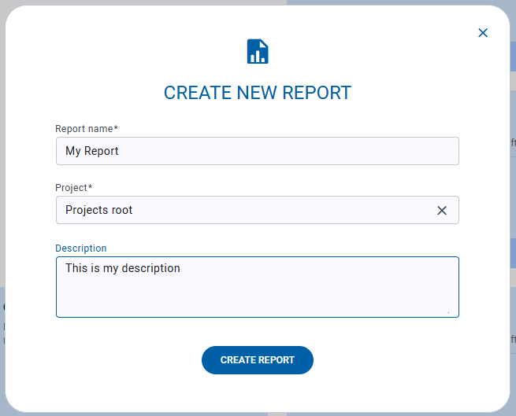

With ClearML’s Reports you can write up notes, experiment findings, or really anything you want. You can create reports 
in any of your ClearML projects.

In addition to its main document, a report also contains a description field, which will appear in the report's card in 
the [Reports Page](#reports-page).

Reports are editable Markdown documents, supporting:
* Multi-level headings
* Text formatting: Italics, bold, and strikethrough
* Bulleted and numbered lists
* Tables
* Code blocks
* Text and image hyperlinks
* Embedded ClearML task content

Publishing a report locks it for future editing, so you can preserve its contents. You can also share your reports, 
download a PDF copy, or simply copy the MarkDown content and reuse in your editor of choice.

Access ClearML reports through the [Reports Page](#reports-page).

## Embedding ClearML Visualizations
You can embed plots and images from your experiments into your reports: scalar graphs and other plots, and debug samples 
from an individual experiment or from an experiment comparison page. These visualizations are updated live as the 
experiment(s) updates.

To add a graphic resource: 
1. Go to the resource you want to embed in your report (a plot or debug sample from an individual experiment or 
experiment comparison) 
2. Hover over the resource and click . 
   
   

   Click `Embed in ClearML report`. This generates the embed code for accessing the resource, and copies 
   it to your clipboard. 
 
   

3. Return to your report page and paste the code snippet

   
   
## Reports Page
Use the Reports Page to navigate between and manage reports. The page shows summaries 
for all reports.

Click on a report card to access it.

### Report Cards

The report cards display summarized report information:

* Report name
* Report's project
* Creating user
* Last update time
* Status
* Description
* Tags 

#### Report Actions

Click  on the top right
of a report card to open its context menu and access report actions:  

* **Rename** - Change the report’s name
* **Share** - Copy URL to share report
* **Add Tag** - Add label to the report to help easily classify groups of reports.
* **Move to** - Move the report into another project. If the target project does not exist, it is created on-the-fly.
* **Archive** - Move report from active reports page to archive
* **Delete** - Delete the report. To delete a report, it must first be archived. 

### Create New Reports

To create a new project, click the **+ NEW REPORT** button in the top right of the page, 
which will open a **New Report** modal. 

