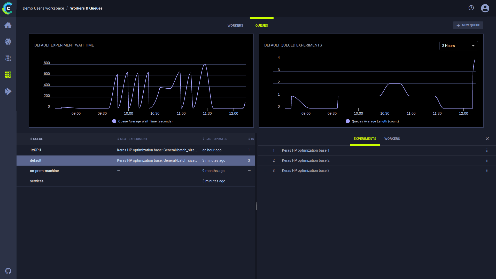

With the **Workers and Queues** page, users can:

* Monitor resources (CPU and GPU, memory, video memory, and network usage) used by the experiments / Tasks that workers
  execute
* View workers and the queues they listen to
* Create and rename queues; delete empty queues; monitor queue utilization
* Reorder, move, and remove experiments from queues

## Resources Utilization

**To monitor resource utilization:**

1. In the **WORKERS** tab, click a worker. The chart refreshes showing resource utilization over time for that worker. The
   worker **INFO** slides open, showing information about the worker:
   * Name
   * Current experiment
   * Current runtime
   * Last iteration
   * Last update time.

1. Select a metric and time frame:

    1. In the list of resources (top left side), select **CPU and GPU Usage**, **Memory Usage**, **Video Memory Usage**, or **Network Usage**.

    1. In the period list (top right side), select **3 Hours**, **6 Hours**, **12 Hours**, **1 Day**, **1 Week**, or **1 Month**.

## Worker Utilization

Optimize worker use by monitoring worker utilization in the **Workers** tab.

**To monitor worker utilization:**

* Open the **Workers** tab in the **Workers & Queues** page. The worker utilization chart
  appears. Hover over any data point and see average workers and total workers.

## Queue Utilization

**To monitor all queues:**

* Open the **Queues** tab in the **Workers & Queues** page. The queue utilization chart appears and shows
 average wait time (seconds) and number of experiments queued for all queues.
* Hover over any data point and see average wait time and number of experiments.

**To monitor a queue:**

1. In the queues list (below the plot on the left), click a queue.
1. The chart refreshes, showing metrics for the selected queue. The info panel slides open with two tabs:
   1. To see the enqueued experiments on the queue, click the **EXPERIMENTS** tab.
   2. To view information about the workers listening to the queue, click the **WORKERS** tab.

## Queue Management

In the **Queues** tab, do any of the following:

* Create a queue - Click **+ NEW QUEUE** (top right) **>** Type a queue name **>** **CREATE**.
* Do either of the following by clicking a queue in the queues list (lower right):
    * Rename a queue - Click **RENAME** > Type a queue name **>** **RENAME**, or click **DELETE**.
    * Delete a queue - Click **Delete**.
* Do any of the following by right clicking an experiment in a queue's **EXPERIMENTS** tab (lower right):
    * Reorder experiments in a queue - Drag an experiment to a new position in the queue, or click 
      (menu) and then select **Move to top** or **Move to bottom**.
    * Move to a new queue - Click    (menu) **>** **Move to queue...** **>** Select a queue **>** **ENQUEUE**.
    * Remove an experiment - Click   (menu) **>** **Move to queue...** **>** Select a queue **>** **ENQUEUE**.

