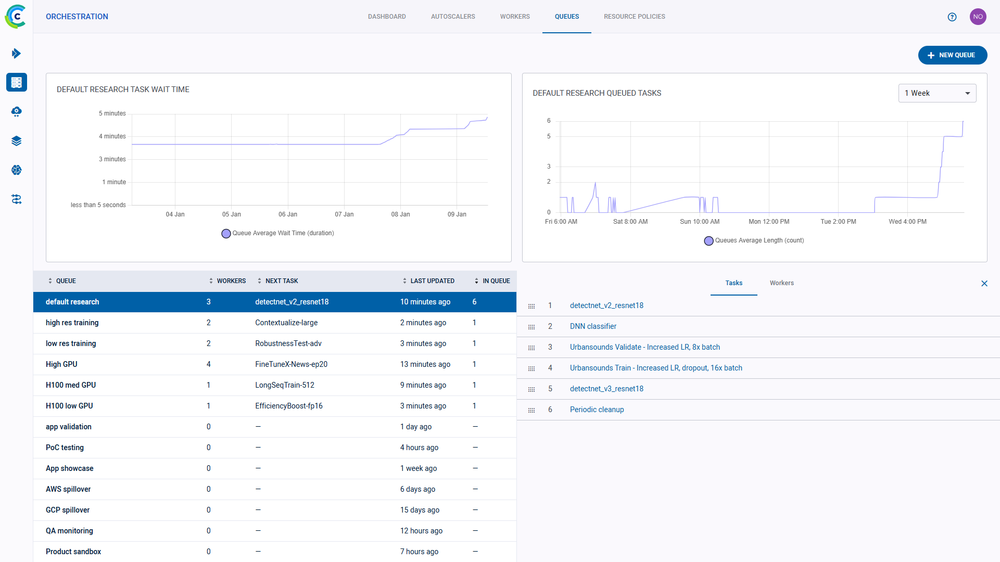
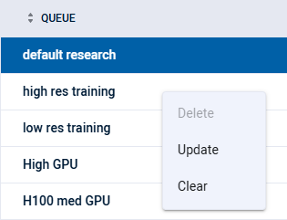

With the **Workers and Queues** page, users can:

* Monitor resources (CPU and GPU, memory, video memory, and network usage) used by the experiments / Tasks that workers
  execute
* View workers and the queues they listen to
* Create and rename queues; delete empty queues; monitor queue utilization
* Reorder, move, and remove experiments from queues

## Workers

Use the **WORKERS** tab to track worker activity and monitor worker utilization.
The page shows a worker activity graph and a worker details table. The graph time span can be controlled through the menu 
at its top right corner. Hover over any plot point to see its data. By default, the **WORKER UTILIZATION** graph displays the 
number of active and total workers over time.

The worker table shows the currently available workers and their current execution information: 
* Current running experiment
* Current execution time 
* Training iteration.

Clicking on a worker will open the worker’s details panel and replace the graph with that worker’s resource utilization 
information. The resource metric being monitored can be selected through the menu at the graph’s top left corner:
* CPU and GPU Usage
* Memory Usage
* Video Memory Usage
* Network Usage.

The worker’s details panel includes the following two tabs:
* **INFO** - worker information:
    * Worker Name
    * Update time - The last time the worker reported data
    * Current Experiment - The experiment currently being executed by the worker
    * Experiment Runtime - How long the currently executing experiment has been running
    * Experiment iteration - The last reported training iteration for the experiment
* **QUEUES** -  Information about the queues that the worker is assigned to:
    * Queue - The name of the Queue
    * Next experiment - The next experiment available in this queue
    * In Queue - The number of experiments currently enqueued

## Queues

Use the **QUEUES** tab to manage queues and monitor their statistics. The page shows graphs of the average experiment 
wait time and the number of queued experiments, and a queue details table. Hover over any plot point to view its data. 
By default, the graphs display the overall information of all queues. 

The queue table shows the following queue information:
* Queue - Queue name 
* Workers - Number of workers servicing the queue
* Next Experiment - The next experiment available in this queue
* Last Updated - The last time queue contents were modified
* In Queue - Number of experiments currently enqueued in the queue

To create a new queue - Click **+ NEW QUEUE** (top left).

Hover over a queue and click  
to copy the queue’s ID. 

Right-click on a queue or hover and click its action button  
to access queue actions:

   
* Delete - Delete the queue. Any pending tasks will be dequeued.
* Rename - Change the queue’s name
* Clear - Remove all pending tasks from the queue
* Custom action - The ClearML Enterprise Server provides a mechanism to define your own custom actions, which will 
  appear in the context menu. See [Custom UI Context Menu Actions](../deploying_clearml/clearml_server_config.md#custom-ui-context-menu-actions)
  
Clicking on a queue will open the queue’s details panel and replace the graphs with that queue’s statistics.

The queue’s details panel includes the following two tabs: 
* **EXPERIMENTS** - A list of experiments in the queue. You can reorder and remove enqueued experiments. See 
  [Controlling Queue Contents](#controlling-queue-contents).
* **WORKERS**  - Information about the workers assigned to the queue:
  * Name - Worker name
  * IP - Worker’s IP
  * Currently Executing - The experiment currently being executed by the worker

### Controlling Queue Contents

Click on an experiment’s menu button  
in the **EXPERIMENTS** tab to reorganize your queue:

  
  
* Move a task to the top or bottom of the queue
* Move the task to a different queue
* Dequeue the task

You can also reorder experiments in a queue by dragging an experiment to a new position in the queue.
